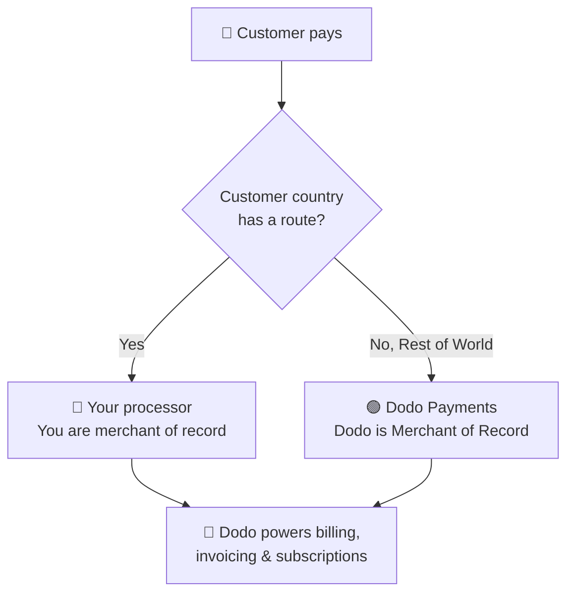

**Mang Theo Bộ Xử Lý Của Bạn (BYOP)** cho phép bạn kết nối bộ xử lý thanh toán của riêng mình — hiện tại là **Stripe** hoặc **Adyen**, với việc hỗ trợ thêm các bộ xử lý khác trong tương lai — và tiếp tục sử dụng Dodo Payments cho tất cả các hoạt động trên giao dịch: sản phẩm, đăng ký, khóa giấy phép và công cụ quy định quyền, lập hóa đơn, cổng khách hàng, và phân tích.

Bạn quyết định, mỗi quốc gia của khách hàng, liệu một thanh toán sẽ được xử lý bởi **bộ xử lý của bạn** (bạn vẫn là merchant of record cho tuyến đó) hay bởi **Dodo Payments** như Merchant of Record toàn dịch vụ của bạn. Các quốc gia bạn không định tuyến rõ ràng sẽ tự động phụ thuộc vào Dodo.

<CardGroup cols={2}>
<Card title="Route by geography" icon="globe">
Chuyển thanh toán từ các quốc gia cụ thể đến bộ xử lý của riêng bạn, và tất cả các quốc gia khác đến Dodo.
</Card>

<Card title="Keep your processor accounts" icon="plug">
Tiếp tục sử dụng các tài khoản và mối quan hệ Stripe hoặc Adyen hiện có của bạn.
</Card>

<Card title="Stay the merchant of record" icon="building">
Trên các tuyến của riêng bạn, bạn vẫn là người bán hợp pháp và kiểm soát thuế, tranh chấp, và thanh toán.
</Card>

<Card title="One billing layer" icon="layer-group">
Dodo cung cấp sản phẩm, đăng ký, hóa đơn, và phân tích qua cả hai tuyến.
</Card>
</CardGroup>

## BYOP so với Dodo là Merchant of Record

Khi bạn bật BYOP, bạn chọn cách từng thanh toán được xử lý. Hai mô hình có thể chạy song song, định tuyến bởi quốc gia của khách hàng.

| Tính năng | Dodo là Merchant of Record | Mang Theo Bộ Xử Lý Của Bạn |
|---------|----------------------------|--------------------------|
| Người bán hợp pháp | Dodo Payments | Công ty của bạn |
| Thuế (VAT, GST & thuế bán hàng) | Tính toán, thu thập & nộp cho bạn | Bạn đăng ký, thu thập & nộp |
| Tranh chấp & gian lận | Trách nhiệm & bảo vệ được xử lý bởi Dodo | Bạn quản lý với các công cụ của riêng bộ xử lý của bạn |
| Tuân thủ PCI | Được Dodo xử lý | Bạn quản lý |
| Phương thức thanh toán | 30+ toàn cầu & địa phương, đa tiền tệ | Chỉ thẻ (tín dụng/ghi nợ) |
| Thanh toán | Tổng hợp thanh toán toàn cầu | Trực tiếp từ bộ xử lý của bạn |
| Thiết lập | Đơn giản, hoạt động trong phút | Trung bình, thêm khóa & định tuyến |
| Tốt nhất cho | Bán toàn cầu, tuân thủ không cần quản lý | Bộ xử lý hiện tại & kiểm soát khu vực |

<Tip>
Một thiết lập phổ biến là **hybrid**: định tuyến một quốc gia nơi bạn đã có thực thể và bộ xử lý đã đăng ký (ví dụ, thị trường nội địa của bạn) đến bộ xử lý riêng của bạn, và để Dodo xử lý phần còn lại của thế giới như Merchant of Record.
</Tip>

## Bộ xử lý được hỗ trợ

Hiện nay, bạn có thể kết nối **Stripe** hoặc **Adyen**. Hỗ trợ cho thêm nhiều bộ xử lý khác đang trên đường phát triển.

<CardGroup cols={2}>
<Card title="Stripe" icon="stripe" />
<Card title="Adyen" icon="/images/logos/adyen.svg" />
</CardGroup>

<Note>
Các thanh toán định tuyến qua bộ xử lý của riêng bạn hiện chỉ hỗ trợ **thẻ tín dụng và ghi nợ**. Chúng tôi sẽ thêm nhiều phương thức thanh toán sớm.
</Note>

<Warning>
Cả **Stripe** và **Adyen** đều yêu cầu **quyền truy cập API thẻ thô** được bật trên tài khoản của bạn để Dodo có thể cung cấp dịch vụ lập hóa đơn trên bộ xử lý của bạn. Mỗi bộ xử lý cấp quyền này theo yêu cầu — bạn sắp xếp bằng cách liên hệ với hỗ trợ của bộ xử lý trước khi kết nối. Xem các hướng dẫn [Stripe](/features/byop/stripe) và [Adyen](/features/byop/adyen) để biết chi tiết.
</Warning>

<Info>
Các kết nối được cấu hình **theo môi trường**. Bộ xử lý bạn kết nối trong **chế độ thử nghiệm** (Sandbox) tách biệt với bộ xử lý trong **chế độ trực tiếp** (Production); thiết lập cả hai nếu bạn muốn thử nghiệm trước khi đi vào hoạt động. Trình hướng dẫn thiết lập theo dõi nút thử nghiệm/trực tiếp toàn cầu của bảng điều khiển của bạn.
</Info>

## Thiết lập BYOP

Mở **Cài đặt → BYOP** trong bảng điều khiển và chọn **Cấu hình** trên thẻ *Mang Theo Bộ Xử Lý Của Bạn* để khởi chạy trình hướng dẫn thiết lập.

<Frame>

</Frame>

<Steps>
<Step title="Choose a payment processor">
Chọn bộ xử lý bạn muốn kết nối, **Stripe** hoặc **Adyen**, và tiếp tục.

<Frame>

</Frame>
</Step>

<Step title="Connect your account">
Đặt tên cho kết nối là **Tên Nhà Cung Cấp** (hữu ích khi bạn có nhiều tài khoản từ cùng một bộ xử lý, ví dụ *Stripe US* và *Stripe UK*), sau đó nhập **Khóa Bí Mật** của bộ xử lý (đối với Stripe, là khóa `sk_...` của bạn).

Đối với **Adyen**, cũng nhập định danh **Tài khoản Merchant** của bạn.

<Frame>

</Frame>

Lưu để tạo kết nối và tạo một **Điểm Cuối Webhook** độc nhất cho nó. Thêm URL đó làm đích webhook trong bảng điều khiển của bộ xử lý của bạn, sau đó dán lại **Bí Mật Ký Webhook** vào Dodo để hoàn tất:

- **Stripe**: dán bí mật ký từ điểm cuối webhook bạn đã thêm.
- **Adyen**: dán **Khóa HMAC** từ *Khu Vực Khách Hàng → Webhooks*.

<Note>
Khóa bí mật của bạn được lưu trữ an toàn và không thể xem hoặc thay đổi sau khi lưu. Bạn chỉ cần cấu hình URL webhook do Dodo tạo trên bộ xử lý của bạn; bạn không bao giờ tương tác trực tiếp với cơ sở hạ tầng bên dưới.
</Note>

<Tip>
Sử dụng **Xác minh kết nối** sau khi lưu để thực hiện một cuộc gọi thử nghiệm với bộ xử lý của bạn và xác nhận rằng khóa và bí mật webhook là hợp lệ trước khi hoạt động.
</Tip>
</Step>

<Step title="Configure payment routing">
Thêm **quy tắc định tuyến** để ánh xạ các quốc gia khách hàng với một bộ xử lý. Mỗi quốc gia có thể được định tuyến đến chính xác một bộ xử lý.

- **Bộ xử lý của bạn** xử lý thanh toán từ các quốc gia bạn chỉ định.
- **Dodo Payments** xử lý **Phần còn lại của Thế giới** (mọi quốc gia bạn không định tuyến rõ ràng) như Merchant of Record.

<Frame>

</Frame>

Sử dụng **Thêm Tuyến** để gán một hoặc nhiều quốc gia cho một bộ xử lý.

<Frame>

</Frame>

<Info>
**Hướng dẫn định tuyến**
- "Phần còn lại của Thế giới" bao gồm tất cả các quốc gia không được liệt kê ở trên.
- Các tuyến MoR của Dodo Payments xử lý tuân thủ và thuế tự động.
- Các tuyến của bộ xử lý của riêng bạn cần cấu hình thuế riêng nếu cần.
</Info>
</Step>

<Step title="Configure invoice information">
Đối với thanh toán định tuyến qua bộ xử lý của riêng bạn, **bạn** là người bán trên hóa đơn. Nhập chi tiết doanh nghiệp sẽ xuất hiện trên những hóa đơn đó:

- **Tên Doanh Nghiệp Đã Đăng Ký** (bắt buộc)
- **Mã Số Thuế** (EIN, SSN, v.v.; tùy chọn, có thể kiểm tra định dạng cho EIN của Hoa Kỳ)
- **Trình Bày Sao Kê** (bắt buộc): những gì khách hàng thấy trên bảng sao kê ngân hàng của họ (từ 5 đến 22 ký tự)
- **Địa Chỉ Đăng Ký Doanh Nghiệp** (bắt buộc): bắt đầu nhập để tìm kiếm và điền tự động địa chỉ của bạn
- Liên kết **Chính Sách Bảo Mật** và **Điều Khoản Dịch Vụ** (bắt buộc)

Một **Xem Trước Tiêu Đề Hóa Đơn** trực tiếp hiển thị cách chi tiết sẽ xuất hiện. Các chi tiết này áp dụng **chỉ** cho hóa đơn cho các tuyến bạn xử lý qua bộ xử lý của riêng bạn; các thanh toán định tuyến qua Dodo tiếp tục sử dụng chi tiết Merchant of Record của Dodo.

<Frame>

</Frame>
</Step>

<Step title="Review and finish">
Xem lại kết nối bộ xử lý của bạn, quy tắc định tuyến, và chi tiết hóa đơn. Xác nhận rằng định tuyến và chi tiết lập hóa đơn là chính xác, sau đó chọn **Hoàn tất thiết lập**.

<Frame>

</Frame>
</Step>
</Steps>

Một khi cấu hình, thẻ BYOP hiển thị **Chỉnh Sửa Cấu Hình**, và bạn có thể quay lại chế độ chỉ MoR bất cứ lúc nào với **Chỉnh sửa quy tắc định tuyến**.

<Frame>

</Frame>

## Cách định tuyến hoạt động

Định tuyến được xác định bởi **quốc gia của khách hàng** tại thời điểm thanh toán. Cùng một logic áp dụng cho các thanh toán một lần, phiên thanh toán, và đăng ký gói. Việc gia hạn sử dụng lại bộ xử lý đăng ký đã được tạo (xem [Đăng ký](#subscriptions)).

Trên một tuyến được xử lý bởi **bộ xử lý của bạn**:

- Thanh toán được xử lý trên tài khoản bộ xử lý của **bạn** bằng tiền tệ thanh toán.
- **Không thuế nào được tính toán hoặc thu thập** bởi Dodo; bạn vẫn chịu trách nhiệm về thuế trên tuyết.
- Hóa đơn sử dụng **chi tiết doanh nghiệp và trình bày sao kê** bạn đã cấu hình, không có tham chiếu Merchant of Record.
- Thanh toán được giải quyết **trực tiếp cho bạn** từ bộ xử lý của bạn; không có gì chạy qua ví của Dodo.

Trên một tuyến được xử lý bởi **Dodo** (Phần còn lại của thế giới), Dodo hoạt động hoàn toàn như Merchant of Record, xử lý thuế, tuân thủ, tranh chấp, gian lận, và thanh toán tổng hợp.

## Đăng ký

Đăng ký ở lại trên bộ xử lý mà chúng được tạo ra. Tại thời điểm gia hạn, Dodo tính phí bộ xử lý thanh toán giống với cái đã sử dụng để mua đăng ký, sử dụng lại sự ủy quyền thanh toán được lưu trữ cho nó. Quy tắc định tuyến không được đánh giá lại ở mỗi lần gia hạn.

## Xem bộ xử lý nào đã xử lý thanh toán

Một khi BYOP được cấu hình, bảng **Thanh Toán** và **Tranh Chấp** hiển thị một biểu tượng bộ xử lý (Stripe, Adyen, hoặc Dodo) bên cạnh từng hàng, và các trang chi tiết thanh toán và tranh chấp bao gồm trường **Bộ Xử Lý Thanh Toán**, để bạn luôn biết tuyết nào đã xử lý giao dịch đó.

## Hoàn tiền, tranh chấp & thanh toán

<Tabs>
<Tab title="Refunds">
Bạn khởi tạo hoàn tiền từ bảng điều khiển Dodo như bình thường. Đối với các thanh toán định tuyến qua bộ xử lý của riêng bạn, hoàn tiền được thực thi trên bộ xử lý đó; đối với các thanh toán định tuyến qua Dodo, Dodo xử lý hoàn tiền.
</Tab>

<Tab title="Disputes">
Bảng điều khiển Dodo chỉ hiển thị tranh chấp cho các thanh toán được Dodo xử lý.

> Chỉ các tranh chấp được Dodo xử lý mới được hiển thị ở đây. Các tranh chấp trên bộ xử lý của bạn (ví dụ, Stripe) được quản lý trong bảng điều khiển của bộ xử lý đó.

Các hành động tải chứng cứ, chấp nhận, và thách thức chỉ có sẵn cho các tranh chấp được Dodo xử lý. Các tranh chấp trên bộ xử lý của bạn được xử lý với các công cụ của riêng bộ xử lý của bạn.
</Tab>

<Tab title="Payouts">
Đối với các tuyến trên bộ xử lý của riêng bạn, bộ xử lý của bạn trả tiền **trực tiếp** cho bạn; các khoản thanh toán đó không xuất hiện trong Dodo.

> Chỉ xem được thanh toán Dodo ở đây. Thanh toán trên bộ xử lý của bạn xảy ra trong bộ xử lý đó.

Các thanh toán của Dodo (đối với khối lượng MoR còn lại trên thế giới) tuân theo [cấu trúc thanh toán](/features/payouts/payout-structure) tiêu chuẩn.
</Tab>
</Tabs>

## Phân tích

Phân tích doanh thu, thuế, và đăng ký bao gồm **cả hai** tuyến để bạn có cái nhìn toàn diện về việc lập hóa đơn. Các widget tranh chấp và thanh toán chỉ hiển thị hoạt động do Dodo xử lý, với một biểu ngữ chỉ ra rằng hoạt động trên bộ xử lý của bạn tồn tại trong bảng điều khiển của bộ xử lý đó.

## Phí lập hóa đơn

Dodo áp dụng một **phí lập hóa đơn BYOP nhỏ** trên các thanh toán định tuyến qua bộ xử lý của riêng bạn, vì Dodo vẫn cung cấp sản phẩm, đăng ký, hóa đơn, và phân tích trên những giao dịch đó. Nó xuất hiện dưới dạng một `byop_fee` dòng trong sổ cái cân đối của bạn. Tỷ lệ mặc định là **0.5%**; tỷ lệ cụ thể được xác nhận khi bật BYOP cho tài khoản của bạn. [Liên hệ](mailto:founders@dodopayments.com) để biết chi tiết.

## Câu hỏi thường gặp

<AccordionGroup>
<Accordion title="Which processors can I connect?">
Stripe và Adyen được hỗ trợ ngày hôm nay, với hỗ trợ thêm cho nhiều bộ xử lý hơn trong tương lai. Cả hai đều yêu cầu **quyền truy cập API thẻ thô** được kích hoạt trên tài khoản của bạn, mà bạn sắp xếp bằng cách liên hệ với hỗ trợ của bộ xử lý. Xem các hướng dẫn [Stripe](/features/byop/stripe) và [Adyen](/features/byop/adyen) để biết chi tiết.
</Accordion>

<Accordion title="Can I route only some countries to my processor?">
Có. Gán các quốc gia cụ thể cho bộ xử lý của bạn và để phần còn lại là **Phần còn lại của Thế giới**, mà Dodo xử lý như Merchant of Record. Mỗi quốc gia định tuyến đến chính xác một bộ xử lý.
</Accordion>

<Accordion title="Who is the merchant of record on BYOP routes?">
Bạn là. Trên các tuyến được xử lý qua bộ xử lý của riêng bạn, bạn vẫn là người bán hợp pháp và chịu trách nhiệm về thuế, tranh chấp, tuân thủ PCI, và thanh toán trên những giao dịch đó.
</Accordion>

<Accordion title="Does Dodo calculate tax on my processor's routes?">
Không. Thuế không được tính toán hoặc thu thập trên các tuyến xử lý qua bộ xử lý của riêng bạn; bạn quản lý thuế cho những giao dịch đó. Dodo tiếp tục xử lý thuế trên các thanh toán Dodo-routed (MoR).
</Accordion>

<Accordion title="What happens to active subscriptions if I disable a processor?">
Việc gia hạn trên bộ xử lý đó sẽ thất bại và xuất hiện dưới dạng thanh toán thất bại trong bảng điều khiển. Bật lại bộ xử lý để khôi phục việc gia hạn.
</Accordion>
</AccordionGroup>

## Bắt đầu

<Card title="What is Merchant of Record?" icon="building-columns" href="/features/mor-introduction">
Hiểu cách mô hình Merchant of Record toàn dịch vụ của Dodo hoạt động.
</Card>
