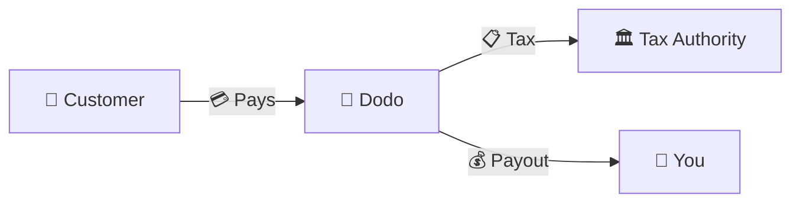
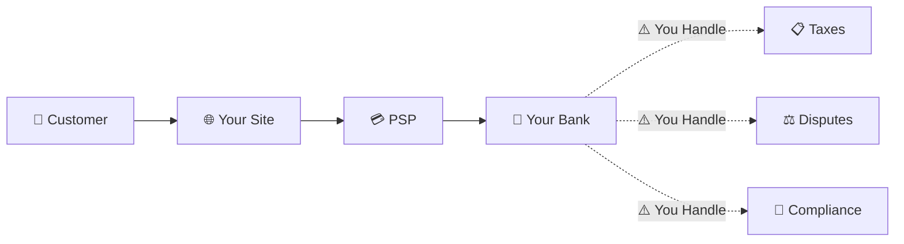
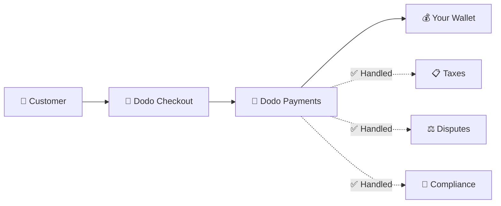
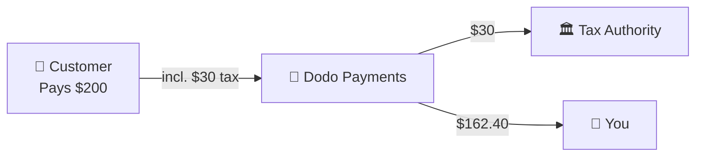

Dodo Payments hoạt động với tư cách là **Merchant of Record (MoR)** — chúng tôi trở thành bên bán hợp pháp các sản phẩm kỹ thuật số của bạn và chịu trách nhiệm về thanh toán, thuế, gian lận và tuân thủ để bạn có thể hoàn toàn tập trung vào việc xây dựng sản phẩm.

<CardGroup cols={3}>
<Card title="220+ Regions" icon="globe">
Tự động xử lý tuân thủ thuế
</Card>

<Card title="30+ Payment Methods" icon="credit-card">
Thẻ, ví điện tử và phương thức thanh toán địa phương
</Card>

<Card title="Zero Tax Filing" icon="file-invoice">
Chúng tôi xử lý toàn bộ việc chuyển tiền
</Card>
</CardGroup>

## Merchant of Record là gì?

**Merchant of Record** là pháp nhân xuất hiện trên bảng sao kê thẻ tín dụng của khách hàng và chịu trách nhiệm về giao dịch. Khi sử dụng Dodo Payments làm MoR:

- **Chúng tôi là bên bán hợp pháp** — Dodo xuất hiện trên sao kê ngân hàng và biên lai
- **Bạn là người tạo sản phẩm** — Bạn xây dựng, định giá và cung cấp sản phẩm
- **Chúng tôi xử lý các hoạt động hậu cần** — Thuế, tranh chấp, tuân thủ và hỗ trợ thanh toán
- **Bạn nhận khoản chi trả ròng** — Doanh thu được chuyển trực tiếp vào tài khoản của bạn

<Note>
Hãy hình dung Merchant of Record như việc thuê một đội ngũ tài chính toàn cầu xử lý việc lập hóa đơn, thuế và thanh toán ở mọi quốc gia — mà bạn không cần phải làm gì cả.
</Note>

## Tại sao nên sử dụng Merchant of Record?

Bán sản phẩm kỹ thuật số trên toàn cầu đồng nghĩa với việc phải xử lý VAT ở châu Âu, GST ở Úc, Sales Tax ở Hoa Kỳ và vô số yêu cầu khác. Mỗi khu vực pháp lý có các quy định, mức thuế, ngưỡng và thời hạn nộp hồ sơ khác nhau.

| Trách nhiệm của bạn | Không có MoR | Dodo làm MoR |
|---------------------|:-----------:|:----------------:|
| Đăng ký VAT/GST | ❌ Bạn | ✅ Dodo |
| Tính thuế | ❌ Bạn | ✅ Dodo |
| Khai và nộp thuế | ❌ Bạn | ✅ Dodo |
| Trách nhiệm về chargeback | ❌ Bạn | ✅ Dodo |
| Tuân thủ PCI | ❌ Bạn | ✅ Dodo |
| Hỗ trợ đa tiền tệ | ❌ Phức tạp | ✅ Tích hợp sẵn |
| Phương thức thanh toán địa phương | ❌ Tích hợp từng phương thức | ✅ Bao gồm hơn 30 phương thức |

<Tip>
**Ví dụ**: Bán gói đăng ký €50/tháng cho một khách hàng ở Pháp?

**Không có MoR**: Đăng ký VAT tại Pháp, tính phí €60 (20% VAT), nộp tờ khai thuế hàng quý tại Pháp và xử lý các cuộc kiểm toán bằng tiếng Pháp.

**Với Dodo**: Chúng tôi thu €60, nộp €10 VAT cho Pháp và trả cho bạn €50 sau khi trừ phí. Bạn chỉ cần viết code.
</Tip>

## PSP và MoR: Những khác biệt chính

Việc hiểu rõ sự khác biệt giữa **Payment Service Provider** (như Stripe) và **Merchant of Record** là điều thiết yếu.

### Payment Service Provider (PSP)

PSP xử lý các giao dịch nhưng bạn vẫn là bên bán hợp pháp:

<Warning>
Với PSP, **bạn** chịu trách nhiệm đăng ký, thu, khai và nộp thuế tại mọi khu vực pháp lý nơi bạn có khách hàng.
</Warning>

### Merchant of Record (Dodo)

MoR trở thành bên bán hợp pháp và xử lý việc tuân thủ từ đầu đến cuối:

<Check>
Khi Dodo là MoR, chúng tôi xử lý thuế, tranh chấp và tuân thủ. Bạn nhận khoản chi trả ròng mà không cần giấy tờ.
</Check>

### So sánh trực tiếp

| Khía cạnh | PSP (Stripe, v.v.) | MoR (Dodo) |
|--------|:------------------:|:----------:|
| Bên bán hợp pháp | Công ty của bạn | Dodo |
| Trên bảng sao kê của khách hàng | Tên của bạn | Dodo |
| Đăng ký thuế | ❌ Bạn | ✅ Dodo |
| Tính thuế | ❌ Bạn | ✅ Dodo |
| Nộp thuế | ❌ Bạn | ✅ Dodo |
| Rủi ro chargeback | ❌ Bạn | ✅ Dodo |
| Tuân thủ PCI | ❌ Bạn | ✅ Dodo |
| Thiết lập để kinh doanh toàn cầu | Phức tạp | Đơn giản |

<Info>
**Quan trọng**: Cả PSP và MoR đều xử lý việc thanh toán. Điểm khác biệt chính là **ai chịu trách nhiệm pháp lý** về tuân thủ thuế và trách nhiệm đối với giao dịch.
</Info>

## Cách thức tuân thủ thuế hoạt động

Dodo tự động xử lý toàn bộ vòng đời thuế:

<Steps>
<Step title="Customer Location">
Chúng tôi xác định quốc gia của khách hàng và xác định các quy định thuế áp dụng — VAT, GST, Sales Tax hoặc các yêu cầu địa phương khác.
</Step>

<Step title="Rate Calculation">
Mức thuế chính xác được tính dựa trên loại sản phẩm, vị trí của khách hàng và trạng thái B2B/B2C. Khách hàng doanh nghiệp tại EU có mã VAT hợp lệ sẽ được áp dụng reverse charge.
</Step>

<Step title="Collection at Checkout">
Thuế được hiển thị rõ ràng và thu tại bước thanh toán. Khách hàng biết chính xác số tiền họ phải trả.
</Step>

<Step title="Filing & Remittance">
Chúng tôi nộp tờ khai và nộp số thuế đã thu cho các cơ quan chức năng liên quan đúng hạn. Bạn không bao giờ phải xử lý biểu mẫu thuế.
</Step>
</Steps>

## Luồng doanh thu

Sau đây là cách tiền di chuyển từ khách hàng vào tài khoản của bạn:

### Ví dụ phân tích khoản chi trả

| Khoản mục | Số tiền |
|-----------|-------:|
| Khoản thanh toán của khách hàng | $200.00 |
| Sales Tax (15% VAT) | −$30.00 |
| Phí nền tảng Dodo (4%) | −$8.00 |
| Phí xử lý thanh toán | −$0.60 |
| **Khoản chi trả cho bạn** | **$162.40** |

## Khi nào nên chọn MoR hay PSP

<Tabs>
<Tab title="Choose Dodo (MoR)">
**Dodo Payments phù hợp nếu bạn:**

- Bán sản phẩm kỹ thuật số, SaaS hoặc gói đăng ký
- Có khách hàng ở nhiều quốc gia
- Muốn tránh những rắc rối khi đăng ký thuế
- Ưu tiên việc tuân thủ được thuê ngoài với chi phí có thể dự đoán
- Coi trọng tốc độ tiếp cận thị trường hơn quyền kiểm soát tối đa
- Không muốn tự quản lý tranh chấp và gian lận
</Tab>

<Tab title="Consider a PSP">
**PSP có thể phù hợp nếu bạn:**

- Hoạt động chủ yếu tại một quốc gia
- Có đội ngũ tài chính và tuân thủ nội bộ
- Cần toàn quyền kiểm soát UX của trang thanh toán
- Hoạt động với biên lợi nhuận cực kỳ thấp
- Bán hàng hóa vật lý (MoR tập trung vào sản phẩm kỹ thuật số)
</Tab>
</Tabs>

<Note>
Nhiều doanh nghiệp bắt đầu với PSP và chuyển sang MoR khi mở rộng ra thị trường quốc tế. Dodo cung cấp hỗ trợ chuyển đổi để quá trình này diễn ra liền mạch.
</Note>

## Câu hỏi thường gặp

<AccordionGroup>
<Accordion title="What appears on my customer's credit card statement?">
Dodo Payments xuất hiện với tư cách là merchant. Chúng tôi hiển thị thông tin sản phẩm/thương hiệu của bạn khi giới hạn ký tự cho phép, đồng thời khách hàng nhận được biên lai chi tiết có thông tin về sản phẩm của bạn.
</Accordion>

<Accordion title="Do I still own the customer relationship?">
Có. Bạn kiểm soát việc định giá, thương hiệu, cung cấp sản phẩm và giao tiếp trực tiếp. Dodo xử lý các cơ chế thanh toán, nhưng khách hàng biết họ đang mua hàng từ bạn. Thương hiệu của bạn xuất hiện nổi bật trên trang thanh toán, email và hóa đơn.
</Accordion>

<Accordion title="How does B2B VAT reverse charge work?">
Đối với giao dịch B2B tại EU, khách hàng có thể nhập mã VAT tại bước thanh toán. Chúng tôi xác thực mã này và tự động áp dụng reverse charge — thuế được chuyển sang tờ khai VAT của người mua thay vì được thu tại thời điểm thanh toán.
</Accordion>

<Accordion title="Can I use my own payment processor?">
Dodo hoạt động như một giải pháp hoàn chỉnh sử dụng hạ tầng thanh toán của chúng tôi. Tích hợp này cho phép chúng tôi chịu trách nhiệm về thuế và gian lận. Trong tương lai, chúng tôi sẽ cung cấp khả năng tích hợp với các bộ xử lý thanh toán khác.
</Accordion>

<Accordion title="How do refunds work?">
Bắt đầu hoàn tiền từ dashboard của bạn. Chúng tôi xử lý khoản hoàn tiền về phương thức thanh toán và loại tiền tệ ban đầu của khách hàng. Các khoản thuế được tự động điều chỉnh và đối soát.
</Accordion>

<Accordion title="What about my income tax?">
Dodo xử lý **sales taxes** (VAT, GST, Sales Tax) trên các giao dịch của khách hàng. Bạn vẫn chịu trách nhiệm về thuế thu nhập doanh nghiệp, thuế công ty và các nghĩa vụ thuế đối với những khoản chi trả bạn nhận được.
</Accordion>

<Accordion title="Which countries can I sell to?">
Chúng tôi chấp nhận thanh toán từ hơn 220 quốc gia và khu vực, đồng thời liên tục mở rộng phạm vi hỗ trợ. Xem danh sách đầy đủ:

<Card title="Supported Regions" icon="globe" href="/miscellaneous/list-of-countries-we-accept-payments-from">
Xem tất cả hơn 220 quốc gia và khu vực nơi chúng tôi chấp nhận thanh toán.
</Card>
</Accordion>
</AccordionGroup>

## Bắt đầu ngay

<CardGroup cols={2}>
<Card title="Create Account" icon="rocket" href="https://app.dodopayments.com/signup">
Đăng ký miễn phí và chấp nhận thanh toán toàn cầu chỉ trong vài phút.
</Card>

<Card title="MoR vs PG Deep Dive" icon="scale-balanced" href="/features/mor-vs-pg">
So sánh chi tiết kèm ví dụ và trường hợp sử dụng.
</Card>

<Card title="Acceptance Policy" icon="building-shield" href="/miscellaneous/merchant-acceptance">
Tìm hiểu những doanh nghiệp mà chúng tôi hỗ trợ.
</Card>

<Card title="Talk to Us" icon="envelope" href="mailto:founders@dodopayments.com">
Nhận hướng dẫn được cá nhân hóa từ đội ngũ của chúng tôi.
</Card>
</CardGroup>
