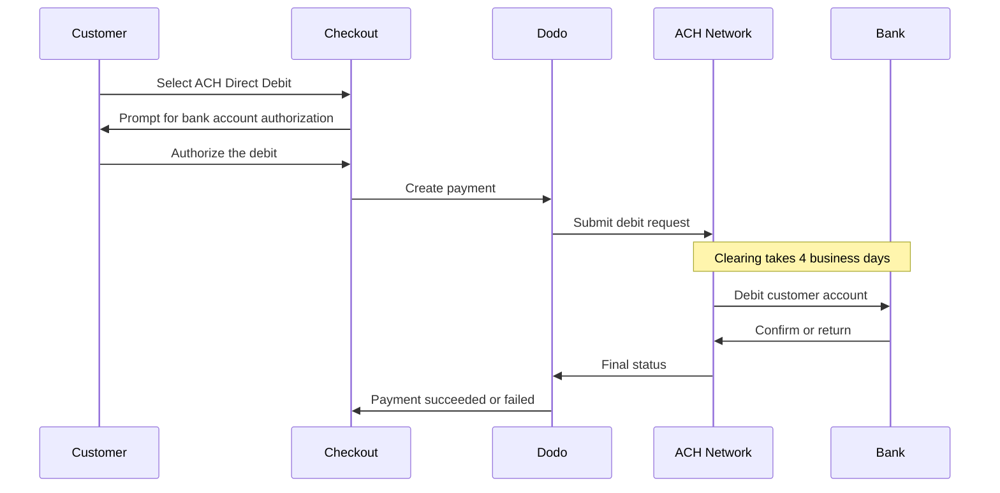

ACH Direct Debit cho phép khách hàng tại Hoa Kỳ thanh toán trực tiếp từ tài khoản ngân hàng thay vì sử dụng thẻ. Phương thức này hoạt động trên mạng lưới Automated Clearing House và được cung cấp tại các trang thanh toán bằng USD cho các khoản thanh toán một lần.

## Tại sao nên cung cấp ACH Direct Debit?

<CardGroup cols={3}>
<Card title="Lower Processing Cost" icon="piggy-bank">
Chi phí xử lý giao dịch trích nợ ngân hàng thường thấp hơn thanh toán bằng thẻ, đặc biệt đối với các đơn hàng có giá trị cao.
</Card>

<Card title="No Card Required" icon="building-columns">
Tiếp cận khách hàng Hoa Kỳ thích thanh toán từ tài khoản ngân hàng hoặc không muốn sử dụng thẻ cho các giao dịch mua hàng lớn.
</Card>

<Card title="Higher Value Orders" icon="chart-line">
Lợi thế về chi phí so với thẻ tăng theo giá trị đơn hàng, khiến ACH phù hợp với các giao dịch mua hàng một lần có giá trị lớn.
</Card>
</CardGroup>

## Tổng quan

| Chi tiết | Giá trị |
| :----- | :---- |
| **Đơn vị tiền tệ thanh toán** | USD |
| **Quốc gia được hỗ trợ** | Hoa Kỳ |
| **Gói đăng ký** | Không |
| **Số tiền tối thiểu** | $0.50 |
| **Quyết toán** | 4 ngày làm việc |

<Warning>
ACH Direct Debit không diễn ra tức thì. Một khoản thanh toán cần **4 ngày làm việc** để được xác nhận, vì vậy không được xem việc ủy quyền là quyết toán — chỉ thực hiện giao hàng hoặc cấp quyền khi khoản thanh toán chuyển sang trạng thái succeeded.
</Warning>

## Cách thức hoạt động



## Trải nghiệm khách hàng

1. Khách hàng chọn ACH Direct Debit tại trang thanh toán
2. Khách hàng ủy quyền trích nợ từ tài khoản ngân hàng Hoa Kỳ của mình
3. Khoản thanh toán được gửi đến mạng lưới ACH và chuyển sang trạng thái processing
4. Quá trình clearing hoàn tất trong những ngày làm việc tiếp theo
5. Khoản thanh toán chuyển sang trạng thái succeeded hoặc thất bại nếu ngân hàng hoàn trả khoản thanh toán

<Info>
Vì quá trình clearing diễn ra không đồng bộ, hãy dựa vào [webhooks](/developer-resources/webhooks) để biết kết quả cuối cùng thay vì dựa vào chuyển hướng sau khi thanh toán. Chuyển hướng thành công chỉ có nghĩa là khách hàng đã ủy quyền trích nợ.

Khoản thanh toán phát ra `payment.processing` ngay khi giao dịch trích nợ được gửi đi, sau đó phát ra `payment.succeeded` hoặc `payment.failed` khi quá trình clearing hoàn tất. Chỉ `payment.succeeded` mới an toàn để thực hiện giao hàng hoặc cấp quyền.
</Info>

## Tính khả dụng

ACH Direct Debit xuất hiện tại trang thanh toán khi tất cả điều kiện sau đều được đáp ứng:

- **Đơn vị tiền tệ thanh toán** là `USD`
- **Quốc gia thanh toán** là `US`
- Giao dịch là **thanh toán một lần**

<Note>
ACH Direct Debit không khả dụng cho các gói đăng ký. Khoảng thời gian clearing kéo dài nhiều ngày khiến phương thức này không phù hợp với các chu kỳ thanh toán định kỳ. Đối với các khoản thanh toán định kỳ, hãy sử dụng thẻ hoặc một phương thức khác hỗ trợ gói đăng ký — xem [Tổng quan về phương thức thanh toán](/features/payment-methods).
</Note>

## Cấu hình

```javascript
const session = await client.checkoutSessions.create({
  product_cart: [{ product_id: 'pdt_123', quantity: 1 }],
  allowed_payment_method_types: ['ach', 'credit', 'debit'],
  billing_currency: 'USD',
  billing_address: {
    country: 'US',
    zipcode: '94102'
  },
  return_url: 'https://example.com/success'
});
```

<Note>
ACH Direct Debit yêu cầu đơn vị tiền tệ thanh toán là **USD** và địa chỉ thanh toán tại **Hoa Kỳ**. Nếu báo giá của bạn sử dụng đơn vị tiền tệ khác, hãy bật [Adaptive Currency](/features/adaptive-currency) để khách hàng Hoa Kỳ được thanh toán bằng USD và ACH khả dụng.
</Note>

## Loại phương thức API

| Loại | Phương thức | Quốc gia |
| :--- | :----- | :------ |
| `ach` | ACH Direct Debit | Hoa Kỳ |

## Hoàn tiền và tranh chấp

Hoàn tiền và tranh chấp đối với các khoản thanh toán ACH sử dụng cùng API và quy trình trên dashboard như mọi phương thức thanh toán khác — không cần triển khai cách xử lý riêng cho ACH.

<Warning>
Vì các khoản thanh toán ACH có thể bị ngân hàng của khách hàng hoàn trả sau khi có vẻ đã hoàn tất, hãy tránh hoàn tiền cho đến khi khoản thanh toán ban đầu chuyển sang trạng thái succeeded.
</Warning>

## Kiểm thử

<Steps>
<Step title="Enable test mode">
Sử dụng test API keys của Dodo Payments.
</Step>

<Step title="Set currency and billing address">
Đặt đơn vị tiền tệ thanh toán thành `USD` và quốc gia của địa chỉ thanh toán thành `US`.
</Step>

<Step title="Include `ach` in allowed methods">
Truyền `ach` trong `allowed_payment_method_types` hoặc bỏ qua hoàn toàn trường này để hiển thị mọi phương thức đủ điều kiện.
</Step>

<Step title="Enter the test bank details">
Nhập một trong các cặp routing number và account number kiểm thử bên dưới, sau đó xác nhận rằng webhook handler của bạn nhận được trạng thái thanh toán cuối cùng.
</Step>
</Steps>

### Tài khoản ngân hàng kiểm thử

Khách hàng nhập account number và routing number trực tiếp tại trang thanh toán. Ở test mode, hãy sử dụng routing number `110000000` cùng với một trong các account number bên dưới để buộc một kết quả cụ thể.

| Account Number | Routing Number | Hành vi |
| :------------- | :------------- | :------- |
| `000123456789` | `110000000` | Khoản thanh toán thành công. |
| `000222222227` | `110000000` | Khoản thanh toán thất bại do không đủ tiền. |
| `000111111113` | `110000000` | Khoản thanh toán thất bại vì tài khoản đã bị đóng. |
| `000111111116` | `110000000` | Khoản thanh toán thất bại vì không tìm thấy tài khoản. |
| `000333333335` | `110000000` | Khoản thanh toán thất bại vì tài khoản không cho phép giao dịch trích nợ. |
| `000444444440` | `110000000` | Khoản thanh toán thất bại do đơn vị tiền tệ không hợp lệ. |
| `000555555559` | `110000000` | Khoản thanh toán thành công, sau đó phát sinh tranh chấp. |
| `000000000009` | `110000000` | Khoản thanh toán duy trì ở trạng thái processing vô thời hạn, hữu ích để kiểm tra giao diện người dùng ở trạng thái đang chờ. |

<Note>
Hầu hết các khoản thanh toán kiểm thử đạt trạng thái cuối cùng nhanh hơn nhiều so với thời gian clearing thực tế, vì vậy bạn không cần chờ nhiều ngày để xác minh tích hợp. Ngoại lệ là `000000000009`, được thiết kế để duy trì ở trạng thái processing.
</Note>

## Thực tiễn tốt nhất

<AccordionGroup>
<Accordion title="Don't fulfill on authorization">
Ủy quyền ACH không đồng nghĩa với thanh toán. Hãy chờ khoản thanh toán chuyển sang trạng thái succeeded trước khi cấp quyền truy cập hoặc giao hàng — ngân hàng của khách hàng vẫn có thể hoàn trả giao dịch trích nợ.
</Accordion>

<Accordion title="Set customer expectations at checkout">
Thông báo cho khách hàng rằng các khoản thanh toán qua ngân hàng không được clearing tức thì. Điều này giúp giảm số lượng yêu cầu hỗ trợ về việc đơn hàng vẫn đang chờ xử lý.
</Accordion>

<Accordion title="Provide card fallbacks">
Luôn cung cấp `credit` và `debit` cùng với `ach` để những khách hàng cần truy cập sản phẩm ngay lập tức có thể chọn phương thức nhanh hơn.
</Accordion>

<Accordion title="Use ACH for high-value one-time purchases">
Lợi thế về chi phí của ACH tăng theo giá trị đơn hàng, vì vậy phương thức này hữu ích nhất cho các giao dịch mua hàng một lần có giá trị lớn thay vì các giao dịch nhỏ.
</Accordion>
</AccordionGroup>

## Khắc phục sự cố

<AccordionGroup>
<Accordion title="ACH not appearing at checkout">
**Kiểm tra:**
1. Đơn vị tiền tệ thanh toán đã được đặt thành `USD` chưa?
2. Quốc gia thanh toán của khách hàng có phải là `US` không?
3. `ach` đã được đưa vào `allowed_payment_method_types` chưa?
4. Đây có phải là thanh toán một lần không? ACH không được cung cấp cho các gói đăng ký.

**Giải pháp:** Tạm thời xóa `allowed_payment_method_types` để xem tất cả phương thức đủ điều kiện, sau đó xác minh đơn vị tiền tệ thanh toán và quốc gia của địa chỉ trong API request.
</Accordion>

<Accordion title="ACH not appearing on a subscription checkout">
**Nguyên nhân:** ACH Direct Debit chỉ được cung cấp cho các khoản thanh toán một lần.

**Giải pháp:** Sử dụng thẻ hoặc một phương thức khác hỗ trợ gói đăng ký cho các khoản thanh toán định kỳ.
</Accordion>

<Accordion title="Payment stuck in processing">
**Nguyên nhân:** Đây là hành vi dự kiến. Các khoản thanh toán ACH duy trì ở trạng thái processing trong toàn bộ khoảng thời gian clearing, lâu hơn nhiều so với thanh toán bằng thẻ.

**Giải pháp:** Chờ webhook cuối cùng. Không thử lại khoản thanh toán — việc thử lại có thể khiến khách hàng bị trích nợ hai lần.
</Accordion>

<Accordion title="Payment failed after initially succeeding at checkout">
**Nguyên nhân:** Ngân hàng của khách hàng đã hoàn trả giao dịch trích nợ — thường là do không đủ tiền hoặc tài khoản đã bị đóng.

**Giải pháp:** Xem khoản thanh toán là thất bại và yêu cầu khách hàng thử lại bằng một phương thức thanh toán khác. Luôn chỉ thực hiện giao hàng hoặc cấp quyền khi khoản thanh toán ở trạng thái succeeded để tránh tình huống này.
</Accordion>
</AccordionGroup>

## Các trang liên quan

<CardGroup cols={2}>
<Card title="Payment Methods Overview" icon="credit-card" href="/features/payment-methods">
Xem tất cả phương thức thanh toán được hỗ trợ.
</Card>

<Card title="Adaptive Currency" icon="globe" href="/features/adaptive-currency">
Các đơn vị tiền tệ được hỗ trợ và tính năng chuyển đổi tự động.
</Card>

<Card title="Checkout Guide" icon="book" href="/developer-resources/checkout-session">
Hướng dẫn triển khai checkout đầy đủ.
</Card>

<Card title="Webhooks" icon="webhook" href="/developer-resources/webhooks">
Xử lý không đồng bộ các xác nhận thanh toán bị trì hoãn.
</Card>
</CardGroup>
