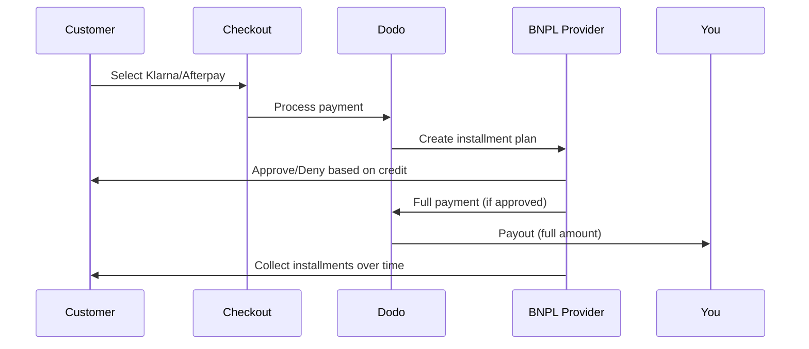

Mua ngay, thanh toán sau (BNPL) cho phép khách hàng chia nhỏ khoản chi tiêu thành các khoản thanh toán không lãi suất, tăng giá trị đơn hàng trung bình từ 20-50% và tỷ lệ chuyển đổi từ 10-30% cho các giao dịch đủ điều kiện.

## Tại sao nên cung cấp BNPL?

<CardGroup cols={3}>
<Card title="Giá trị đơn hàng cao hơn" icon="chart-line">
Khách hàng chi tiêu nhiều hơn khi họ có thể trả dần theo thời gian. Giá trị đơn hàng trung bình tăng từ 20-50%.
</Card>

<Card title="Tỷ lệ chuyển đổi tốt hơn" icon="percent">
Loại bỏ sự cản trở thanh toán tại thanh toán. Tỷ lệ chuyển đổi cải thiện từ 10-30% cho các mặt hàng có giá trị cao.
</Card>

<Card title="Không có rủi ro" icon="shield-check">
Các nhà cung cấp BNPL xử lý rủi ro tín dụng và thu hồi nợ. Bạn nhận được khoản thanh toán đầy đủ ngay từ đầu.
</Card>
</CardGroup>

## Các nhà cung cấp hỗ trợ

### Klarna

| Tính năng | Chi tiết |
| :------ | :------ |
| **Tính khả dụng** | Mỹ + 19 quốc gia châu Âu |
| **Tiền tệ** | USD, EUR, GBP, DKK, NOK, SEK, CZK, RON, PLN, CHF |
| **Số tiền tối thiểu** | $50.01 (hoặc tương đương) |
| **Đăng ký** | Không |

**Các quốc gia hỗ trợ:** Áo, Bỉ, Cộng hòa Séc, Đan Mạch, Phần Lan, Pháp, Đức, Hy Lạp, Ireland, Italy, Hà Lan, Na Uy, Ba Lan, Bồ Đào Nha, Romania, Tây Ban Nha, Thụy Điển, Thụy Sĩ, Vương quốc Anh, Hoa Kỳ

**Các tùy chọn thanh toán:**
- **Trả góp trong 4 kỳ** — Chia thành 4 khoản thanh toán không lãi suất
- **Thanh toán trong 30 ngày** — Toàn bộ khoản thanh toán được yêu cầu trong 30 ngày
- **Tài chính** — Kế hoạch trả góp dài hạn

### Afterpay (Clearpay)

| Tính năng | Chi tiết |
| :------ | :------ |
| **Tính khả dụng** | Mỹ, Vương quốc Anh |
| **Tiền tệ** | USD, GBP |
| **Số tiền tối thiểu** | $50.01 (hoặc tương đương) |
| **Đăng ký** | Không |

**Các tùy chọn thanh toán:**
- **Trả góp trong 4 kỳ** — 4 khoản thanh toán không lãi suất mỗi 2 tuần

<Note>
Tại Vương quốc Anh, Afterpay hoạt động dưới tên "Clearpay" nhưng sử dụng cùng loại API (`afterpay_clearpay`).
</Note>

### Billie

| Tính năng | Chi tiết |
| :------ | :------ |
| **Tính khả dụng** | Toàn cầu |
| **Tiền tệ** | GBP |
| **Số tiền tối thiểu** | Không |
| **Đăng ký** | Không |

**Về Billie:**
Billie là giải pháp mua ngay thanh toán sau B2B cho phép các doanh nghiệp cung cấp các điều khoản thanh toán linh hoạt cho khách hàng của họ. Nó được thiết kế cho các giao dịch giữa doanh nghiệp với doanh nghiệp, nơi người mua cần các tùy chọn thanh toán theo hóa đơn.

**Các tùy chọn thanh toán:**
- **Thanh toán hóa đơn** — Thanh toán trong thời hạn đã thỏa thuận
- **Điều khoản linh hoạt** — Lịch trình thanh toán thân thiện với doanh nghiệp

## Cấu hình

### Các loại phương thức API

| Loại | Nhà cung cấp |
| :--- | :------- |
| `klarna` | Klarna |
| `afterpay_clearpay` | Afterpay / Clearpay |
| `billie` | Billie (B2B) |

### Ví dụ

```javascript
const session = await client.checkoutSessions.create({
  product_cart: [{ product_id: 'prod_123', quantity: 1 }],
  allowed_payment_method_types: [
    'klarna',
    'afterpay_clearpay',
    'credit',
    'debit'
  ],
  customer: {
    email: 'customer@example.com',
    name: 'Jane Smith'
  },
  billing_address: {
    country: 'US',
    zipcode: '10001'
  },
  return_url: 'https://example.com/success'
});
```

<Warning>
Luôn bao gồm `credit` và `debit` như là các biện pháp dự phòng. Không phải tất cả khách hàng đều đủ điều kiện cho BNPL, và các giao dịch dưới $50.01 sẽ không đủ điều kiện.
</Warning>

## Số tiền giao dịch tối thiểu

**Cả Klarna và Afterpay yêu cầu số tiền tối thiểu là $50.01 USD** (hoặc tương đương trong các loại tiền tệ được hỗ trợ).

Các giao dịch dưới ngưỡng này:
- Các tùy chọn BNPL sẽ không xuất hiện tại thanh toán
- Không có lỗi nào được đưa ra — các tùy chọn đơn giản sẽ không hiển thị
- Các khoản thanh toán bằng thẻ vẫn khả dụng

Đây là hành vi dự kiến. Đừng bao gồm BNPL trong `allowed_payment_method_types` cho các sản phẩm dưới $50.

## Cách các khoản trả góp hoạt động



**Điểm chính:**
- Bạn nhận được **toàn bộ khoản thanh toán ngay** từ nhà cung cấp BNPL
- Nhà cung cấp BNPL xử lý **rủi ro tín dụng và thu hồi nợ**
- Khách hàng thanh toán cho nhà cung cấp trực tiếp trong **4 khoản trả góp** (thường thì)
- **Không có chargebacks** từ những lần trả góp không thành công — đó là rủi ro của nhà cung cấp

## Kiểm thử

### Dữ liệu kiểm thử Klarna

Sử dụng các thông tin này trong chế độ kiểm thử:

| Trường | Đã phê duyệt | Bị từ chối |
| :---- | :------- | :----- |
| **Ngày sinh** | 07-10-1970 | 07-10-1970 |
| **Tên** | Test | Test |
| **Họ** | Person-us | Person-us |
| **Email** | customer@email.us | customer+denied@email.us |
| **Đường phố** | Amsterdam Ave | Amsterdam Ave |
| **Số nhà** | 509 | 509 |
| **Thành phố** | New York | New York |
| **Tiểu bang** | New York | New York |
| **Mã bưu chính** | 10024-3941 | 10024-3941 |
| **Điện thoại** | +13106683312 | +13106354386 |

<Note>
Giao dịch phải có ít nhất $50 để Klarna xuất hiện như một tùy chọn.
</Note>

### Kiểm thử Afterpay

<Steps>
<Step title="Chọn Afterpay">
Chọn Afterpay tại thanh toán và nhấp vào Thanh toán.
</Step>

<Step title="Thanh toán thành công">
Sử dụng bất kỳ email và địa chỉ giao hàng hợp lệ nào.
</Step>

<Step title="Xác thực không thành công">
Để kiểm thử lỗi: đóng mô-đun Afterpay trên trang chuyển tiếp. Trạng thái thanh toán chuyển sang `requires_payment_method`.
</Step>
</Steps>

## Các phương pháp tốt nhất

<AccordionGroup>
<Accordion title="Nhắm mục tiêu vào các mặt hàng có giá trị cao">
BNPL hoạt động tốt nhất cho các sản phẩm từ $100-$1000. Giá trị thuyết phục của "trả dần" là mạnh mẽ nhất trong khoảng này.
</Accordion>

<Accordion title="Hiển thị số tiền trả góp">
"4 khoản thanh toán $25" thì hấp dẫn hơn "$100 với Klarna". Hiển thị số tiền mỗi đợt khi có thể.
</Accordion>

<Accordion title="Không ép buộc BNPL cho các sản phẩm giá trị thấp">
Dưới $50, BNPL sẽ không xuất hiện. Dưới $100, hầu hết khách hàng thích dùng thẻ. Tập trung quảng bá BNPL vào các mặt hàng có giá trị cao.
</Accordion>

<Accordion title="Thu thập địa chỉ thanh toán">
Các nhà cung cấp BNPL yêu cầu thông tin thanh toán để kiểm tra tín dụng. Đảm bảo quá trình thanh toán của bạn thu thập đầy đủ thông tin địa chỉ.
</Accordion>

<Accordion title="Đặt kỳ vọng rõ ràng">
Khách hàng cần hiểu rằng họ đang vào một hợp đồng tín dụng với Klarna/Afterpay, không phải với bạn.
</Accordion>
</AccordionGroup>

## Giới hạn

### Không có Đăng ký
Các phương thức thanh toán BNPL **không hỗ trợ thanh toán định kỳ**. Đối với các sản phẩm đăng ký, hãy sử dụng thẻ hoặc các phương thức tương thích với định kỳ khác.

### Phê duyệt dựa trên tín dụng
Các nhà cung cấp BNPL thực hiện kiểm tra tín dụng ngay lập tức. Không phải tất cả khách hàng đều được phê duyệt. Tỷ lệ phê duyệt khác nhau tùy theo:
- Lịch sử tín dụng của khách hàng với nhà cung cấp
- Số tiền giao dịch
- Địa điểm của khách hàng

### Phân loại tiền tệ và quốc gia

Mỗi loại tiền tệ chỉ được phép sử dụng trong khu vực tương ứng của nó:

| Tiền tệ | Các quốc gia hỗ trợ |
| :------- | :------------------ |
| **USD** | Chỉ của Hoa Kỳ |
| **EUR** | Tất cả các quốc gia Châu Âu được hỗ trợ (Áo, Bỉ, Cộng hòa Séc, Đan Mạch, Phần Lan, Pháp, Đức, Hy Lạp, Ireland, Italy, Hà Lan, Na Uy, Ba Lan, Bồ Đào Nha, Romania, Tây Ban Nha, Thụy Điển, Thụy Sĩ) |
| **GBP** | Vương quốc Anh và tất cả các quốc gia Châu Âu được hỗ trợ |

Các loại tiền tệ khác được Klarna hỗ trợ (DKK, NOK, SEK, CZK, RON, PLN, CHF) hoạt động tại các quốc gia tương ứng của chúng.

<Info>
Ví dụ, một giao dịch USD chỉ hiển thị các tùy chọn BNPL cho khách hàng tại Hoa Kỳ. Một giao dịch EUR sẽ hiển thị các tùy chọn BNPL trên tất cả các quốc gia châu Âu được hỗ trợ. Một giao dịch GBP sẽ hiển thị các tùy chọn BNPL cho khách hàng tại Vương quốc Anh và tất cả các quốc gia châu Âu được hỗ trợ.
</Info>

| Nhà cung cấp | Các loại tiền tệ hỗ trợ |
| :------- | :------------------- |
| Klarna | USD, EUR, GBP, DKK, NOK, SEK, CZK, RON, PLN, CHF |
| Afterpay | USD (Mỹ), GBP (Vương quốc Anh) |

## Khắc phục sự cố

<AccordionGroup>
<Accordion title="BNPL không xuất hiện tại thanh toán">
**Kiểm tra:**
1. Số tiền giao dịch ít nhất là $50.01?
2. Địa điểm khách hàng ở quốc gia được hỗ trợ?
3. Tiền tệ do nhà cung cấp BNPL hỗ trợ?
4. Phương thức BNPL có được bao gồm trong `allowed_payment_method_types` không?

**Giải pháp:** Thường thì giao dịch dưới mức tối thiểu. Xác minh số tiền đáp ứng ngưỡng $50.01.
</Accordion>

<Accordion title="Khách hàng bị từ chối bởi nhà cung cấp BNPL">
**Nguyên nhân:**
- Lịch sử tín dụng không đủ với nhà cung cấp
- Quá nhiều kế hoạch trả góp đang hoạt động
- Xác thực danh tính không thành công

**Giải pháp:** Điều này là dự kiến đối với một số khách hàng. Đảm bảo các biện pháp thay thế bằng thẻ có sẵn. Đừng tiết lộ lý do từ chối cụ thể.
</Accordion>

<Accordion title="Thanh toán bị kẹt trong trạng thái chờ">
**Nguyên nhân:** Khách hàng không hoàn tất quy trình xác thực với nhà cung cấp BNPL.

**Giải pháp:** Thanh toán sẽ hết hạn và thất bại. Khách hàng có thể thử lại hoặc sử dụng phương thức khác.
</Accordion>
</AccordionGroup>

## Các trang liên quan

<CardGroup cols={2}>
<Card title="Tổng quan về các phương thức thanh toán" icon="credit-card" href="/features/payment-methods">
Xem tất cả các phương thức thanh toán được hỗ trợ.
</Card>

<Card title="Hướng dẫn thanh toán" icon="book" href="/developer-resources/checkout-session">
Hướng dẫn hoàn chỉnh về triển khai thanh toán.
</Card>

<Card title="Quy trình kiểm thử" icon="flask" href="/miscellaneous/testing-process">
Tất cả dữ liệu kiểm thử cho các phương thức thanh toán.
</Card>

<Card title="Tiền tệ thích ứng" icon="globe" href="/features/adaptive-currency">
Hỗ trợ và chuyển đổi tiền tệ.
</Card>
</CardGroup>