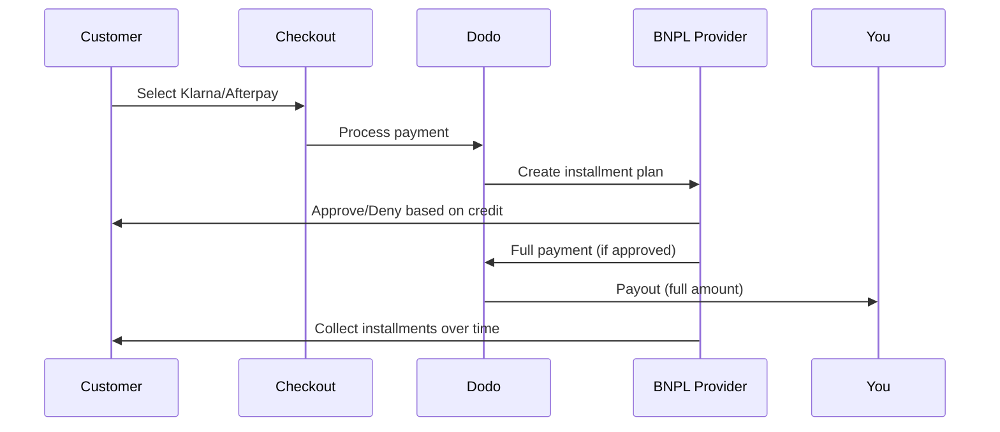

Mua Trước Trả Sau (BNPL) cho phép khách hàng chia khoản mua thành các kỳ thanh toán không lãi suất, tăng giá trị đơn hàng trung bình 20-50% và tỷ lệ chuyển đổi 10-30% cho các giao dịch đủ điều kiện.

## Tại sao nên cung cấp BNPL?

<CardGroup cols={3}>
<Card title="Higher AOV" icon="chart-line">
Khách hàng chi tiêu nhiều hơn khi họ có thể giãn các khoản thanh toán theo thời gian. Giá trị đơn hàng trung bình tăng 20-50%.
</Card>

<Card title="Better Conversion" icon="percent">
Giảm ma sát thanh toán khi thanh toán. Tỷ lệ chuyển đổi cải thiện 10-30% cho các mặt hàng giá trị cao.
</Card>

<Card title="Zero Risk" icon="shield-check">
Các nhà cung cấp BNPL xử lý rủi ro tín dụng và thu hồi nợ. Bạn nhận được toàn bộ khoản thanh toán ngay từ đầu.
</Card>
</CardGroup>

## Các nhà cung cấp hỗ trợ

### Klarna

| Tính năng | Chi tiết |
| :------ | :------ |
| **Khả dụng** | US + 19 European countries |
| **Đơn vị tiền tệ** | USD, EUR, GBP, DKK, NOK, SEK, CZK, RON, PLN, CHF |
| **Tối thiểu** | $50.01 (or equivalent) |
| **Đăng ký** | Không |

**Các quốc gia hỗ trợ:** Austria, Belgium, Czech Republic, Denmark, Finland, France, Germany, Greece, Ireland, Italy, Netherlands, Norway, Poland, Portugal, Romania, Spain, Sweden, Switzerland, United Kingdom, United States

**Các tùy chọn thanh toán:**
- **Pay in 4** — Chia thành 4 khoản thanh toán không lãi suất
- **Pay in 30 days** — Thanh toán đầy đủ sau 30 ngày
- **Financing** — Các kế hoạch trả góp dài hạn

### Afterpay (Clearpay)

| Tính năng | Chi tiết |
| :------ | :------ |
| **Khả dụng** | US, UK |
| **Đơn vị tiền tệ** | USD, GBP |
| **Tối thiểu** | $50.01 (or equivalent) |
| **Đăng ký** | Không |

**Các tùy chọn thanh toán:**
- **Pay in 4** — 4 khoản thanh toán không lãi suất mỗi 2 tuần

<Note>
Tại Vương quốc Anh, Afterpay hoạt động dưới tên “Clearpay” nhưng sử dụng cùng loại API (`afterpay_clearpay`).
</Note>

### Billie

| Tính năng | Chi tiết |
| :------ | :------ |
| **Khả dụng** | Global |
| **Đơn vị tiền tệ** | GBP |
| **Tối thiểu** | Không |
| **Đăng ký** | Không |

**Về Billie:**
Billie là giải pháp Mua Trước Trả Sau B2B cho phép các doanh nghiệp cung cấp điều khoản thanh toán linh hoạt cho khách hàng. Nó được thiết kế cho các giao dịch doanh nghiệp nơi người mua cần tùy chọn thanh toán theo hóa đơn.

**Các tùy chọn thanh toán:**
- **Invoice Payment** — Thanh toán trong thời hạn đã thỏa thuận
- **Flexible Terms** — Lịch trình thanh toán thân thiện với doanh nghiệp

### Sunbit

| Tính năng | Chi tiết |
| :------ | :------ |
| **Khả dụng** | Mỹ |
| **Tiền tệ** | USD |
| **Tối thiểu** | $60.00 |
| **Tối đa** | $19,999.00 |
| **Đăng ký** | Không |

**Tùy chọn Thanh toán:**
- **Tài chính Trả góp** — Chia nhỏ mua sắm thành các khoản thanh toán hàng tháng dễ quản lý

## Cấu hình

### Các Loại Phương pháp API

| Loại | Nhà cung cấp |
| :--- | :------- |
| `klarna` | Klarna |
| `afterpay_clearpay` | Afterpay / Clearpay |
| `billie` | Billie (B2B) |
| `sunbit` | Sunbit |

### Ví dụ

```javascript
const session = await client.checkoutSessions.create({
  product_cart: [{ product_id: 'prod_123', quantity: 1 }],
  allowed_payment_method_types: [
    'klarna',
    'afterpay_clearpay',
    'credit',
    'debit'
  ],
  customer: {
    email: 'customer@example.com',
    name: 'Jane Smith'
  },
  billing_address: {
    country: 'US',
    zipcode: '10001'
  },
  return_url: 'https://example.com/success'
});
```

<Warning>
Luôn bao gồm `credit` và `debit` làm phương án dự phòng. Không phải tất cả khách hàng đều đủ điều kiện cho BNPL, và giao dịch dưới mức tối thiểu của nhà cung cấp sẽ không đủ điều kiện.
</Warning>

## Giới hạn Số tiền Giao dịch

Mỗi nhà cung cấp BNPL có số tiền giao dịch tối thiểu (và đôi khi là tối đa) riêng:

| Nhà cung cấp | Tối thiểu | Tối đa |
| :------- | :------ | :------ |
| Klarna | $50.01 | — |
| Afterpay | $50.01 | — |
| Sunbit | $60.00 | $19,999.00 |

Các giao dịch ngoài ngưỡng này:
- Tùy chọn BNPL sẽ không hiển thị tại checkout
- Không có lỗi được tạo ra — các tùy chọn đơn giản là không xuất hiện
- Các thanh toán bằng thẻ vẫn có sẵn

Đây là hành vi mong đợi. Đừng bao gồm một phương pháp BNPL trong `allowed_payment_method_types` nếu giá sản phẩm của bạn không có khả năng nằm trong khoảng hỗ trợ của nhà cung cấp đó.

## Cách Hoạt động của Trả góp



**Các điểm chính:**
- Bạn nhận được **thanh toán đầy đủ trước** từ nhà cung cấp BNPL
- Nhà cung cấp BNPL xử lý **rủi ro tín dụng và thu nợ**
- Khách hàng thanh toán cho nhà cung cấp theo **4 đợt** (thông thường)
- **Không có bồi hoàn** từ các thất bại trả góp — đó là rủi ro của nhà cung cấp

## Kiểm tra

### Dữ liệu Kiểm tra Klarna

Sử dụng các chi tiết này ở chế độ kiểm tra:

| Trường | Chấp thuận | Từ chối |
| :---- | :------- | :----- |
| **Ngày sinh** | 07-10-1970 | 07-10-1970 |
| **Tên** | Test | Test |
| **Họ** | Person-us | Person-us |
| **Email** | customer@email.us | customer+denied@email.us |
| **Đường** | Amsterdam Ave | Amsterdam Ave |
| **Số nhà** | 509 | 509 |
| **Thành phố** | New York | New York |
| **Bang** | New York | New York |
| **Mã bưu điện** | 10024-3941 | 10024-3941 |
| **Điện thoại** | +13106683312 | +13106354386 |

<Note>
Giao dịch phải ít nhất $50 để Klarna xuất hiện như một tùy chọn.
</Note>

### Thử nghiệm Afterpay

<Steps>
<Step title="Select Afterpay">
Chọn Afterpay tại checkout và nhấp vào Thanh toán.
</Step>

<Step title="Successful payment">
Sử dụng bất kỳ email và địa chỉ giao hàng hợp lệ nào.
</Step>

<Step title="Failed authentication">
Để kiểm tra thất bại: đóng modal Afterpay trên trang chuyển hướng. Trạng thái thanh toán chuyển sang `requires_payment_method`.
</Step>
</Steps>

### Thử nghiệm Sunbit

<Steps>
<Step title="Set billing country and currency">
Đảm bảo phiên checkout có `billing_address.country` được đặt thành `US` và `billing_currency` được đặt thành `USD`.
</Step>

<Step title="Use a qualifying amount">
Đặt số tiền giao dịch giữa **$60.00 và $19,999.00**. Sunbit sẽ không xuất hiện ngoài khoảng này.
</Step>

<Step title="Select Sunbit">
Chọn Sunbit tại checkout và hoàn thành luồng ứng dụng tài chính trong modal Sunbit.
</Step>

<Step title="Test failure">
Để mô phỏng đơn xin bị từ chối, đóng modal Sunbit trước khi hoàn thành luồng. Thanh toán chuyển sang `requires_payment_method`.
</Step>
</Steps>

<Note>
Sunbit chỉ có sẵn cho khách hàng Mỹ thanh toán bằng USD với số tiền giao dịch giữa $60.00 và $19,999.00.
</Note>

## Thực hành Tốt nhất

<AccordionGroup>
<Accordion title="Target high-ticket items">
BNPL hoạt động tốt nhất cho các sản phẩm từ $100-$1000. Lợi ích "trả dần theo thời gian" là mạnh nhất trong khoảng này.
</Accordion>

<Accordion title="Show installment amounts">
"4 lần thanh toán $25" hấp dẫn hơn là "$100 với Klarna". Hiển thị số tiền thanh toán mỗi kỳ khi có thể.
</Accordion>

<Accordion title="Don't force BNPL for low-value products">
Dưới $50, BNPL sẽ không xuất hiện. Dưới $100, hầu hết các khách hàng đều thích dùng thẻ. Tập trung quảng bá BNPL cho các mặt hàng có giá trị cao hơn.
</Accordion>

<Accordion title="Collect billing address">
Các nhà cung cấp BNPL yêu cầu thông tin thanh toán cho kiểm tra tín dụng. Đảm bảo quá trình checkout của bạn thu thập đầy đủ thông tin địa chỉ.
</Accordion>

<Accordion title="Set clear expectations">
Khách hàng nên hiểu rằng họ đang tham gia vào một hợp đồng tín dụng với Klarna/Afterpay, không phải với bạn.
</Accordion>
</AccordionGroup>

## Giới hạn

### Không có Đăng ký
Phương thức thanh toán BNPL **không hỗ trợ thanh toán định kỳ**. Đối với các sản phẩm đăng ký, sử dụng thẻ hoặc các phương thức tương thích định kỳ khác.

### Phê duyệt Dựa trên Tín dụng
Các nhà cung cấp BNPL thực hiện các kiểm tra tín dụng ngay lập tức. Không phải tất cả khách hàng đều được phê duyệt. Tỷ lệ phê duyệt thay đổi dựa trên:
- Lịch sử tín dụng của khách hàng với nhà cung cấp
- Số tiền giao dịch
- Vị trí của khách hàng

### Ánh xạ Tiền tệ & Quốc gia

Mỗi loại tiền tệ bị giới hạn theo khu vực tương ứng:

| Tiền tệ | Các Quốc gia Hỗ trợ |
| :------- | :------------------ |
| **USD** | Chỉ có Hoa Kỳ |
| **EUR** | Tất cả các nước châu Âu hỗ trợ (Áo, Bỉ, Cộng hòa Séc, Đan Mạch, Phần Lan, Pháp, Đức, Hy Lạp, Ireland, Ý, Hà Lan, Na Uy, Ba Lan, Bồ Đào Nha, Romania, Tây Ban Nha, Thụy Điển, Thụy Sĩ) |
| **GBP** | Vương quốc Anh và tất cả các nước châu Âu hỗ trợ |

Các loại tiền tệ khác mà Klarna hỗ trợ (DKK, NOK, SEK, CZK, RON, PLN, CHF) hoạt động tại các nước tương ứng.

<Info>
Ví dụ, giao dịch USD chỉ hiển thị các tùy chọn BNPL cho khách hàng tại Mỹ. Giao dịch EUR sẽ hiển thị các tùy chọn BNPL trên tất cả các nước châu Âu hỗ trợ. Giao dịch GBP sẽ hiển thị các tùy chọn BNPL cho khách hàng tại Vương quốc Anh và tất cả các nước châu Âu hỗ trợ.
</Info>

| Nhà cung cấp | Các Tiền tệ Hỗ trợ |
| :------- | :------------------- |
| Klarna | USD, EUR, GBP, DKK, NOK, SEK, CZK, RON, PLN, CHF |
| Afterpay | USD (Mỹ), GBP (Anh) |
| Sunbit | USD (Mỹ) |

## Khắc phục sự cố

<AccordionGroup>
<Accordion title="BNPL not appearing at checkout">
**Kiểm tra:**
1. Số tiền giao dịch nằm trong phạm vi hỗ trợ của nhà cung cấp? (Klarna/Afterpay: tối thiểu $50.01; Sunbit: $60.00–$19,999.00)
2. Vị trí khách hàng tại quốc gia hỗ trợ?
3. Tiền tệ được BNPL hỗ trợ?
4. Phương pháp BNPL có được bao gồm trong `allowed_payment_method_types`?

**Giải pháp:** Thông thường, giao dịch dưới mức tối thiểu hoặc trên mức tối đa. Xác minh số tiền nằm trong phạm vi hỗ trợ của nhà cung cấp.
</Accordion>

<Accordion title="Customer denied by BNPL provider">
**Nguyên nhân:**
- Lịch sử tín dụng không đủ với nhà cung cấp
- Quá nhiều kế hoạch trả góp đang hoạt động
- Xác minh danh tính thất bại

**Giải pháp:** Đây là điều dự đoán được với một số khách hàng. Đảm bảo có phương án dự phòng thẻ. Không chia sẻ lý do từ chối cụ thể.
</Accordion>

<Accordion title="Payment stuck in pending">
**Nguyên nhân:** Khách hàng không hoàn thành luồng xác thực với nhà cung cấp BNPL.

**Giải pháp:** Thanh toán sẽ bị hết thời gian và thất bại. Khách hàng có thể thử lại hoặc sử dụng phương pháp khác.
</Accordion>
</AccordionGroup>

## Các Trang Liên Quan

<CardGroup cols={2}>
<Card title="Payment Methods Overview" icon="credit-card" href="/features/payment-methods">
Xem tất cả các phương thức thanh toán hỗ trợ.
</Card>

<Card title="Checkout Guide" icon="book" href="/developer-resources/checkout-session">
Hướng dẫn hoàn chỉnh về triển khai checkout.
</Card>

<Card title="Testing Process" icon="flask" href="/miscellaneous/testing-process">
Tất cả dữ liệu thử nghiệm cho các phương thức thanh toán.
</Card>

<Card title="Adaptive Currency" icon="globe" href="/features/adaptive-currency">
Hỗ trợ tiền tệ và chuyển đổi.
</Card>
</CardGroup>