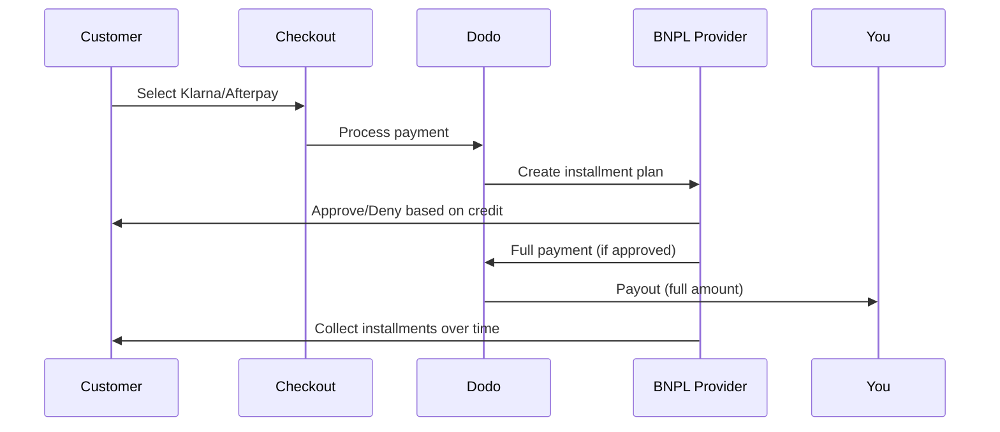

Mua Trước Trả Sau (BNPL) cho phép khách hàng chia khoản mua thành các kỳ thanh toán không lãi suất, tăng giá trị đơn hàng trung bình 20-50% và tỷ lệ chuyển đổi 10-30% cho các giao dịch đủ điều kiện.

## Tại sao nên cung cấp BNPL?

<CardGroup cols={3}>
<Card title="Higher AOV" icon="chart-line">
Khách hàng chi tiêu nhiều hơn khi họ có thể giãn các khoản thanh toán theo thời gian. Giá trị đơn hàng trung bình tăng 20-50%.
</Card>

<Card title="Better Conversion" icon="percent">
Giảm ma sát thanh toán khi thanh toán. Tỷ lệ chuyển đổi cải thiện 10-30% cho các mặt hàng giá trị cao.
</Card>

<Card title="Zero Risk" icon="shield-check">
Các nhà cung cấp BNPL xử lý rủi ro tín dụng và thu hồi nợ. Bạn nhận được toàn bộ khoản thanh toán ngay từ đầu.
</Card>
</CardGroup>

## Các nhà cung cấp hỗ trợ

### Klarna

| Tính năng | Chi tiết |
| :-------- | :------ |
| **Khả dụng** | Mỹ + 19 nước châu Âu |
| **Tiền tệ** | USD, EUR, GBP, DKK, NOK, SEK, CZK, RON, PLN, CHF |
| **Tối thiểu** | $50.01 (hoặc tương đương) |
| **Đăng ký** | Có |

**Các quốc gia hỗ trợ:** Austria, Belgium, Czech Republic, Denmark, Finland, France, Germany, Greece, Ireland, Italy, Netherlands, Norway, Poland, Portugal, Romania, Spain, Sweden, Switzerland, United Kingdom, United States

**Các tùy chọn thanh toán:**
- **Pay in 4** — Chia thành 4 khoản thanh toán không lãi suất
- **Pay in 30 days** — Thanh toán đầy đủ sau 30 ngày
- **Financing** — Các kế hoạch trả góp dài hạn

### Afterpay (Clearpay)

| Tính năng | Chi tiết |
| :------ | :------ |
| **Khả dụng** | US, UK |
| **Đơn vị tiền tệ** | USD, GBP |
| **Tối thiểu** | $50.01 (or equivalent) |
| **Đăng ký** | Không |

**Các tùy chọn thanh toán:**
- **Pay in 4** — 4 khoản thanh toán không lãi suất mỗi 2 tuần

<Note>
Tại Vương quốc Anh, Afterpay hoạt động dưới tên “Clearpay” nhưng sử dụng cùng loại API (`afterpay_clearpay`).
</Note>

### Billie

| Tính năng | Chi tiết |
| :------ | :------ |
| **Khả dụng** | Global |
| **Đơn vị tiền tệ** | GBP |
| **Tối thiểu** | Không |
| **Đăng ký** | Không |

**Về Billie:**
Billie là giải pháp Mua Trước Trả Sau B2B cho phép các doanh nghiệp cung cấp điều khoản thanh toán linh hoạt cho khách hàng. Nó được thiết kế cho các giao dịch doanh nghiệp nơi người mua cần tùy chọn thanh toán theo hóa đơn.

**Các tùy chọn thanh toán:**
- **Invoice Payment** — Thanh toán trong thời hạn đã thỏa thuận
- **Flexible Terms** — Lịch trình thanh toán thân thiện với doanh nghiệp

## Cấu hình

### Loại phương thức API

| Loại | Nhà cung cấp |
| :--- | :------- |
| `klarna` | Klarna |
| `afterpay_clearpay` | Afterpay / Clearpay |
| `billie` | Billie (B2B) |

### Ví dụ

```javascript
const session = await client.checkoutSessions.create({
  product_cart: [{ product_id: 'prod_123', quantity: 1 }],
  allowed_payment_method_types: [
    'klarna',
    'afterpay_clearpay',
    'credit',
    'debit'
  ],
  customer: {
    email: 'customer@example.com',
    name: 'Jane Smith'
  },
  billing_address: {
    country: 'US',
    zipcode: '10001'
  },
  return_url: 'https://example.com/success'
});
```

<Warning>
Luôn bao gồm `credit` và `debit` làm phương án dự phòng. Không phải tất cả khách hàng đều đủ điều kiện sử dụng BNPL và các giao dịch thấp hơn mức tối thiểu của nhà cung cấp sẽ không đủ điều kiện.
</Warning>

## Giới hạn số tiền giao dịch

Mỗi nhà cung cấp BNPL có mức tối thiểu riêng (và đôi khi có cả mức tối đa) cho số tiền giao dịch:

| Nhà cung cấp | Tối thiểu | Tối đa |
| :------- | :------ | :------ |
| Klarna | $50.01 | — |
| Afterpay | $50.01 | — |

Các giao dịch nằm ngoài những ngưỡng này:
- Tùy chọn BNPL sẽ không xuất hiện tại bước thanh toán
- Không phát sinh lỗi — các tùy chọn chỉ đơn giản là không hiển thị
- Thanh toán bằng thẻ vẫn khả dụng

Đây là hành vi được dự kiến. Không đưa phương thức BNPL vào `allowed_payment_method_types` nếu giá sản phẩm của bạn khó có khả năng nằm trong phạm vi được nhà cung cấp đó hỗ trợ.

## Cách thức hoạt động của hình thức trả góp



**Các điểm chính:**
- Bạn nhận **toàn bộ khoản thanh toán ngay lập tức** từ nhà cung cấp BNPL
- Nhà cung cấp BNPL chịu trách nhiệm xử lý **rủi ro tín dụng và thu hồi khoản nợ**
- Khách hàng thanh toán trực tiếp cho nhà cung cấp trong **4 kỳ trả góp** (thông thường)
- **Không có khoản bồi hoàn** do không thanh toán được các kỳ trả góp — đó là rủi ro của nhà cung cấp

## Kiểm thử

### Dữ liệu kiểm thử Klarna

Sử dụng các thông tin sau trong chế độ kiểm thử:

| Trường | Được chấp thuận | Bị từ chối |
| :---- | :------- | :----- |
| **Ngày sinh** | 07-10-1970 | 07-10-1970 |
| **Tên** | Test | Test |
| **Họ** | Person-us | Person-us |
| **Email** | customer@email.us | customer+denied@email.us |
| **Đường phố** | Amsterdam Ave | Amsterdam Ave |
| **Số nhà** | 509 | 509 |
| **Thành phố** | New York | New York |
| **Tiểu bang** | New York | New York |
| **Mã bưu chính** | 10024-3941 | 10024-3941 |
| **Số điện thoại** | +13106683312 | +13106354386 |

<Note>
Giao dịch phải có giá trị ít nhất $50 để Klarna xuất hiện dưới dạng một tùy chọn.
</Note>

### Kiểm thử Afterpay

<Steps>
<Step title="Select Afterpay">
Chọn Afterpay tại bước thanh toán và nhấp vào Pay.
</Step>

<Step title="Successful payment">
Sử dụng bất kỳ email và địa chỉ giao hàng hợp lệ nào.
</Step>

<Step title="Failed authentication">
Để kiểm thử trường hợp thất bại: đóng cửa sổ phương thức Afterpay trên trang chuyển hướng. Trạng thái thanh toán chuyển sang `requires_payment_method`.
</Step>
</Steps>

## Thực tiễn tốt nhất

<AccordionGroup>
<Accordion title="Target high-ticket items">
BNPL hoạt động hiệu quả nhất đối với các sản phẩm có giá từ $100-$1000. Đề xuất giá trị của việc "thanh toán theo thời gian" hấp dẫn nhất trong phạm vi này.
</Accordion>

<Accordion title="Show installment amounts">
"4 khoản thanh toán, mỗi khoản $25" hấp dẫn hơn "$100 với Klarna". Khi có thể, hãy hiển thị số tiền của từng khoản thanh toán.
</Accordion>

<Accordion title="Don't force BNPL for low-value products">
Dưới $50, BNPL sẽ không xuất hiện. Dưới $100, hầu hết khách hàng предпочитають thẻ hơn. Hãy tập trung quảng bá BNPL cho các mặt hàng có giá trị cao hơn.
</Accordion>

<Accordion title="Collect billing address">
Nhà cung cấp BNPL yêu cầu thông tin thanh toán để kiểm tra tín dụng. Đảm bảo bước thanh toán của bạn thu thập đầy đủ thông tin địa chỉ.
</Accordion>

<Accordion title="Set clear expectations">
Khách hàng cần hiểu rằng họ đang ký một thỏa thuận tín dụng với Klarna/Afterpay, không phải với bạn.
</Accordion>
</AccordionGroup>

## Giới hạn

### Không hỗ trợ gói đăng ký
Các phương thức thanh toán BNPL **không hỗ trợ thanh toán định kỳ**. Đối với sản phẩm dạng gói đăng ký, hãy sử dụng thẻ hoặc các phương thức khác hỗ trợ thanh toán định kỳ.

### Phê duyệt dựa trên tín dụng
Nhà cung cấp BNPL thực hiện kiểm tra tín dụng tức thì. Không phải tất cả khách hàng đều được phê duyệt. Tỷ lệ phê duyệt thay đổi tùy theo:
- Lịch sử tín dụng của khách hàng với nhà cung cấp
- Số tiền giao dịch
- Vị trí của khách hàng

### Ánh xạ tiền tệ và quốc gia

Mỗi loại tiền tệ bị giới hạn ở khu vực tương ứng:

| Tiền tệ | Quốc gia được hỗ trợ |
| :------- | :------------------ |
| **USD** | Chỉ Hoa Kỳ |
| **EUR** | Tất cả các quốc gia châu Âu được hỗ trợ (Áo, Bỉ, Cộng hòa Séc, Đan Mạch, Phần Lan, Pháp, Đức, Hy Lạp, Ireland, Ý, Hà Lan, Na Uy, Ba Lan, Bồ Đào Nha, Romania, Tây Ban Nha, Thụy Điển, Thụy Sĩ) |
| **GBP** | Vương quốc Anh và tất cả các quốc gia châu Âu được hỗ trợ |

Các loại tiền tệ khác được Klarna hỗ trợ (DKK, NOK, SEK, CZK, RON, PLN, CHF) hoạt động tại các quốc gia tương ứng.

<Info>
Ví dụ: giao dịch USD sẽ chỉ hiển thị các tùy chọn BNPL cho khách hàng ở Hoa Kỳ. Giao dịch EUR sẽ hiển thị các tùy chọn BNPL tại tất cả các quốc gia châu Âu được hỗ trợ. Giao dịch GBP sẽ hiển thị các tùy chọn BNPL cho khách hàng ở Vương quốc Anh và tất cả các quốc gia châu Âu được hỗ trợ.
</Info>

| Nhà cung cấp | Tiền tệ được hỗ trợ |
| :------- | :------------------- |
| Klarna | USD, EUR, GBP, DKK, NOK, SEK, CZK, RON, PLN, CHF |
| Afterpay | USD (US), GBP (UK) |

## Khắc phục sự cố

<AccordionGroup>
<Accordion title="BNPL not appearing at checkout">
**Kiểm tra:**
1. Số tiền giao dịch có nằm trong phạm vi được nhà cung cấp hỗ trợ không? (Klarna/Afterpay: tối thiểu $50.01)
2. Vị trí của khách hàng có nằm trong quốc gia được hỗ trợ không?
3. Nhà cung cấp BNPL có hỗ trợ loại tiền tệ này không?
4. Phương thức BNPL có được đưa vào `allowed_payment_method_types` không?

**Giải pháp:** Thông thường, giao dịch thấp hơn mức tối thiểu hoặc cao hơn mức tối đa. Xác minh số tiền nằm trong phạm vi được nhà cung cấp hỗ trợ.
</Accordion>

<Accordion title="Customer denied by BNPL provider">
**Nguyên nhân:**
- Lịch sử tín dụng không đủ với nhà cung cấp
- Có quá nhiều kế hoạch trả góp đang hoạt động
- Xác minh danh tính không thành công

**Giải pháp:** Đây là điều dự kiến đối với một số khách hàng. Đảm bảo có sẵn các phương án thanh toán dự phòng bằng thẻ. Không hiển thị lý do từ chối cụ thể.
</Accordion>

<Accordion title="Payment stuck in pending">
**Nguyên nhân:** Khách hàng chưa hoàn tất quy trình xác thực với nhà cung cấp BNPL.

**Giải pháp:** Thanh toán sẽ hết thời gian chờ và thất bại. Khách hàng có thể thử lại hoặc sử dụng phương thức khác.
</Accordion>
</AccordionGroup>

## Các trang liên quan

<CardGroup cols={2}>
<Card title="Payment Methods Overview" icon="credit-card" href="/features/payment-methods">
Xem tất cả các phương thức thanh toán được hỗ trợ.
</Card>

<Card title="Checkout Guide" icon="book" href="/developer-resources/checkout-session">
Hướng dẫn hoàn chỉnh về triển khai bước thanh toán.
</Card>

<Card title="Testing Process" icon="flask" href="/miscellaneous/testing-process">
Tất cả dữ liệu kiểm thử cho các phương thức thanh toán.
</Card>

<Card title="Adaptive Currency" icon="globe" href="/features/adaptive-currency">
Hỗ trợ và chuyển đổi tiền tệ.
</Card>
</CardGroup>