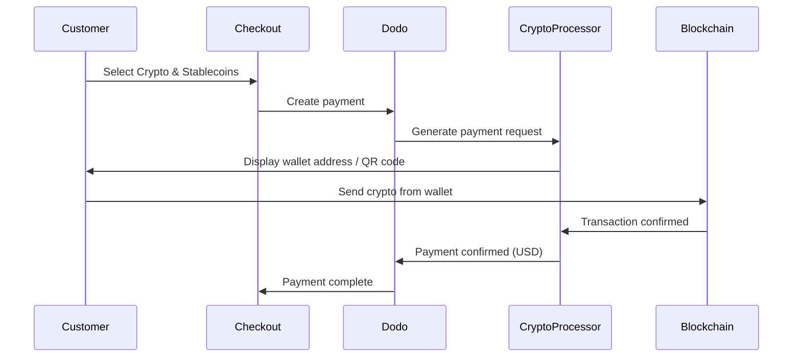

Thanh toán bằng Crypto & Stablecoins cho phép khách hàng trả tiền bằng tiền điện tử và stablecoin từ bất kỳ nơi nào trên thế giới (trừ Ấn Độ). Các giao dịch được tính bằng USD, vì vậy bạn nhận được tiền fiat trong khi khách hàng thanh toán bằng ví tiền điện tử ưa thích của họ.

## Tại sao cung cấp Crypto & Stablecoins?

<CardGroup cols={3}>
<Card title="Global Reach" icon="globe">
Chấp nhận thanh toán từ bất kỳ quốc gia nào — không yêu cầu cơ sở hạ tầng ngân hàng từ phía khách hàng.
</Card>

<Card title="No Chargebacks" icon="shield-check">
Các giao dịch bằng tiền điện tử không thể đảo ngược, loại bỏ hoàn toàn gian lận thu hồi thanh toán.
</Card>

<Card title="USD Settlement" icon="dollar-sign">
Bạn nhận được USD — không cần quản lý sự biến động của tiền điện tử hoặc ví.
</Card>
</CardGroup>

## Tổng quan

| Chi tiết | Giá trị |
| :----- | :---- |
| **Billing Currency** | USD |
| **Supported Countries** | Toàn cầu (Trừ IN) |
| **Subscriptions** | Không |
| **Min Amount** | $0.50 |
| **Settlement** | USD |

## Cách hoạt động



## Trải nghiệm của Khách hàng

1. Khách hàng chọn Crypto & Stablecoins tại checkout
2. Địa chỉ ví và mã QR được hiển thị với số tiền bằng tiền điện tử
3. Khách hàng gửi số tiền chính xác từ ví tiền điện tử của họ
4. Giao dịch được xác nhận trên blockchain
5. Khách hàng được chuyển hướng đến trang thành công

<Info>
Thanh toán bằng tiền điện tử được tính bằng USD. Số tiền bằng tiền điện tử hiển thị tại checkout phản ánh tỷ giá hối đoái thực tế tại thời điểm thanh toán.
</Info>

## Các loại tiền tệ & mạng lưới hỗ trợ

| Currency | Networks |
| :------- | :------- |
| **USDC** | Ethereum, Solana, Polygon, Base |
| **USDP** | Ethereum, Solana |
| **USDG** | Ethereum |

## Cấu hình

```javascript
const session = await client.checkoutSessions.create({
  product_cart: [{ product_id: 'prod_123', quantity: 1 }],
  allowed_payment_method_types: ['crypto', 'credit', 'debit'],
  return_url: 'https://example.com/success'
});
```

## Loại phương thức API

| Type | Method | Country |
| :--- | :----- | :------ |
| `crypto` | Crypto & Stablecoins | Toàn cầu (Trừ IN) |

## Kiểm tra

<Steps>
<Step title="Enable test mode">
Sử dụng khóa API thử nghiệm của Dodo Payments.
</Step>

<Step title="Create a test checkout">
Tạo một phiên checkout với `crypto` trong các phương thức thanh toán được phép.
</Step>

<Step title="Complete the test flow">
Theo dõi luồng thanh toán tiền điện tử mô phỏng trong môi trường thử nghiệm.
</Step>
</Steps>

## Thực hành tốt nhất

<AccordionGroup>
<Accordion title="Always include card fallbacks">
Không phải tất cả khách hàng đều có ví tiền điện tử. Luôn bao gồm `credit` và `debit` như các phương thức thanh toán dự phòng.
</Accordion>

<Accordion title="Set clear expectations on confirmation time">
Xác nhận trên blockchain có thể mất vài phút tùy thuộc vào mạng lưới. Đảm bảo quy trình checkout của bạn thông báo điều này cho khách hàng.
</Accordion>

<Accordion title="Handle underpayments and overpayments">
Các khoản thanh toán bằng tiền điện tử đôi khi có thể khác một chút so với số tiền chính xác do phí mạng lưới. Theo dõi webhook để cập nhật trạng thái thanh toán.
</Accordion>
</AccordionGroup>

## Xử lý sự cố

<AccordionGroup>
<Accordion title="Crypto not appearing at checkout">
**Check:**
1. `crypto` có được bao gồm trong `allowed_payment_method_types` không?
2. Số tiền giao dịch có đạt tối thiểu ($0,50) không?

**Giải pháp:** Xác minh loại phương thức thanh toán được chuyển đúng trong yêu cầu API của bạn.
</Accordion>

<Accordion title="Payment not confirming">
**Nguyên nhân:** Thời gian xác nhận trên blockchain thay đổi. Một số mạng lưới mất nhiều thời gian hơn những mạng khác.

**Giải pháp:** Chờ xác nhận webhook. Không coi thanh toán là thất bại cho đến khi cửa sổ xác nhận đã qua.
</Accordion>

<Accordion title="Amount mismatch">
**Nguyên nhân:** Tỷ giá trao đổi tiền điện tử biến động giữa thời điểm thanh toán được khởi tạo và khi nó được gửi.

**Giải pháp:** Theo dõi webhook cho số tiền xác nhận cuối cùng. Chênh lệch nhỏ được xử lý tự động.
</Accordion>
</AccordionGroup>

## Trang liên quan

<CardGroup cols={2}>
<Card title="Payment Methods Overview" icon="credit-card" href="/features/payment-methods">
Xem tất cả các phương thức thanh toán hỗ trợ.
</Card>

<Card title="Checkout Guide" icon="book" href="/developer-resources/checkout-session">
Hướng dẫn hoàn chỉnh thực hiện quy trình checkout.
</Card>

<Card title="Webhooks" icon="webhook" href="/developer-resources/webhooks">
Xử lý xác nhận thanh toán không đồng bộ.
</Card>

<Card title="Testing Process" icon="flask" href="/miscellaneous/testing-process">
Hướng dẫn kiểm tra hoàn chỉnh cho tất cả các phương thức thanh toán.
</Card>
</CardGroup>
