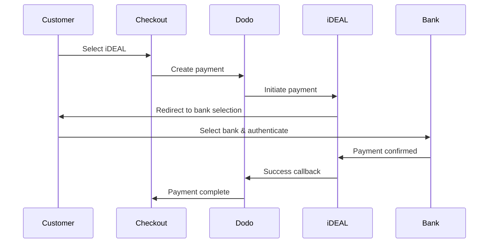

Khách hàng châu Âu rất thích các phương thức thanh toán địa phương tích hợp với hệ thống ngân hàng của họ. Việc cung cấp các phương thức này có thể tăng tỷ lệ chuyển đổi lên 20-40% ở các thị trường mục tiêu.

## Tại sao lại cần phương thức thanh toán địa phương châu Âu?

<CardGroup cols={3}>
<Card title="Tỷ lệ chuyển đổi cao" icon="chart-line">
iDEAL chiếm ~60% các thanh toán trực tuyến tại Hà Lan. Không cung cấp nó có nghĩa là mất khách hàng.
</Card>

<Card title="Giảm gian lận" icon="shield-check">
Các thanh toán được xác thực qua ngân hàng có tỷ lệ gian lận gần như bằng không và không có hoàn tiền.
</Card>

<Card title="Thanh toán Đúng thời gian" icon="bolt">
Hầu hết các phương thức châu Âu cung cấp xác nhận thanh toán tức thì.
</Card>
</CardGroup>

## Các phương thức được hỗ trợ

| Phương thức | Quốc gia | Thị phần | Tiền tệ | Đăng ký |
| :----- | :------ | :----------- | :------- | :-----------: |
| **iDEAL** | Hà Lan | ~60% | EUR | Không |
| **Bancontact** | Bỉ | ~50% | EUR | Không |
| **EPS** | Áo | ~30% | EUR | Không |
| **Multibanco** | Bồ Đào Nha | ~40% | EUR | Không |

## iDEAL (Hà Lan)

iDEAL là phương thức thanh toán trực tuyến chiếm ưu thế tại Hà Lan, kết nối trực tiếp với tất cả các ngân hàng lớn của Hà Lan.

### Cách thức hoạt động



### Các ngân hàng được hỗ trợ

Tất cả các ngân hàng lớn ở Hà Lan đều được hỗ trợ:
- ABN AMRO
- ASN Bank
- Bunq
- ING
- Knab
- Rabobank
- RegioBank
- Revolut
- SNS
- Triodos Bank
- Van Lanschot

### Cấu hình

```javascript
const session = await client.checkoutSessions.create({
  product_cart: [{ product_id: 'prod_123', quantity: 1 }],
  allowed_payment_method_types: ['ideal', 'credit', 'debit'],
  billing_currency: 'EUR',
  billing_address: {
    country: 'NL',
    zipcode: '1012JS'
  },
  return_url: 'https://example.com/success'
});
```

## Bancontact (Bỉ)

Bancontact là hệ thống thanh toán quốc gia của Bỉ, được hầu hết tất cả các ngân hàng Bỉ sử dụng cho thanh toán trực tuyến.

### Tính năng
- Hoạt động với các thẻ ghi nợ Bỉ hiện có
- Hỗ trợ ứng dụng di động (Payconiq by Bancontact)
- Xác nhận thanh toán tức thì
- Không cần đăng ký bổ sung cho khách hàng

### Cấu hình

```javascript
const session = await client.checkoutSessions.create({
  product_cart: [{ product_id: 'prod_123', quantity: 1 }],
  allowed_payment_method_types: ['bancontact_card', 'credit', 'debit'],
  billing_currency: 'EUR',
  billing_address: {
    country: 'BE',
    zipcode: '1000'
  },
  return_url: 'https://example.com/success'
});
```

## EPS (Áo)

EPS (Tiêu chuẩn Thanh toán điện tử) cho phép chuyển khoản ngân hàng trực tiếp cho khách hàng Áo.

### Tính năng
- Tích hợp trực tiếp với các ngân hàng Áo
- Xác nhận thanh toán theo thời gian thực
- Độ tin cậy cao trong số người tiêu dùng Áo
- Không có hoàn tiền

### Các ngân hàng được hỗ trợ

Các ngân hàng lớn của Áo bao gồm:
- Erste Bank
- Bank Austria
- Raiffeisen
- BAWAG
- Volksbank

### Cấu hình

```javascript
const session = await client.checkoutSessions.create({
  product_cart: [{ product_id: 'prod_123', quantity: 1 }],
  allowed_payment_method_types: ['eps', 'credit', 'debit'],
  billing_currency: 'EUR',
  billing_address: {
    country: 'AT',
    zipcode: '1010'
  },
  return_url: 'https://example.com/success'
});
```

## Multibanco (Bồ Đào Nha)

Multibanco là mạng lưới ngân hàng liên ngân hàng của Bồ Đào Nha, cung cấp cả thanh toán trực tuyến và dựa trên ATM.

### Tùy chọn thanh toán

1. **Ngân hàng trực tuyến** — Chuyển khoản ngân hàng trực tiếp qua ngân hàng trực tuyến
2. **Thanh toán qua ATM** — Khách hàng nhận được một mã tham chiếu để thanh toán tại bất kỳ ATM Multibanco nào
3. **Ngân hàng di động** — Thanh toán qua các ứng dụng ngân hàng di động

### Cách thức hoạt động của thanh toán qua ATM

Đối với thanh toán qua ATM, khách hàng nhận được một mã tham chiếu thanh toán:

```
Entity: 12345
Reference: 123 456 789
Amount: €50.00
Expiry: 24 hours
```

Khách hàng có thể thanh toán tại bất kỳ ATM nào của Bồ Đào Nha hoặc qua ngân hàng trực tuyến bằng cách sử dụng mã tham chiếu này.

### Cấu hình

```javascript
const session = await client.checkoutSessions.create({
  product_cart: [{ product_id: 'prod_123', quantity: 1 }],
  allowed_payment_method_types: ['multibanco', 'credit', 'debit'],
  billing_currency: 'EUR',
  billing_address: {
    country: 'PT',
    zipcode: '1000-001'
  },
  return_url: 'https://example.com/success'
});
```

<Note>
Thanh toán qua ATM Multibanco có thể có độ trễ giữa thời điểm thanh toán và thanh toán thực tế. Theo dõi webhooks để xác nhận thanh toán.
</Note>

## Các loại phương thức API

| Loại | Phương thức | Quốc gia |
| :--- | :----- | :------ |
| `ideal` | iDEAL | Hà Lan |
| `bancontact_card` | Bancontact | Bỉ |
| `eps` | EPS | Áo |
| `multibanco` | Multibanco | Bồ Đào Nha |

## Thanh toán đa quốc gia châu Âu

Đối với các doanh nghiệp phục vụ nhiều quốc gia châu Âu, hãy bao gồm tất cả các phương thức theo vùng:

```javascript
const session = await client.checkoutSessions.create({
  product_cart: [{ product_id: 'prod_123', quantity: 1 }],
  allowed_payment_method_types: [
    'ideal',           // Netherlands
    'bancontact_card', // Belgium
    'eps',             // Austria
    'multibanco',      // Portugal
    'credit',          // Fallback
    'debit'            // Fallback
  ],
  billing_currency: 'EUR',
  return_url: 'https://example.com/success'
});
```

Dodo tự động chỉ hiển thị các phương thức liên quan dựa trên vị trí của khách hàng. Một khách hàng Hà Lan sẽ thấy iDEAL; một khách hàng Bỉ sẽ thấy Bancontact.

## Kiểm tra

Các phương thức thanh toán châu Âu có thể được kiểm tra trong chế độ sandbox. Quy trình thử nghiệm mô phỏng quy trình xác thực ngân hàng.

<Steps>
<Step title="Kích hoạt chế độ thử nghiệm">
Sử dụng khóa API thử nghiệm của Dodo Payments.
</Step>

<Step title="Đặt địa chỉ thanh toán phù hợp">
Đặt quốc gia địa chỉ thanh toán để phù hợp với phương thức thanh toán:
- `NL` cho iDEAL
- `BE` cho Bancontact
- `AT` cho EPS
- `PT` cho Multibanco
</Step>

<Step title="Hoàn thành quy trình thử nghiệm">
Theo dõi quy trình xác thực ngân hàng mô phỏng trong môi trường thử nghiệm.
</Step>
</Steps>

## Thực hành tốt nhất

<AccordionGroup>
<Accordion title="Luôn bao gồm các phương thức theo vùng cho thị trường mục tiêu">
Nếu bạn bán cho khách hàng Hà Lan, hãy bao gồm iDEAL. Không làm như vậy giống như không chấp nhận Visa ở Mỹ — bạn sẽ mất doanh thu đáng kể.
</Accordion>

<Accordion title="Khớp tiền tệ với khu vực">
Các phương thức thanh toán châu Âu yêu cầu EUR. Đảm bảo giá của bạn hỗ trợ giao dịch Euro.
</Accordion>

<Accordion title="Xử lý chuyển hướng một cách khéo léo">
Tất cả các phương thức châu Âu đều liên quan đến việc chuyển hướng đến các trang web của ngân hàng. Đảm bảo xử lý URL trả về của bạn là chắc chắn và tính đến người dùng từ bỏ giữa quy trình.
</Accordion>

<Accordion title="Cung cấp các phương thức dự phòng thẻ">
Không phải tất cả khách hàng châu Âu đều có quyền truy cập vào các phương thức địa phương này (khách du lịch, người nước ngoài, v.v.). Luôn bao gồm `credit` và `debit` như các phương thức dự phòng.
</Accordion>

<Accordion title="Xem xét thời gian thanh toán Multibanco">
Thanh toán qua ATM Multibanco có thể mất vài giờ để hoàn thành. Đừng ngăn cản việc thực hiện dựa trên việc thanh toán ngay lập tức — hãy sử dụng webhooks để xác nhận không đồng bộ.
</Accordion>
</AccordionGroup>

## Khắc phục sự cố

<AccordionGroup>
<Accordion title="Phương thức châu Âu không xuất hiện">
**Kiểm tra:**
1. Quốc gia thanh toán của khách hàng có khớp với quốc gia của phương thức không?
2. Tiền tệ có được đặt là EUR không?
3. Phương thức có được bao gồm trong `allowed_payment_method_types` không?

**Giải pháp:** Các phương thức châu Âu rất nghiêm ngặt theo vùng. Một khách hàng có quốc gia thanh toán `DE` (Đức) sẽ không thấy iDEAL, chỉ dành riêng cho Hà Lan.
</Accordion>

<Accordion title="Xác thực ngân hàng thất bại">
**Nguyên nhân:**
- Khách hàng đã hủy bỏ trong quá trình xác thực ngân hàng
- Hệ thống xác thực của ngân hàng tạm thời không khả dụng
- Khách hàng đã nhập thông tin không chính xác


**Giải pháp:** Khách hàng nên thử lại. Nếu vẫn không được, đề nghị thử một phương thức thanh toán khác.
</Accordion>

<Accordion title="Chuyển hướng không hoàn tất">
**Nguyên nhân:**
- Khách hàng đã đóng trình duyệt trong quá trình chuyển hướng ngân hàng
- Vấn đề mạng trong quá trình xác thực
- URL trả về bị cấu hình sai


**Giải pháp:** Xác minh URL trả về là chính xác và có thể truy cập. Đảm bảo nó xử lý cả trạng thái thành công và thất bại.
</Accordion>

<Accordion title="Thanh toán Multibanco đang chờ xử lý">
**Nguyên nhân:** Khách hàng đã nhận được mã tham chiếu thanh toán nhưng chưa thanh toán.


**Giải pháp:** Điều này được mong đợi đối với các khoản thanh toán dựa trên ATM. Chờ xác nhận webhook. Mã tham chiếu thường sẽ hết hạn trong 24-72 giờ.
</Accordion>
</AccordionGroup>

## Tuân thủ PSD2

Tất cả các phương thức thanh toán châu Âu đều tuân thủ các quy định của PSD2 (Chỉ thị dịch vụ thanh toán 2):

- **Xác thực khách hàng mạnh (SCA)** — Được tích hợp trong quy trình xác thực ngân hàng
- **Giao tiếp an toàn** — Tất cả dữ liệu được truyền qua các kênh an toàn
- **Bảo vệ người tiêu dùng** — Tuân thủ đầy đủ các quyền của người tiêu dùng EU

## Các trang liên quan

<CardGroup cols={2}>
<Card title="Tổng quan về các phương thức thanh toán" icon="credit-card" href="/features/payment-methods">
Xem tất cả các phương thức thanh toán được hỗ trợ.
</Card>

<Card title="Tiền tệ thích ứng" icon="globe" href="/features/adaptive-currency">
Hỗ trợ tiền tệ và chuyển đổi tự động.
</Card>

<Card title="Hướng dẫn thanh toán" icon="book" href="/developer-resources/checkout-session">
Hướng dẫn triển khai thanh toán hoàn chỉnh.
</Card>

<Card title="Webhooks" icon="webhook" href="/developer-resources/webhooks">
Xử lý xác nhận thanh toán không đồng bộ.
</Card>
</CardGroup>