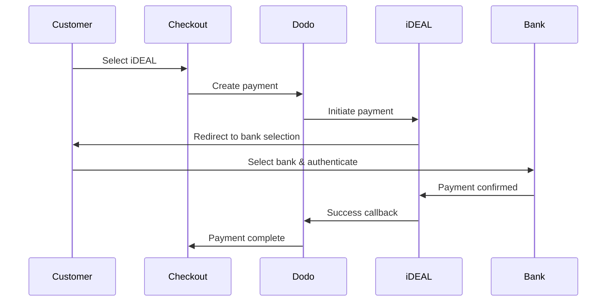
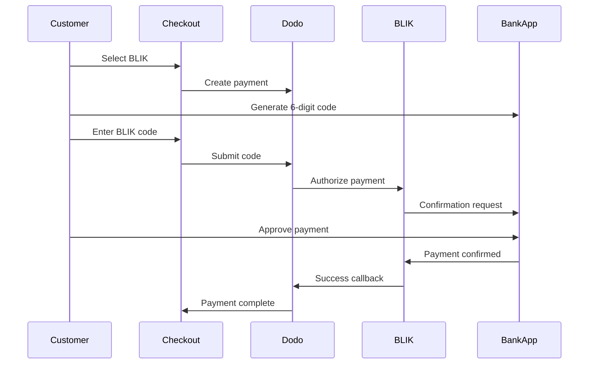

Khách hàng châu Âu đặc biệt ưa chuộng các phương thức thanh toán nội địa tích hợp với hệ thống ngân hàng của họ. Việc cung cấp các phương thức này có thể tăng tỷ lệ chuyển đổi từ 20-40% tại các thị trường mục tiêu.

## Tại sao nên cung cấp phương thức thanh toán nội địa tại châu Âu?

<CardGroup cols={3}>
<Card title="Higher Conversion" icon="chart-line">
iDEAL chiếm khoảng 60% các khoản thanh toán trực tuyến tại Hà Lan. Không cung cấp phương thức này đồng nghĩa với việc mất khách hàng.
</Card>

<Card title="Lower Fraud" icon="shield-check">
Các khoản thanh toán được ngân hàng xác thực có tỷ lệ gian lận gần như bằng không và không có chargeback.
</Card>

<Card title="Real-Time Settlement" icon="bolt">
Hầu hết các phương thức thanh toán tại châu Âu đều cung cấp xác nhận thanh toán tức thì.
</Card>
</CardGroup>

## Các phương thức được hỗ trợ

| Phương thức | Quốc gia | Thị phần | Tiền tệ | Gói đăng ký |
| :----- | :------ | :----------- | :------- | :-----------: |
| **iDEAL** | Hà Lan | ~60% | EUR | Không |
| **Bancontact** | Bỉ | ~50% | EUR | Không |
| **EPS** | Áo | ~30% | EUR | Không |
| **Multibanco** | Bồ Đào Nha | ~40% | EUR | Không |
| **BLIK** | Ba Lan | ~60% | PLN | Không |
| **SEPA Direct Debit** | Khu vực Eurozone | Được sử dụng rộng rãi | EUR | Không |
| **Satispay** | Châu Âu (Ý) | Đang tăng trưởng | EUR | Có |

## iDEAL (Hà Lan)

iDEAL là phương thức thanh toán trực tuyến phổ biến nhất tại Hà Lan, kết nối trực tiếp với tất cả các ngân hàng lớn của Hà Lan.

### Cách thức hoạt động



### Các ngân hàng được hỗ trợ

Tất cả các ngân hàng lớn của Hà Lan đều được hỗ trợ:
- ABN AMRO
- ASN Bank
- Bunq
- ING
- Knab
- Rabobank
- RegioBank
- Revolut
- SNS
- Triodos Bank
- Van Lanschot

### Cấu hình

```javascript
const session = await client.checkoutSessions.create({
  product_cart: [{ product_id: 'pdt_123', quantity: 1 }],
  allowed_payment_method_types: ['ideal', 'credit', 'debit'],
  billing_currency: 'EUR',
  billing_address: {
    country: 'NL',
    zipcode: '1012JS'
  },
  return_url: 'https://example.com/success'
});
```

## Bancontact (Bỉ)

Bancontact là hệ thống thanh toán quốc gia của Bỉ, được hầu hết các ngân hàng Bỉ sử dụng cho thanh toán trực tuyến.

### Tính năng
- Hoạt động với các thẻ ghi nợ hiện có của Bỉ
- Hỗ trợ ứng dụng di động (Payconiq by Bancontact)
- Xác nhận thanh toán tức thì
- Khách hàng không cần đăng ký thêm

### Cấu hình

```javascript
const session = await client.checkoutSessions.create({
  product_cart: [{ product_id: 'pdt_123', quantity: 1 }],
  allowed_payment_method_types: ['bancontact_card', 'credit', 'debit'],
  billing_currency: 'EUR',
  billing_address: {
    country: 'BE',
    zipcode: '1000'
  },
  return_url: 'https://example.com/success'
});
```

## EPS (Áo)

EPS (Electronic Payment Standard) cho phép khách hàng Áo thực hiện chuyển khoản ngân hàng trực tuyến trực tiếp.

### Tính năng
- Tích hợp trực tiếp với các ngân hàng Áo
- Xác nhận thanh toán theo thời gian thực
- Được người tiêu dùng Áo tin tưởng
- Không có chargeback

### Các ngân hàng được hỗ trợ

Các ngân hàng lớn của Áo bao gồm:
- Erste Bank
- Bank Austria
- Raiffeisen
- BAWAG
- Volksbank

### Cấu hình

```javascript
const session = await client.checkoutSessions.create({
  product_cart: [{ product_id: 'pdt_123', quantity: 1 }],
  allowed_payment_method_types: ['eps', 'credit', 'debit'],
  billing_currency: 'EUR',
  billing_address: {
    country: 'AT',
    zipcode: '1010'
  },
  return_url: 'https://example.com/success'
});
```

## Multibanco (Bồ Đào Nha)

Multibanco là mạng lưới liên ngân hàng của Bồ Đào Nha, cung cấp cả thanh toán trực tuyến và thanh toán qua ATM.

### Tùy chọn thanh toán

1. **Ngân hàng trực tuyến** — Chuyển khoản ngân hàng trực tiếp qua internet banking
2. **Thanh toán qua ATM** — Khách hàng nhận mã tham chiếu để thanh toán tại bất kỳ ATM Multibanco nào
3. **Ngân hàng di động** — Thanh toán qua ứng dụng di động của ngân hàng

### Cách thức thanh toán qua ATM hoạt động

Đối với thanh toán qua ATM, khách hàng sẽ nhận được mã tham chiếu thanh toán:

```
Entity: 12345
Reference: 123 456 789
Amount: €50.00
Expiry: 24 hours
```

Khách hàng có thể thanh toán tại bất kỳ ATM nào ở Bồ Đào Nha hoặc qua internet banking bằng mã tham chiếu này.

### Cấu hình

```javascript
const session = await client.checkoutSessions.create({
  product_cart: [{ product_id: 'pdt_123', quantity: 1 }],
  allowed_payment_method_types: ['multibanco', 'credit', 'debit'],
  billing_currency: 'EUR',
  billing_address: {
    country: 'PT',
    zipcode: '1000-001'
  },
  return_url: 'https://example.com/success'
});
```

<Note>
Thanh toán Multibanco qua ATM có thể bị trì hoãn giữa thời điểm checkout và thời điểm thanh toán thực tế. Hãy theo dõi webhooks để nhận xác nhận thanh toán.
</Note>

## BLIK (Ba Lan)

BLIK là phương thức thanh toán di động phổ biến nhất tại Ba Lan, cho phép khách hàng thanh toán bằng mã gồm 6 chữ số, được tạo một lần trong ứng dụng ngân hàng. BLIK quyết toán bằng **PLN** (Złoty Ba Lan), không phải EUR.

### Cách thức hoạt động



### Phạm vi khả dụng

- **Tiền tệ thanh toán:** Chỉ PLN
- **Loại giao dịch:** Chỉ thanh toán một lần (không khả dụng cho gói đăng ký)
- **Phạm vi hỗ trợ:** Tất cả ngân hàng lớn tại Ba Lan hỗ trợ BLIK

### Cấu hình

```javascript
const session = await client.checkoutSessions.create({
  product_cart: [{ product_id: 'pdt_123', quantity: 1 }],
  allowed_payment_method_types: ['blik', 'credit', 'debit'],
  billing_currency: 'PLN',
  billing_address: {
    country: 'PL',
    zipcode: '00-001'
  },
  return_url: 'https://example.com/success'
});
```

<Note>
BLIK yêu cầu tiền tệ thanh toán là **PLN**. Nếu bạn báo giá bằng EUR, hãy bật [Adaptive Currency](/features/adaptive-currency) để khách hàng Ba Lan được tính phí bằng PLN và BLIK trở nên khả dụng.
</Note>

## SEPA Direct Debit (Khu vực Eurozone)

SEPA Direct Debit cho phép khách hàng trên toàn Khu vực Eurozone thanh toán trực tiếp từ tài khoản ngân hàng thay vì sử dụng thẻ. Phương thức này được cung cấp trên các trang thanh toán bằng EUR cho các khoản thanh toán một lần.

### Cách thức hoạt động

Khách hàng ủy quyền trích nợ trong quá trình thanh toán và khoản tiền được thu từ tài khoản ngân hàng của họ. Không giống hầu hết các phương thức châu Âu khác trên trang này, việc xác nhận không diễn ra ngay lập tức.

<Warning>
SEPA Direct Debit không diễn ra tức thì. Một khoản thanh toán cần **6 ngày làm việc** để được xác nhận, vì vậy không được coi việc ủy quyền là quyết toán — chỉ thực hiện cung cấp dịch vụ khi khoản thanh toán chuyển sang trạng thái succeeded.
</Warning>

### Tính khả dụng

- **Tiền tệ thanh toán:** EUR
- **Loại giao dịch:** Chỉ thanh toán một lần (không khả dụng cho gói đăng ký)

### Cấu hình

```javascript
const session = await client.checkoutSessions.create({
  product_cart: [{ product_id: 'pdt_123', quantity: 1 }],
  allowed_payment_method_types: ['sepa', 'credit', 'debit'],
  billing_currency: 'EUR',
  billing_address: {
    country: 'DE',
    zipcode: '10115'
  },
  return_url: 'https://example.com/success'
});
```

### IBAN kiểm thử SEPA

Ở chế độ kiểm thử, nhập một trong các IBAN dưới đây tại trang thanh toán để buộc một kết quả cụ thể.

| IBAN kiểm thử | Hành vi |
| :-------- | :------- |
| `DE89370400440532013000` | Khoản thanh toán thành công. |
| `DE08370400440532013003` | Khoản thanh toán thành công sau khoảng trễ ít nhất ba phút. |
| `DE62370400440532013001` | Khoản thanh toán thất bại. |
| `DE78370400440532013004` | Khoản thanh toán thất bại sau khoảng trễ ít nhất ba phút. |
| `DE35370400440532013002` | Khoản thanh toán thành công, sau đó lập tức bị tranh chấp. |
| `DE65370400440002222227` | Khoản thanh toán thất bại do không đủ tiền. |
| `DE18370400440000066666` | Tài khoản ngân hàng không thể sử dụng, vì vậy không thể tạo phương thức thanh toán. |

Để kiểm thử hành vi theo từng quốc gia, hãy sử dụng IBAN thành công tương ứng của một quốc gia khác trong Khu vực Eurozone:

| Quốc gia | IBAN thành công |
| :------ | :----------- |
| Áo | `AT611904300234573201` |
| Bỉ | `BE62510007547061` |
| Estonia | `EE382200221020145685` |
| Phần Lan | `FI2112345600000785` |
| Pháp | `FR1420041010050500013M02606` |
| Ireland | `IE29AIBK93115212345678` |
| Luxembourg | `LU280019400644750000` |

<Note>
Các IBAN kiểm thử có độ trễ hữu ích để xác nhận rằng trình xử lý webhook — chứ không phải chuyển hướng của trang thanh toán — là thành phần cấp quyền truy cập, vì các khoản thanh toán SEPA được xác nhận rất lâu sau khi khách hàng rời trang thanh toán.
</Note>

## Satispay (Châu Âu)

Satispay là một mạng lưới thanh toán di động phổ biến tại châu Âu, đặc biệt là ở Ý, cho phép khách hàng thanh toán trực tiếp từ ứng dụng Satispay mà không cần chia sẻ thông tin thẻ hoặc ngân hàng. Satispay quyết toán bằng **EUR**.

### Tính năng

- Thanh toán dựa trên ứng dụng, độc lập với các mạng lưới thẻ
- Mức độ sử dụng cao trên khắp nước Ý và đang tăng trưởng ở các thị trường châu Âu khác
- Hỗ trợ cả thanh toán một lần và gói đăng ký

### Tính khả dụng

- **Tiền tệ thanh toán:** EUR
- **Loại giao dịch:** Thanh toán một lần và gói đăng ký

### Cấu hình

```javascript
const session = await client.checkoutSessions.create({
  product_cart: [{ product_id: 'pdt_123', quantity: 1 }],
  allowed_payment_method_types: ['satispay', 'credit', 'debit'],
  billing_currency: 'EUR',
  billing_address: {
    country: 'IT',
    zipcode: '00100'
  },
  return_url: 'https://example.com/success'
});
```

## Loại phương thức API

| Loại | Phương thức | Quốc gia |
| :--- | :----- | :------ |
| `ideal` | iDEAL | Hà Lan |
| `bancontact_card` | Bancontact | Bỉ |
| `eps` | EPS | Áo |
| `multibanco` | Multibanco | Bồ Đào Nha |
| `blik` | BLIK | Ba Lan |
| `sepa` | SEPA Direct Debit | Khu vực Eurozone |
| `satispay` | Satispay | Châu Âu (Ý) |

## Trang thanh toán đa quốc gia tại châu Âu

Đối với các doanh nghiệp phục vụ nhiều quốc gia châu Âu, hãy bao gồm tất cả phương thức theo khu vực:

```javascript
const session = await client.checkoutSessions.create({
  product_cart: [{ product_id: 'pdt_123', quantity: 1 }],
  allowed_payment_method_types: [
    'ideal',           // Netherlands
    'bancontact_card', // Belgium
    'eps',             // Austria
    'multibanco',      // Portugal
    'blik',            // Poland (requires PLN billing currency)
    'sepa',            // Eurozone (one-time payments only)
    'satispay',        // Europe / Italy
    'credit',          // Fallback
    'debit'            // Fallback
  ],
  billing_currency: 'EUR',
  return_url: 'https://example.com/success'
});
```

Dodo tự động chỉ hiển thị các phương thức phù hợp dựa trên vị trí của khách hàng. Khách hàng Hà Lan sẽ thấy iDEAL; khách hàng Bỉ sẽ thấy Bancontact.

## Kiểm thử

Các phương thức thanh toán châu Âu có thể được kiểm thử trong Test Mode. Quy trình kiểm thử mô phỏng quá trình xác thực ngân hàng.

<Note>
SEPA Direct Debit được kiểm thử theo cách khác — thay vì quy trình ngân hàng mô phỏng, bạn nhập trực tiếp một IBAN kiểm thử. Xem [IBAN kiểm thử SEPA](#sepa-test-ibans).
</Note>

<Steps>
<Step title="Enable test mode">
Sử dụng các khóa API kiểm thử của Dodo Payments.
</Step>

<Step title="Set appropriate billing address">
Đặt quốc gia của địa chỉ thanh toán khớp với phương thức thanh toán:
- `NL` cho iDEAL
- `BE` cho Bancontact
- `AT` cho EPS
- `PT` cho Multibanco
- `PL` cho BLIK (với tiền tệ thanh toán PLN)
- `IT` cho Satispay
</Step>

<Step title="Complete the test flow">
Thực hiện theo quy trình xác thực ngân hàng mô phỏng trong môi trường kiểm thử.
</Step>
</Steps>

## Phương pháp hay nhất

<AccordionGroup>
<Accordion title="Always include regional methods for target markets">
Nếu bạn bán hàng cho khách hàng Hà Lan, hãy cung cấp iDEAL. Không làm như vậy cũng giống như không chấp nhận Visa tại Mỹ — bạn sẽ mất một lượng doanh thu đáng kể.
</Accordion>

<Accordion title="Match currency to region">
Hầu hết các phương thức thanh toán châu Âu yêu cầu EUR — hãy đảm bảo mô hình định giá của bạn hỗ trợ các giao dịch bằng Euro. Ngoại lệ duy nhất là BLIK, chỉ được cung cấp với hình thức thanh toán bằng **PLN** (Złoty Ba Lan).
</Accordion>

<Accordion title="Handle redirects gracefully">
Tất cả các phương thức châu Âu đều chuyển hướng đến trang web ngân hàng. Hãy đảm bảo việc xử lý return URL của bạn đủ ổn định và tính đến những người dùng thoát giữa chừng.
</Accordion>

<Accordion title="Provide card fallbacks">
Không phải tất cả khách hàng châu Âu đều có quyền truy cập vào các phương thức theo khu vực này (khách du lịch, người nước ngoài sinh sống tại địa phương, v.v.). Luôn bao gồm `credit` và `debit` làm phương án dự phòng.
</Accordion>

<Accordion title="Consider Multibanco timing">
Thanh toán Multibanco qua ATM có thể mất vài giờ để hoàn tất. Đừng chặn việc cung cấp dịch vụ chỉ vì chưa nhận được thanh toán ngay lập tức — hãy sử dụng webhook để xác nhận bất đồng bộ.
</Accordion>
</AccordionGroup>

## Khắc phục sự cố

<AccordionGroup>
<Accordion title="European method not appearing">
**Kiểm tra:**
1. Quốc gia thanh toán của khách hàng có khớp với quốc gia của phương thức không?
2. Tiền tệ có được đặt là EUR không?
3. Phương thức có được bao gồm trong `allowed_payment_method_types` không?

**Giải pháp:** Các phương thức châu Âu bị giới hạn nghiêm ngặt theo khu vực. Khách hàng có quốc gia thanh toán là `DE` (Đức) sẽ không thấy iDEAL, vì iDEAL chỉ dành cho Hà Lan.
</Accordion>

<Accordion title="Bank authentication failed">
**Nguyên nhân:**
- Khách hàng đã hủy trong quá trình xác thực ngân hàng
- Hệ thống xác thực của ngân hàng tạm thời không khả dụng
- Khách hàng đã nhập sai thông tin xác thực

**Giải pháp:** Khách hàng nên thử lại. Nếu sự cố vẫn tiếp diễn, hãy đề xuất thử một phương thức thanh toán khác.
</Accordion>

<Accordion title="Redirect not completing">
**Nguyên nhân:**
- Khách hàng đã đóng trình duyệt trong khi chuyển hướng đến ngân hàng
- Sự cố mạng trong quá trình xác thực
- return URL được cấu hình không chính xác

**Giải pháp:** Xác minh return URL là chính xác và có thể truy cập. Đảm bảo URL này xử lý cả trạng thái thành công và thất bại.
</Accordion>

<Accordion title="Multibanco payment pending">
**Nguyên nhân:** Khách hàng đã nhận được mã tham chiếu thanh toán nhưng chưa thanh toán.

**Giải pháp:** Đây là hành vi dự kiến đối với các khoản thanh toán qua ATM. Hãy chờ xác nhận webhook. Mã tham chiếu thường hết hạn sau 24–72 giờ.
</Accordion>
</AccordionGroup>

## Tuân thủ PSD2

Tất cả các phương thức thanh toán châu Âu đều tuân thủ các quy định PSD2 (Payment Services Directive 2):

- **Strong Customer Authentication (SCA)** — Được tích hợp vào quy trình xác thực ngân hàng
- **Secure Communication** — Tất cả dữ liệu được truyền qua các kênh bảo mật
- **Consumer Protection** — Tuân thủ đầy đủ các quyền của người tiêu dùng tại EU

## Trang liên quan

<CardGroup cols={2}>
<Card title="Payment Methods Overview" icon="credit-card" href="/features/payment-methods">
Xem tất cả các phương thức thanh toán được hỗ trợ.
</Card>

<Card title="Adaptive Currency" icon="globe" href="/features/adaptive-currency">
Hỗ trợ tiền tệ và chuyển đổi tự động.
</Card>

<Card title="Checkout Guide" icon="book" href="/developer-resources/checkout-session">
Hướng dẫn triển khai trang thanh toán đầy đủ.
</Card>

<Card title="Webhooks" icon="webhook" href="/developer-resources/webhooks">
Xử lý xác nhận thanh toán một cách bất đồng bộ.
</Card>
</CardGroup>