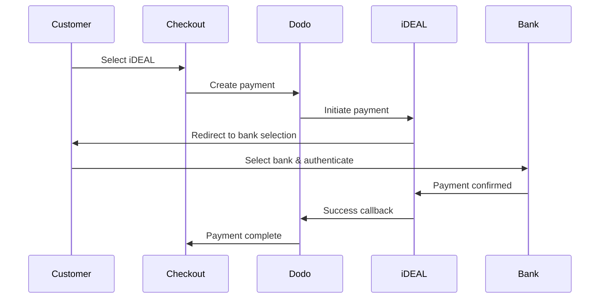
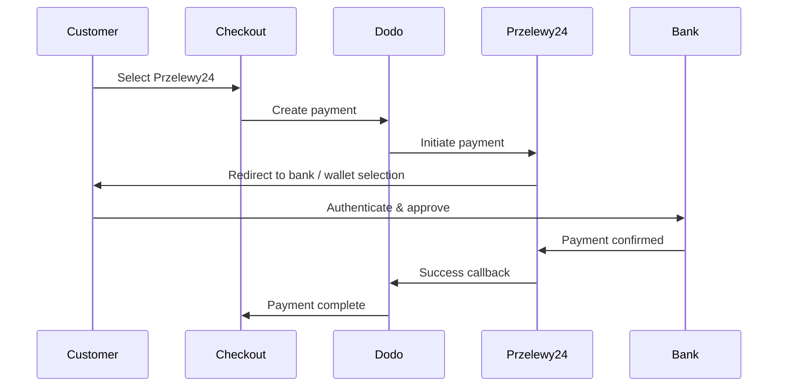

Khách hàng châu Âu ưu tiên mạnh mẽ các phương thức thanh toán địa phương tích hợp với hệ thống ngân hàng của họ. Cung cấp những phương thức này có thể tăng tỷ lệ chuyển đổi từ 20-40% ở các thị trường mục tiêu.

## Tại sao nên dùng phương thức thanh toán địa phương ở châu Âu?

<CardGroup cols={3}>
<Card title="Higher Conversion" icon="chart-line">
iDEAL chiếm khoảng 60% khoản thanh toán trực tuyến ở Hà Lan. Không cung cấp phương thức này đồng nghĩa với việc bỏ lỡ khách hàng.
</Card>

<Card title="Lower Fraud" icon="shield-check">
Thanh toán xác thực bởi ngân hàng có tỷ lệ gian lận gần như bằng 0 và không có chargebacks.
</Card>

<Card title="Real-Time Settlement" icon="bolt">
Hầu hết phương thức châu Âu cung cấp xác nhận thanh toán tức thì.
</Card>
</CardGroup>

## Các phương thức được hỗ trợ

| Phương thức | Quốc gia | Thị phần | Tiền tệ | Đăng ký |
| :----- | :------ | :----------- | :------- | :-----------: |
| **iDEAL** | Hà Lan | ~60% | EUR | Không |
| **Bancontact** | Bỉ | ~50% | EUR | Không |
| **EPS** | Áo | ~30% | EUR | Không |
| **Multibanco** | Bồ Đào Nha | ~40% | EUR | Không |
| **Przelewy24 (P24)** | Ba Lan | ~30% | PLN | Không |

## iDEAL (Hà Lan)

iDEAL là phương thức thanh toán trực tuyến chiếm ưu thế ở Hà Lan, kết nối trực tiếp với tất cả ngân hàng lớn của Hà Lan.

### Cách nó hoạt động



### Ngân hàng được hỗ trợ

All major Dutch banks are supported:
- ABN AMRO
- ASN Bank
- Bunq
- ING
- Knab
- Rabobank
- RegioBank
- Revolut
- SNS
- Triodos Bank
- Van Lanschot

### Cấu hình

```javascript
const session = await client.checkoutSessions.create({
  product_cart: [{ product_id: 'prod_123', quantity: 1 }],
  allowed_payment_method_types: ['ideal', 'credit', 'debit'],
  billing_currency: 'EUR',
  billing_address: {
    country: 'NL',
    zipcode: '1012JS'
  },
  return_url: 'https://example.com/success'
});
```

## Bancontact (Bỉ)

Bancontact là hệ thống thanh toán quốc gia của Bỉ, được hầu hết ngân hàng Bỉ sử dụng cho các giao dịch trực tuyến.

### Tính năng
- Tương thích với thẻ ghi nợ Bỉ hiện có
- Hỗ trợ ứng dụng di động (Payconiq của Bancontact)
- Xác nhận thanh toán tức thì
- Khách hàng không cần đăng ký thêm

### Cấu hình

```javascript
const session = await client.checkoutSessions.create({
  product_cart: [{ product_id: 'prod_123', quantity: 1 }],
  allowed_payment_method_types: ['bancontact_card', 'credit', 'debit'],
  billing_currency: 'EUR',
  billing_address: {
    country: 'BE',
    zipcode: '1000'
  },
  return_url: 'https://example.com/success'
});
```

## EPS (Áo)

EPS (Tiêu chuẩn Thanh toán Điện tử) cho phép chuyển khoản ngân hàng trực tuyến trực tiếp cho khách hàng Áo.

### Tính năng
- Tích hợp trực tiếp với các ngân hàng Áo
- Xác nhận thanh toán theo thời gian thực
- Độ tin cậy cao trong người tiêu dùng Áo
- Không có chargebacks

### Ngân hàng hỗ trợ

Major Austrian banks including:
- Erste Bank
- Bank Austria
- Raiffeisen
- BAWAG
- Volksbank

### Cấu hình

```javascript
const session = await client.checkoutSessions.create({
  product_cart: [{ product_id: 'prod_123', quantity: 1 }],
  allowed_payment_method_types: ['eps', 'credit', 'debit'],
  billing_currency: 'EUR',
  billing_address: {
    country: 'AT',
    zipcode: '1010'
  },
  return_url: 'https://example.com/success'
});
```

## Multibanco (Bồ Đào Nha)

Multibanco là mạng lưới ngân hàng liên minh của Bồ Đào Nha, cung cấp cả thanh toán trực tuyến và thanh toán qua cây ATM.

### Tùy chọn thanh toán

1. **Online Banking** — Chuyển khoản trực tiếp qua ngân hàng trực tuyến
2. **ATM Payment** — Khách hàng nhận mã tham chiếu để trả tại bất kỳ cây ATM Multibanco nào
3. **Mobile Banking** — Thanh toán qua ứng dụng di động của ngân hàng

### Cách thanh toán qua ATM hoạt động

Với thanh toán ATM, khách hàng nhận được mã tham chiếu thanh toán:

```
Entity: 12345
Reference: 123 456 789
Amount: €50.00
Expiry: 24 hours
```

Khách hàng có thể thanh toán tại bất kỳ cây ATM nào ở Bồ Đào Nha hoặc qua ngân hàng trực tuyến bằng mã này.

### Cấu hình

```javascript
const session = await client.checkoutSessions.create({
  product_cart: [{ product_id: 'prod_123', quantity: 1 }],
  allowed_payment_method_types: ['multibanco', 'credit', 'debit'],
  billing_currency: 'EUR',
  billing_address: {
    country: 'PT',
    zipcode: '1000-001'
  },
  return_url: 'https://example.com/success'
});
```

<Note>
Thanh toán qua ATM Multibanco có thể bị trễ giữa lúc thanh toán và khi thực sự ghi nhận. Theo dõi webhook để xác nhận thanh toán.
</Note>

## Przelewy24 (Ba Lan)

Przelewy24 (P24) là phương thức thanh toán trực tuyến hàng đầu của Ba Lan, tổng hợp chuyển khoản ngân hàng và ví địa phương từ tất cả các ngân hàng lớn của Ba Lan. Không giống như các phương thức châu Âu khác, Przelewy24 thanh toán bằng **PLN** (zloty Ba Lan), không phải EUR.

### Cách thức hoạt động



### Khả Dụng

- **Tiền tệ thanh toán:** Chỉ PLN
- **Loại giao dịch:** Chỉ thanh toán một lần (không khả dụng cho đăng ký)
- **Phạm vi:** Tất cả các ngân hàng lớn của Ba Lan cùng với các ví địa phương phổ biến

### Cấu Hình

```javascript
const session = await client.checkoutSessions.create({
  product_cart: [{ product_id: 'prod_123', quantity: 1 }],
  allowed_payment_method_types: ['przelewy24', 'credit', 'debit'],
  billing_currency: 'PLN',
  billing_address: {
    country: 'PL',
    zipcode: '00-001'
  },
  return_url: 'https://example.com/success'
});
```

Przelewy24 yêu cầu tiền tệ thanh toán là **PLN**. Nếu bạn báo giá bằng EUR, hãy kích hoạt [Adaptive Currency](/features/adaptive-currency) để khách hàng Ba Lan được tính bằng PLN và Przelewy24 khả dụng.

## Các Loại Phương Thức API

| Loại | Phương thức | Quốc gia |
| :--- | :----- | :------ |
| `ideal` | iDEAL | Hà Lan |
| `bancontact_card` | Bancontact | Bỉ |
| `eps` | EPS | Áo |
| `multibanco` | Multibanco | Bồ Đào Nha |
| `przelewy24` | Przelewy24 (P24) | Ba Lan |

## Thanh Toán Châu Âu Đa Quốc Gia

Đối với các doanh nghiệp phục vụ nhiều quốc gia châu Âu, bao gồm tất cả các phương thức khu vực:

```javascript
const session = await client.checkoutSessions.create({
  product_cart: [{ product_id: 'prod_123', quantity: 1 }],
  allowed_payment_method_types: [
    'ideal',           // Netherlands
    'bancontact_card', // Belgium
    'eps',             // Austria
    'multibanco',      // Portugal
    'przelewy24',      // Poland (requires PLN billing currency)
    'credit',          // Fallback
    'debit'            // Fallback
  ],
  billing_currency: 'EUR',
  return_url: 'https://example.com/success'
});
```

Dodo tự động hiển thị chỉ các phương thức phù hợp dựa trên vị trí của khách hàng. Khách hàng Hà Lan sẽ thấy iDEAL; khách hàng Bỉ sẽ thấy Bancontact.

## Kiểm Tra

Các phương thức thanh toán châu Âu có thể được kiểm tra trong chế độ sandbox. Luồng kiểm tra mô phỏng quá trình xác thực ngân hàng.

Sử dụng khóa API kiểm tra Dodo Payments của bạn.

Thiết lập quốc gia địa chỉ thanh toán để phù hợp với phương thức thanh toán:
- `NL` cho iDEAL
- `BE` cho Bancontact
- `AT` cho EPS
- `PT` cho Multibanco
- `PL` cho Przelewy24 (với tiền tệ thanh toán PLN)

Thực hiện theo luồng xác thực ngân hàng mô phỏng trong môi trường kiểm tra.

## Thực Hành Tốt Nhất

Nếu bạn bán cho khách hàng Hà Lan, bao gồm iDEAL. Không làm như vậy giống như không chấp nhận Visa ở Mỹ — bạn sẽ mất một lượng lớn doanh số bán hàng.

Hầu hết các phương thức thanh toán châu Âu yêu cầu EUR — đảm bảo giá của bạn hỗ trợ các giao dịch bằng Euro. Ngoại lệ duy nhất là Przelewy24, chỉ được cung cấp trên hóa đơn **PLN** (zloty Ba Lan).

Tất cả các phương thức châu Âu đều liên quan đến việc chuyển hướng đến các trang web ngân hàng. Đảm bảo xử lý URL quay lại của bạn mạnh mẽ và tính đến các trường hợp người dùng bỏ cuộc giữa chừng.

Không phải tất cả các khách hàng châu Âu đều có quyền truy cập vào các phương thức khu vực này (khách du lịch, người nước ngoài, v.v.). Luôn bao gồm `credit` và `debit` như các lựa chọn dự phòng.

Thanh toán qua ATM Multibanco có thể mất vài giờ để hoàn thành. Đừng chặn việc thực hiện do thanh toán ngay lập tức - sử dụng webhooks để xác nhận không đồng bộ.

## Xử Lý Sự Cố

**Kiểm Tra:**
1. Quốc gia thanh toán của khách hàng có khớp với quốc gia của phương thức? 
2. Tiền tệ đặt thành EUR? 
3. Phương thức có được bao gồm trong `allowed_payment_method_types` không?

**Giải Pháp:** Phương thức châu Âu là hoàn toàn thuộc về khu vực. Một khách hàng có quốc gia thanh toán `DE` (Đức) sẽ không thấy iDEAL, phương thức chỉ có ở Hà Lan.

**Nguyên Nhân:**
- Khách hàng hủy trong quá trình xác thực ngân hàng
- Hệ thống xác thực của ngân hàng tạm thời không khả dụng
- Khách hàng nhập sai thông tin

**Giải Pháp:** Khách hàng nên thử lại. Nếu kéo dài, hãy gợi ý thử một phương thức thanh toán khác.

**Nguyên Nhân:**
- Khách hàng đóng trình duyệt trong quá trình chuyển hướng ngân hàng
- Sự cố mạng trong quá trình xác thực
- URL quay lại bị cấu hình sai

**Giải Pháp:** Xác minh URL quay lại là chính xác và có thể truy cập. Đảm bảo xử lý cả trạng thái thành công và thất bại.

**Nguyên Nhân:** Khách hàng đã nhận được tham chiếu thanh toán nhưng chưa thanh toán.

**Giải Pháp:** Điều này là dự kiến đối với các khoản thanh toán qua ATM. Đợi xác nhận webhook. Tham chiếu thường hết hạn trong 24-72 giờ.

## Tuân Thủ PSD2

Tất cả các phương thức thanh toán châu Âu tuân thủ các quy định của PSD2 (Chỉ thị dịch vụ thanh toán 2):

- **Xác Thực Khách Hàng Mạnh (SCA)** — Tích hợp vào luồng xác thực ngân hàng
- **Giao Tiếp An Toàn** — Tất cả dữ liệu được truyền qua các kênh an toàn
- **Bảo Vệ Người Tiêu Dùng** — Tuân thủ hoàn toàn quyền lợi người tiêu dùng của EU

## Các Trang Liên Quan

Xem tất cả các phương thức thanh toán được hỗ trợ.

Hỗ trợ tiền tệ và chuyển đổi tự động.

Hướng dẫn thực hiện thanh toán hoàn chỉnh.

Xử lý thanh toán xác nhận một cách asincron.