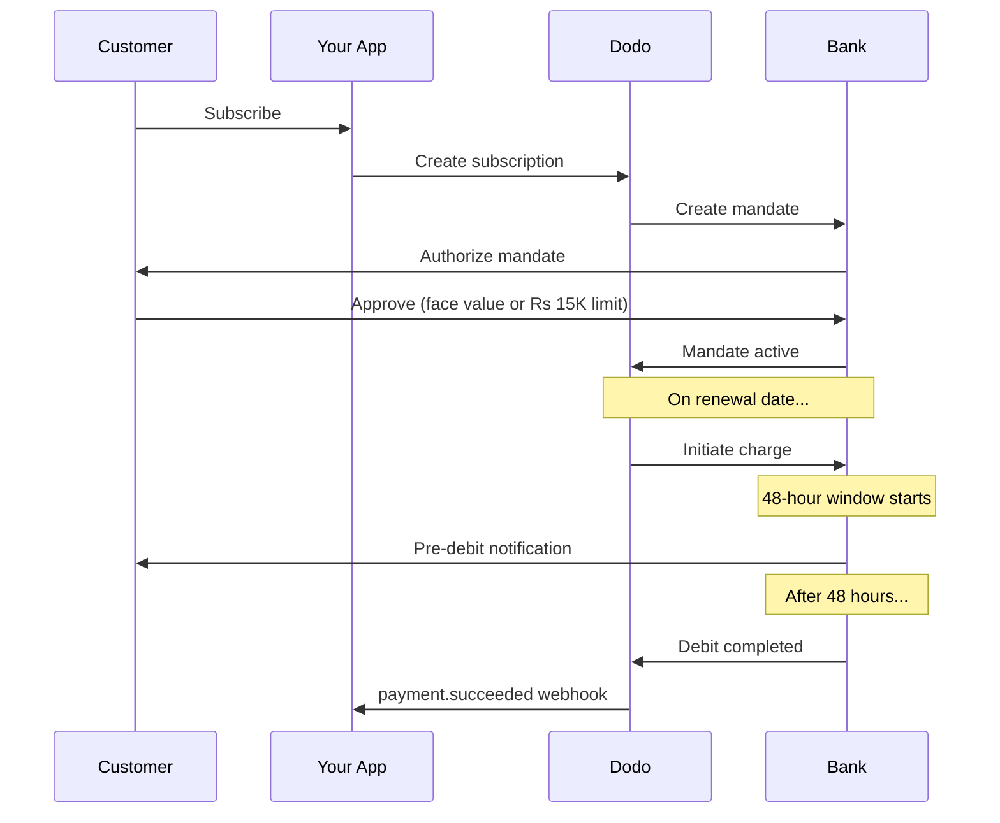

Ấn Độ có cơ sở hạ tầng thanh toán độc đáo, được dẫn dắt bởi UPI (hơn 60% giao dịch điện tử) và các thẻ Rupay. Dodo Payments hỗ trợ cả hai với sự tuân thủ hoàn toàn của RBI cho các lệnh đăng ký.

## Tại Sao Các Phương Thức Thanh Toán Ở Ấn Độ Quan Trọng

<CardGroup cols={3}>
<Card title="Ưu Thế Của UPI" icon="mobile">
UPI xử lý hơn 10 tỷ giao dịch mỗi tháng. Nhiều khách hàng Ấn Độ không có thẻ quốc tế.
</Card>

<Card title="Chi Phí Giao Dịch Thấp" icon="dấu-rupee-Ấn-Độ">
UPI có phí giao dịch gần như bằng 0. Rất tốt cho các giao dịch có khối lượng cao và giá trị thấp.
</Card>

<Card title="Hỗ Trợ Đăng Ký" icon="repeat">
Khác với hầu hết các phương thức thanh toán thay thế, UPI và Rupay hỗ trợ thanh toán định kỳ qua các lệnh của RBI.
</Card>
</CardGroup>

## Các Phương Thức Được Hỗ Trợ

| Phương Thức | Loại | Đăng Ký | Số Tiền Tối Thiểu |
| :----- | :--- | :-----------: | :--------- |
| **UPI Collect** | mã QR / VPA | Có* | ₹1 |
| **Rupay Credit** | Thẻ | Có* | ₹1 |
| **Rupay Debit** | Thẻ | Có* | ₹1 |

*Đăng ký yêu cầu các lệnh tuân thủ RBI với các quy tắc xử lý đặc biệt.

## Cấu Hình

### Các Loại Phương Thức API

| Loại | Mô Tả |
| :--- | :---------- |
| `upi_collect` | UPI thông qua mã QR hoặc nhập VPA |
| `credit` | Thẻ tín dụng bao gồm Rupay |
| `debit` | Thẻ ghi nợ bao gồm Rupay |

### Ví Dụ: Thanh Toán Tập Trung Vào Ấn Độ

```javascript
const session = await client.checkoutSessions.create({
  product_cart: [{ product_id: 'prod_123', quantity: 1 }],
  allowed_payment_method_types: [
    'upi_collect',
    'credit',
    'debit'
  ],
  billing_currency: 'INR',
  customer: {
    email: 'customer@example.in',
    name: 'Priya Sharma',
    phone_number: '+919876543210'
  },
  billing_address: {
    country: 'IN',
    zipcode: '560001'
  },
  return_url: 'https://example.com/success'
});
```

### Các Yêu Cầu cho UPI

Để UPI hiển thị tại thanh toán:
1. **Quốc gia thanh toán** phải là Ấn Độ (`IN`)
2. **Tiền tệ** phải là INR
3. Đối với các thương nhân không Ấn Độ: **Tiền tệ thích ứng** phải được bật

<Warning>
Nếu bạn là thương nhân không Ấn Độ và Tiền tệ thích ứng không được bật, UPI sẽ không khả dụng cho khách hàng của bạn.
</Warning>

## Đăng Ký Với Các Lệnh Của RBI

Các đăng ký phương thức thanh toán Ấn Độ hoạt động theo quy định của RBI (Ngân hàng Dự trữ Ấn Độ) với các yêu cầu đặc biệt.

### Cách Các Lệnh Của RBI Hoạt Động



### Các Loại Lệnh

| Số Tiền Đăng Ký | Loại Lệnh | Giới Hạn |
| :------------------ | :----------- | :---- |
| **Dưới Rs 15,000** | Lệnh theo yêu cầu | Rs 15,000 |
| **Rs 15,000 trở lên** | Lệnh số tiền cố định | Số tiền đăng ký chính xác |

**Quan trọng cho việc thay đổi gói:** Nếu một thao tác nâng cấp dẫn đến khoản phí vượt quá giới hạn lệnh hiện tại, khoản phí sẽ thất bại và khách hàng phải tái ủy quyền.

### Độ Trễ Xử Lý 48 Giờ

Đây là sự khác biệt quan trọng nhất với các khoản thanh toán bằng thẻ quốc tế:

<Steps>
<Step title="Khởi Tạo Khoản Phí (Ngày 0)">
Vào ngày gia hạn đã lên lịch, Dodo khởi tạo khoản phí với ngân hàng.
</Step>

<Step title="Thông Báo Trước Khi Ghi Nợ">
Khách hàng nhận thông báo từ ngân hàng của họ về ghi nợ sắp tới.
</Step>

<Step title="Cửa Sổ 48 Giờ">
Khách hàng có thể hủy lệnh trong khoảng thời gian này thông qua ứng dụng ngân hàng của họ.
</Step>

<Step title="Ghi Nợ Hoàn Tất (~48-51 giờ)">
Sau 48 giờ (cộng thêm tối đa 3 giờ xử lý ngân hàng), tiền sẽ được ghi nợ.
</Step>

<Step title="Webhook Được Gửi">
`payment.succeeded` webhook được gửi sau khi ghi nợ thực tế, không phải lúc khởi tạo.
</Step>
</Steps>

<Warning>
**Không cấp lợi ích tại thời điểm khởi tạo khoản phí.** Chờ webhook `payment.succeeded`, sẽ đến ~48-51 giờ sau ngày thanh toán đã lên lịch.
</Warning>

### Xử Lý Cửa Sổ 48 Giờ

```javascript
// DON'T do this:
async function handleSubscriptionRenewal(subscription) {
  // ❌ Bad: Granting access immediately when charge is initiated
  grantPremiumAccess(subscription.customer_id);
}

// DO this:
async function handlePaymentWebhook(event) {
  if (event.type === 'payment.succeeded') {
    // ✅ Good: Only grant access after payment is confirmed
    grantPremiumAccess(event.data.customer_id);
  }
  
  if (event.type === 'payment.failed') {
    // Handle failed payment (mandate cancelled, insufficient funds)
    revokePremiumAccess(event.data.customer_id);
  }
}
```

### Các Sự Kiện Webhook Cho Các Đăng Ký Ở Ấn Độ

| Sự Kiện | Khi Nào | Hành Động |
| :---- | :--- | :----- |
| `subscription.created` | Lệnh đã được ủy quyền | Ghi nhận bắt đầu đăng ký |
| `payment.succeeded` | ~48h sau ngày thanh toán | Cấp/tiếp tục quyền truy cập |
| `payment.failed` | Ghi nợ thất bại | Thông báo cho khách hàng, tạm dừng quyền truy cập |
| `subscription.on_hold` | Thanh toán thất bại | Nhắc nhở cập nhật phương thức thanh toán |
| `subscription.active` | Được kích hoạt lại sau khi thanh toán | Khôi phục quyền truy cập |

## Kiểm Tra

### ID Kiểm Tra UPI

| Tình Trạng | UPI ID |
| :----- | :----- |
| Thành Công | `success@upi` |
| Thất Bại | `failure@upi` |

### Số Thẻ Kiểm Tra Ấn Độ

| Thương Hiệu | Kịch Bản | Số Thẻ | Hạn | CVV |
| :---- | :------- | :---------- | :----- | :-- |
| Visa | Thành Công | `4576238912771450` | 06/32 | 123 |
| Visa | Từ Chối | `4706131211212123` | 06/32 | 123 |
| Mastercard | Thành Công | `5409162669381034` | 06/32 | 123 |
| Mastercard | Từ Chối | `5105105105105100` | 06/32 | 123 |

## Thực Hành Tốt Nhất

<AccordionGroup>
<Accordion title="Lập Kế Hoạch Cho Độ Trễ 48 Giờ">
Xây dựng ứng dụng của bạn để xử lý khoảng trống giữa khởi tạo khoản phí và khoản thanh toán thực tế. Cân nhắc:
- Thời gian ân hạn cho quyền truy cập vào đăng ký
- Giao tiếp rõ ràng với khách hàng về thời gian xử lý
- Thực hiện khối lượng dựa trên webhook, không phải dựa trên ngày
</Accordion>

<Accordion title="Xử Lý Việc Hủy Lệnh">
Khách hàng có thể hủy lệnh qua ứng dụng ngân hàng của họ bất kỳ lúc nào. Theo dõi webhook `subscription.on_hold` và nhắc nhở khách hàng đăng ký lại hoặc cập nhật phương thức thanh toán.
</Accordion>

<Accordion title="Đặt Số Tiền Lệnh Phù Hợp">
Đối với giá cả biến đổi (ví dụ: theo mức sử dụng), hãy xem xét liệu một lệnh theo yêu cầu Rs 15,000 có đủ. Nếu các khoản phí có thể vượt quá mức này, khách hàng sẽ cần phải tái ủy quyền.
</Accordion>

<Accordion title="Cung Cấp UPI Một Cách Rõ Ràng">
Đối với khách hàng Ấn Độ, UPI nên là phương thức thanh toán chính. Nhiều người dùng thích nó hơn thẻ do sự quen thuộc và giảm thiểu sự cản trở.
</Accordion>
</AccordionGroup>

## Khắc Phục Sự Cố

<AccordionGroup>
<Accordion title="UPI không hiển thị tại thanh toán">
**Kiểm tra:**
1. Quốc gia thanh toán đã được thiết lập thành `IN`?
2. Tiền tệ đã được thiết lập thành `INR`?
3. Nếu là thương nhân không Ấn Độ: Tiền tệ thích ứng đã được bật chưa?
4. `upi_collect` đã có trong `allowed_payment_method_types`?

**Giải pháp:** Xác minh địa chỉ thanh toán có `country: "IN"` và `billing_currency: "INR"`.
</Accordion>

<Accordion title="Khoản phí đăng ký thất bại sau khi nâng cấp">
**Nguyên nhân:** Số tiền phí mới vượt quá giới hạn lệnh hiện tại (ngưỡng Rs 15,000).

**Giải pháp:** Khách hàng phải cập nhật phương thức thanh toán để thiết lập một lệnh mới với giới hạn chính xác.
</Accordion>

<Accordion title="Đăng ký bị tạm giữ nhưng khách hàng khẳng định họ không hủy bỏ">
**Nguyên nhân:** Khách hàng có thể đã hủy lệnh trong khoảng thời gian 48 giờ, hoặc ngân hàng của họ đã từ chối ghi nợ.

**Giải pháp:** Khách hàng cần tái ủy quyền lệnh hoặc cập nhật phương thức thanh toán của họ.
</Accordion>

<Accordion title="Khấu trừ thanh toán bị trì hoãn hơn 48 giờ">
**Nguyên nhân:** Trì hoãn API ngân hàng có thể kéo dài thời gian xử lý thêm 2-3 giờ.

**Giải pháp:** Điều này là điều bình thường. Xây dựng hệ thống của bạn để xử lý độ trễ biến thiên lên đến ~51 giờ tổng cộng.
</Accordion>

<Accordion title="Lệnh bị hủy nhưng đăng ký vẫn đang hoạt động">
**Nguyên nhân:** Trường hợp biên trong quy định của RBI — việc hủy lệnh trong khoảng thời gian xử lý không ngay lập tức hủy bỏ đăng ký.

**Giải pháp:** Khoản phí tiếp theo sẽ thất bại và đăng ký sẽ chuyển sang `on_hold`. Theo dõi webhooks cho `payment.failed`.
</Accordion>
</AccordionGroup>

## Các Trang Liên Quan

<CardGroup cols={2}>
<Card title="Tổng Quan Về Các Phương Thức Thanh Toán" icon="thẻ-tín-dụng" href="/features/payment-methods">
Xem tất cả các phương thức thanh toán được hỗ trợ.
</Card>

<Card title="Đăng Ký" icon="repeat" href="/features/subscription">
Tài liệu hướng dẫn đầy đủ về đăng ký bao gồm các lệnh của RBI.
</Card>

<Card title="Webhook" icon="webhook" href="/developer-resources/webhooks">
Xử lý webhook cho các sự kiện thanh toán.
</Card>

<Card title="Quy Trình Kiểm Tra" icon="flask" href="/miscellaneous/testing-process">
Tất cả dữ liệu kiểm tra bao gồm ID UPI và thẻ Ấn Độ.
</Card>
</CardGroup>