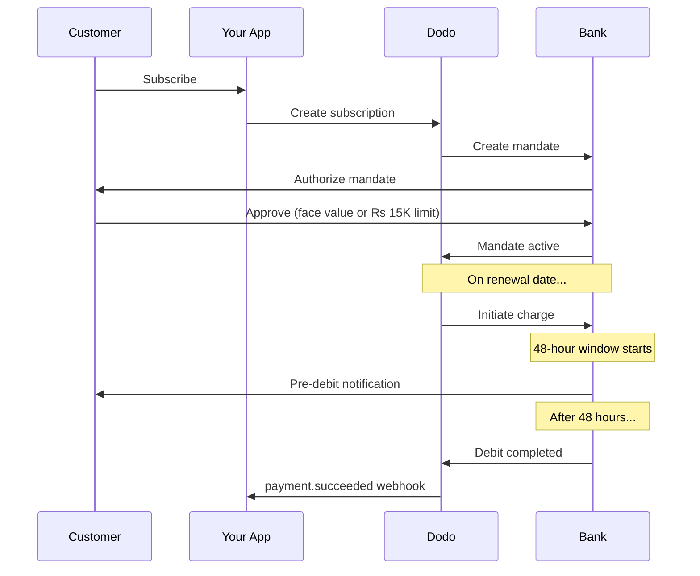

India có cơ sở hạ tầng thanh toán đặc thù, chủ yếu là UPI (hơn 60% giao dịch kỹ thuật số) và các thẻ do India phát hành (Visa, Mastercard, Rupay, v.v.). Dodo Payments hỗ trợ tất cả các phương thức này và tuân thủ đầy đủ RBI đối với các ủy quyền subscription.

## Tại sao phương thức thanh toán tại India quan trọng

<CardGroup cols={3}>
<Card title="UPI Dominance" icon="mobile">
UPI xử lý hơn 10 tỷ giao dịch mỗi tháng. Nhiều khách hàng tại India không có thẻ quốc tế.
</Card>

<Card title="Low Transaction Costs" icon="indian-rupee-sign">
UPI có phí giao dịch gần như bằng không. Đây là lựa chọn lý tưởng cho các giao dịch khối lượng lớn, giá trị thấp.
</Card>

<Card title="Subscription Support" icon="repeat">
Không giống hầu hết các phương thức thanh toán thay thế, UPI và tất cả thẻ do India phát hành (Visa, Mastercard, Rupay, v.v.) đều hỗ trợ thanh toán định kỳ thông qua các ủy quyền RBI.
</Card>
</CardGroup>

## Phương thức được hỗ trợ

| Phương thức | Loại | Subscription | Số tiền tối thiểu |
| :----- | :--- | :-----------: | :--------- |
| **UPI Collect** | Mã QR / VPA | Có* | ₹1 |
| **Rupay Credit** | Thẻ | Có* | ₹1 |
| **Rupay Debit** | Thẻ | Có* | ₹1 |

*Subscription yêu cầu các ủy quyền tuân thủ RBI với quy tắc xử lý đặc biệt. Độ trễ xử lý 48 giờ áp dụng cho tất cả thẻ do India phát hành và UPI.

## Cấu hình

### Loại phương thức API

| Loại | Mô tả |
| :--- | :---------- |
| `upi_collect` | UPI qua mã QR hoặc nhập VPA |
| `credit` | Thẻ tín dụng, bao gồm Rupay |
| `debit` | Thẻ ghi nợ, bao gồm Rupay |

### Ví dụ: Checkout tập trung vào India

```javascript
const session = await client.checkoutSessions.create({
  product_cart: [{ product_id: 'pdt_123', quantity: 1 }],
  allowed_payment_method_types: [
    'upi_collect',
    'credit',
    'debit'
  ],
  billing_currency: 'INR',
  customer: {
    email: 'customer@example.in',
    name: 'Priya Sharma',
    phone_number: '+919876543210'
  },
  billing_address: {
    country: 'IN',
    zipcode: '560001'
  },
  return_url: 'https://example.com/success'
});
```

### Yêu cầu đối với UPI

Để UPI xuất hiện tại checkout:
1. **Quốc gia thanh toán** phải là India (`IN`)
2. **Currency** phải là INR
3. Đối với merchant không ở India: phải bật **Adaptive Currency**

<Warning>
Nếu bạn là merchant không ở India và Adaptive Currency chưa được bật, UPI sẽ không khả dụng cho khách hàng của bạn.
</Warning>

## Subscription với ủy quyền RBI

Subscription thông qua các phương thức thanh toán tại India hoạt động theo quy định của RBI (Reserve Bank of India) với các yêu cầu riêng.

### Cách thức hoạt động của ủy quyền RBI



### Loại ủy quyền

| Số tiền subscription | Loại ủy quyền | Giới hạn |
| :------------------ | :----------- | :---- |
| **Thấp hơn ngưỡng ủy quyền** | Ủy quyền theo nhu cầu | Ngưỡng ủy quyền (mặc định ₹15,000) |
| **Bằng hoặc cao hơn ngưỡng ủy quyền** | Ủy quyền số tiền cố định | Số tiền subscription chính xác |

Số tiền được đăng ký với ngân hàng của khách hàng là `max(mandate_floor, billing_amount)`. Vì vậy, ngưỡng này thực chất là **hạn mức ủy quyền** mà khách hàng nhìn thấy mỗi khi số tiền thanh toán thấp hơn ngưỡng.

**Quan trọng đối với thay đổi gói:** Nếu việc nâng cấp dẫn đến khoản phí vượt quá giới hạn ủy quyền hiện tại, khoản phí sẽ thất bại và khách hàng phải ủy quyền lại.

### Ngưỡng ủy quyền có thể cấu hình

Ngưỡng ủy quyền cho e-mandate INR có thể cấu hình thông qua trường `mandate_min_amount_inr_paise` (bằng **INR paise** — 1 INR = 100 paise). Bạn có thể ghi đè giá trị mặc định của hệ thống là ₹15,000 ở ba cấp độ:

| Cấp độ | Nơi thiết lập | Phạm vi |
|-------|--------------|-------|
| **Theo từng request** | `mandate_min_amount_inr_paise` trên checkout session hoặc subscription | Một giao dịch |
| **Merchant** | Cài đặt doanh nghiệp | Tất cả subscription INR của bạn |
| **Hệ thống** | — | Mặc định ₹15,000 |

Thứ tự ưu tiên: ghi đè theo request → cài đặt merchant → giá trị mặc định của hệ thống.

```typescript
// Per-checkout override
const session = await client.checkoutSessions.create({
  product_cart: [{ product_id: 'pdt_inr_monthly', quantity: 1 }],
  mandate_min_amount_inr_paise: 2_000_000, // ₹20,000 ceiling
  return_url: 'https://yoursite.com/return'
});

// Per-subscription override
const subscription = await client.subscriptions.create({
  product_id: 'pdt_inr_monthly',
  quantity: 1,
  customer: { email: 'customer@example.in' },
  billing: { country: 'IN', /* ... */ },
  mandate_min_amount_inr_paise: 2_000_000
});
```

| Trường | Loại | Validation | Áp dụng cho |
|-------|------|------------|------------|
| `mandate_min_amount_inr_paise` | `integer` (INR paise) | `>= 1` | Subscription INR bằng thẻ India trên các connector không phải Airwallex |

<Info>
Thiết lập ngưỡng cao hơn cho phép bạn hỗ trợ các khoản phí một lần lớn hơn trong tương lai (chẳng hạn như nâng cấp gói hoặc khoản vượt mức dựa trên mức sử dụng) mà không buộc khách hàng phải ủy quyền lại. Thiết lập ngưỡng thấp hơn đưa hạn mức ủy quyền của khách hàng gần hơn với số tiền thanh toán thực tế, nhưng làm giảm khoảng trống cho các khoản phí biến đổi trong tương lai.
</Info>

<Warning>
Cài đặt này chỉ ảnh hưởng đến các e-mandate được đăng ký cho thẻ do India phát hành (Visa, Mastercard, RuPay) trên subscription INR. Subscription UPI tuân theo AutoPay flow riêng và không bị ảnh hưởng.
</Warning>

### Độ trễ xử lý 48 giờ

Đây là khác biệt quan trọng nhất so với thanh toán bằng thẻ quốc tế:

<Steps>
<Step title="Charge Initiated (Day 0)">
Vào ngày gia hạn theo lịch, Dodo bắt đầu khoản phí với ngân hàng.
</Step>

<Step title="Pre-Debit Notification">
Khách hàng nhận được thông báo từ ngân hàng về khoản ghi nợ sắp tới.
</Step>

<Step title="48-Hour Window">
Khách hàng có thể hủy ủy quyền trong thời gian này thông qua ứng dụng ngân hàng.
</Step>

<Step title="Debit Completed (~48-51 hours)">
Sau 48 giờ (cộng thêm tối đa 3 giờ để ngân hàng xử lý), tiền sẽ được ghi nợ.
</Step>

<Step title="Webhook Sent">
Webhook `payment.succeeded` được gửi sau khi ghi nợ thực tế, không phải khi bắt đầu.
</Step>
</Steps>

<Warning>
**Không cấp quyền lợi khi bắt đầu tính phí.** Hãy chờ webhook `payment.succeeded`, được gửi khoảng 48–51 giờ sau ngày tính phí theo lịch.
</Warning>

### Xử lý khoảng thời gian 48 giờ

```javascript
// DON'T do this:
async function handleSubscriptionRenewal(subscription) {
  // ❌ Bad: Granting access immediately when charge is initiated
  grantPremiumAccess(subscription.customer_id);
}

// DO this:
async function handlePaymentWebhook(event) {
  if (event.type === 'payment.succeeded') {
    // ✅ Good: Only grant access after payment is confirmed
    grantPremiumAccess(event.data.customer_id);
  }
  
  if (event.type === 'payment.failed') {
    // Handle failed payment (mandate cancelled, insufficient funds)
    revokePremiumAccess(event.data.customer_id);
  }
}
```

### Sự kiện webhook cho subscription tại India

| Sự kiện | Thời điểm | Hành động |
| :---- | :--- | :----- |
| `subscription.active` | Đã ủy quyền mandate | Ghi nhận thời điểm bắt đầu subscription |
| `payment.succeeded` | ~48 giờ sau ngày tính phí | Cấp/tiếp tục quyền truy cập |
| `payment.failed` | Ghi nợ thất bại | Thông báo cho khách hàng, tạm dừng quyền truy cập |
| `subscription.on_hold` | Payment thất bại | Yêu cầu cập nhật payment method |
| `subscription.active` | Đã kích hoạt lại sau payment | Khôi phục quyền truy cập |

## Kiểm thử

### UPI Test ID

| Trạng thái | UPI ID |
| :----- | :----- |
| Thành công | `success@upi` |
| Thất bại | `failure@upi` |

### Số thẻ India dùng để kiểm thử

| Brand | Tình huống | Số thẻ | Ngày hết hạn | CVV |
| :---- | :------- | :---------- | :----- | :-- |
| Visa | Thành công | `4576238912771450` | 06/32 | 123 |
| Visa | Bị từ chối | `4706131211212123` | 06/32 | 123 |
| Mastercard | Thành công | `5409162669381034` | 06/32 | 123 |
| Mastercard | Bị từ chối | `5105105105105100` | 06/32 | 123 |

## Best practice

<AccordionGroup>
<Accordion title="Plan for the 48-hour delay">
Xây dựng ứng dụng để xử lý khoảng thời gian giữa lúc bắt đầu tính phí và lúc payment thực tế hoàn tất. Hãy cân nhắc:
- Thời gian gia hạn cho quyền truy cập subscription
- Truyền đạt rõ ràng cho khách hàng về thời gian xử lý
- Fulfillment dựa trên webhook, không dựa trên ngày tháng
</Accordion>

<Accordion title="Handle mandate cancellations">
Khách hàng có thể hủy mandate thông qua ứng dụng ngân hàng bất cứ lúc nào. Theo dõi webhook `subscription.on_hold` và yêu cầu khách hàng đăng ký lại subscription hoặc cập nhật payment method.
</Accordion>

<Accordion title="Set appropriate mandate amounts">
Đối với pricing biến đổi (ví dụ: dựa trên mức sử dụng), hãy cân nhắc liệu ủy quyền theo nhu cầu trị giá Rs 15,000 có đủ hay không. Nếu các khoản phí có thể vượt quá mức này, khách hàng sẽ cần ủy quyền lại.
</Accordion>

<Accordion title="Offer UPI prominently">
Đối với khách hàng tại India, UPI nên là phương thức thanh toán chính. Nhiều người dùng ưa chuộng UPI hơn thẻ vì quen thuộc và ít trở ngại hơn.
</Accordion>
</AccordionGroup>

## Khắc phục sự cố

<AccordionGroup>
<Accordion title="UPI not appearing at checkout">
**Kiểm tra:**
1. Quốc gia thanh toán đã được đặt thành `IN` chưa?
2. Currency đã được đặt thành `INR` chưa?
3. Nếu là merchant không ở India: Adaptive Currency đã được bật chưa?
4. `upi_collect` đã được включ trong `allowed_payment_method_types` chưa?

**Giải pháp:** Xác minh địa chỉ thanh toán có `country: "IN"` và `billing_currency: "INR"`.
</Accordion>

<Accordion title="Subscription charge failed after upgrade">
**Nguyên nhân:** Số tiền của khoản phí mới vượt quá giới hạn ủy quyền hiện tại (ngưỡng Rs 15,000).

**Giải pháp:** Khách hàng phải cập nhật payment method để thiết lập mandate mới với giới hạn chính xác.
</Accordion>

<Accordion title="Subscription on hold but customer claims they didn't cancel">
**Nguyên nhân:** Khách hàng có thể đã hủy mandate trong khoảng thời gian 48 giờ hoặc ngân hàng đã từ chối khoản ghi nợ.

**Giải pháp:** Khách hàng cần ủy quyền lại mandate hoặc cập nhật payment method.
</Accordion>

<Accordion title="Payment deduction delayed beyond 48 hours">
**Nguyên nhân:** Độ trễ của Bank API có thể kéo dài thời gian xử lý thêm 2–3 giờ.

**Giải pháp:** Đây là hành vi dự kiến. Hãy xây dựng hệ thống để xử lý độ trễ biến đổi lên đến tổng cộng khoảng 51 giờ.
</Accordion>

<Accordion title="Mandate cancelled but subscription still active">
**Nguyên nhân:** Trường hợp đặc biệt trong quy định RBI — việc hủy mandate trong khoảng thời gian xử lý không ngay lập tức hủy subscription.

**Giải pháp:** Khoản phí tiếp theo sẽ thất bại và subscription sẽ chuyển sang `on_hold`. Theo dõi webhook cho `payment.failed`.
</Accordion>
</AccordionGroup>

## Trang liên quan

<CardGroup cols={2}>
<Card title="Payment Methods Overview" icon="credit-card" href="/features/payment-methods">
Xem tất cả phương thức thanh toán được hỗ trợ.
</Card>

<Card title="Subscriptions" icon="repeat" href="/features/subscription">
Xem tài liệu đầy đủ về subscription, bao gồm các ủy quyền RBI.
</Card>

<Card title="Webhooks" icon="webhook" href="/developer-resources/webhooks">
Cách xử lý webhook cho các sự kiện payment.
</Card>

<Card title="Testing Process" icon="flask" href="/miscellaneous/testing-process">
Tất cả dữ liệu kiểm thử, bao gồm UPI ID và thẻ India.
</Card>
</CardGroup>