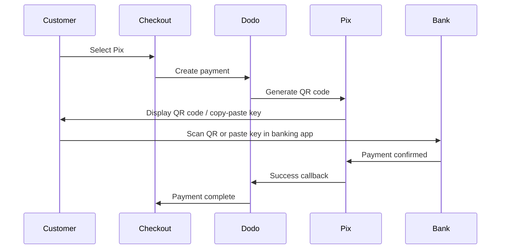

Pix là hệ thống thanh toán ngay lập tức của Brazil được tạo ra bởi Ngân hàng Trung ương Brazil (Banco Central do Brasil). Nó cho phép chuyển tiền theo thời gian thực 24/7, bao gồm cả cuối tuần và ngày lễ, và đã trở thành phương thức thanh toán phổ biến nhất ở Brazil.

## Tại Sao Cung Cấp Pix?

<CardGroup cols={3}>
<Card title="Dominant in Brazil" icon="chart-line">
Pix là phương thức thanh toán được sử dụng nhiều nhất ở Brazil, vượt qua thẻ tín dụng và boleto.
</Card>

<Card title="Instant Settlement" icon="bolt">
Thanh toán được xác nhận trong vài giây, 24/7/365 — không cần chờ đợi các khung xử lý ngân hàng.
</Card>

<Card title="Low Friction" icon="mobile">
Khách hàng thanh toán qua mã QR hoặc sao chép-dán khóa — không cần số thẻ hoặc chi tiết ngân hàng.
</Card>
</CardGroup>

## Tổng Quan

| Chi Tiết | Giá Trị |
| :----- | :---- |
| **Đơn Vị Tiền Thanh Toán** | BRL |
| **Các Quốc Gia Hỗ Trợ** | Brazil |
| **Đăng Ký** | Không |
| **Số Tiền Tối Thiểu** | $0.50 |
| **Giải Quyết** | Ngay lập tức |

## Cách Hoạt Động



## Trải Nghiệm Khách Hàng

1. Khách hàng chọn Pix tại thanh toán
2. Một mã QR và khóa sao chép-dán được hiển thị
3. Khách hàng mở ứng dụng ngân hàng và quét mã QR hoặc dán khóa
4. Thanh toán được xác nhận ngay lập tức
5. Khách hàng được chuyển đến trang thành công

<Info>
Mã QR Pix thường hết hạn sau một khoảng thời gian nhất định. Nếu khách hàng không hoàn tất thanh toán kịp thời, họ cần khởi động lại quá trình thanh toán.
</Info>

## Cấu Hình

```javascript
const session = await client.checkoutSessions.create({
  product_cart: [{ product_id: 'prod_123', quantity: 1 }],
  allowed_payment_method_types: ['pix', 'credit', 'debit'],
  billing_currency: 'BRL',
  return_url: 'https://example.com/success'
});
```

## Loại Phương Thức API

| Loại | Phương Thức | Quốc Gia |
| :--- | :----- | :------ |
| `pix` | Pix | Brazil |

## Kiểm Tra

<Steps>
<Step title="Enable test mode">
Sử dụng các khóa API kiểm tra của Dodo Payments.
</Step>

<Step title="Set billing currency to BRL">
Đảm bảo đơn vị tiền thanh toán được đặt thành `BRL` trong yêu cầu thanh toán của bạn.
</Step>

<Step title="Enter test CPF and scan the QR code">
Khi được yêu cầu nhập mã Pix CPF, nhập `1234567890`. Một mã QR kiểm tra sẽ được tạo — quét nó bằng camera điện thoại thông thường của bạn (không cần ứng dụng Pix). Bạn sẽ được chuyển đến trang kiểm tra Stripe nơi bạn có thể mô phỏng giao dịch thành công hoặc thất bại.
</Step>
</Steps>

## Thực Hành Tốt Nhất

<AccordionGroup>
<Accordion title="Set billing currency to BRL">
Pix chỉ hoạt động với BRL. Đảm bảo giá của bạn hỗ trợ các giao dịch bằng đồng Real Brazil cho thị trường Brazil.
</Accordion>

<Accordion title="Provide card fallbacks">
Không phải tất cả khách hàng Brazil đều ưu tiên sử dụng Pix. Luôn bao gồm `credit` và `debit` như các tùy chọn dự phòng.
</Accordion>

<Accordion title="Handle QR code expiration">
Mã QR Pix hết hạn sau một khoảng thời gian đặt trước. Đảm bảo quy trình thanh toán của bạn xử lý việc hết hạn một cách thuận lợi và cho phép khách hàng tạo lại mã.
</Accordion>
</AccordionGroup>

## Xử Lý Sự Cố

<AccordionGroup>
<Accordion title="Pix not appearing at checkout">
**Kiểm Tra:**
1. Đơn vị tiền thanh toán đã đặt thành `BRL`?
2. `pix` có được bao gồm trong `allowed_payment_method_types`?
3. Quốc gia thanh toán của khách hàng là Brazil?

**Giải Pháp:** Pix chỉ có sẵn cho các giao dịch bằng BRL. Kiểm tra lại đơn vị tiền và địa chỉ thanh toán trong yêu cầu API của bạn.
</Accordion>

<Accordion title="QR code expired">
**Nguyên Nhân:** Khách hàng không hoàn tất thanh toán trong thời gian hết hạn.

**Giải Pháp:** Khách hàng cần khởi động lại quá trình thanh toán để tạo mã QR mới.
</Accordion>

<Accordion title="Payment pending">
**Nguyên Nhân:** Thanh toán bằng Pix thường được xác nhận ngay lập tức trong hầu hết các trường hợp, nhưng có thể xảy ra chậm trễ từ phía ngân hàng.

**Giải Pháp:** Giám sát webhook để xác nhận thanh toán. Nếu thanh toán không được xác nhận trong vài phút, coi là thất bại.
</Accordion>
</AccordionGroup>

## Các Trang Liên Quan

<CardGroup cols={2}>
<Card title="Payment Methods Overview" icon="credit-card" href="/features/payment-methods">
Xem tất cả các phương thức thanh toán được hỗ trợ.
</Card>

<Card title="Adaptive Currency" icon="globe" href="/features/adaptive-currency">
Hỗ trợ đơn vị tiền tệ và chuyển đổi tự động.
</Card>

<Card title="Checkout Guide" icon="book" href="/developer-resources/checkout-session">
Hướng dẫn triển khai quy trình thanh toán hoàn chỉnh.
</Card>

<Card title="Webhooks" icon="webhook" href="/developer-resources/webhooks">
Xử lý xác nhận thanh toán không đồng bộ.
</Card>
</CardGroup>
