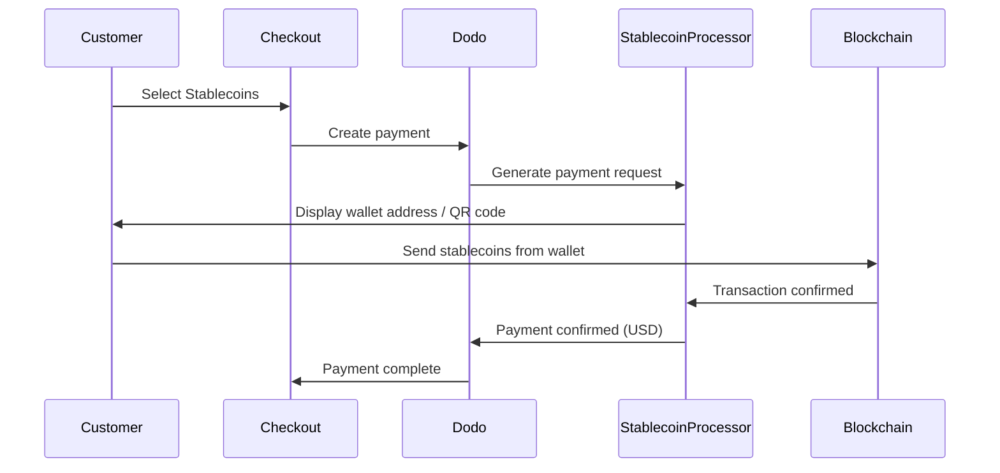

Thanh toán bằng stablecoin cho phép khách hàng thanh toán bằng stablecoin từ bất kỳ đâu trên thế giới (trừ Ấn Độ). Giao dịch được thanh toán bằng USD, vì vậy bạn nhận được tiền mặt trong khi khách hàng thanh toán bằng ví stablecoin ưa thích của họ.

## Tại sao nên cung cấp Stablecoins?

<CardGroup cols={3}>
<Card title="Global Reach" icon="globe">
Chấp nhận thanh toán từ bất kỳ quốc gia nào — không cần hạ tầng ngân hàng từ phía khách hàng.
</Card>

<Card title="No Chargebacks" icon="shield-check">
Giao dịch stablecoin không thể đảo ngược, loại bỏ hoàn toàn gian lận hoàn tiền.
</Card>

<Card title="USD Settlement" icon="dollar-sign">
Bạn nhận được USD — không cần quản lý sự biến động hay ví.
</Card>
</CardGroup>

## Tổng quan

| Chi tiết | Giá trị |
| :----- | :---- |
| **Đơn vị thanh toán** | USD |
| **Quốc gia hỗ trợ** | Toàn cầu (trừ IN) |
| **Đăng ký** | Không |
| **Số tiền tối thiểu** | $0.50 |
| **Thanh toán** | USD |

## Cách thức hoạt động



## Trải nghiệm của khách hàng

1. Khách hàng chọn Stablecoins tại thanh toán
2. Một địa chỉ ví và mã QR được hiển thị với số tiền bằng stablecoin
3. Khách hàng gửi đúng số tiền từ ví stablecoin của họ
4. Giao dịch được xác nhận trên blockchain
5. Khách hàng được chuyển đến trang thành công

<Info>
Thanh toán bằng stablecoin được tính bằng USD. Số tiền stablecoin hiển thị tại thanh toán phản ánh tỷ giá hối đoái thời gian thực tại thời điểm thanh toán.
</Info>

## Các loại tiền và mạng hỗ trợ

| Tiền tệ | Mạng lưới |
| :------- | :------- |
| **USDC** | Ethereum, Solana, Polygon, Base |
| **USDP** | Ethereum, Solana |
| **USDG** | Ethereum |

## Cấu hình

```javascript
const session = await client.checkoutSessions.create({
  product_cart: [{ product_id: 'pdt_123', quantity: 1 }],
  allowed_payment_method_types: ['crypto_currency', 'credit', 'debit'],
  return_url: 'https://example.com/success'
});
```

## Loại phương thức API

| Loại | Phương thức | Quốc gia |
| :--- | :----- | :------ |
| `crypto_currency` | Stablecoins | Toàn cầu (Trừ IN) |

## Kiểm tra

<Steps>
<Step title="Enable test mode">
Sử dụng khóa API kiểm tra Dodo Payments của bạn.
</Step>

<Step title="Create a test checkout">
Tạo một phiên thanh toán với `crypto_currency` trong các phương thức thanh toán được phép.
</Step>

<Step title="Complete the test flow">
Đi theo luồng thanh toán stablecoin mô phỏng trong môi trường thử nghiệm.
</Step>
</Steps>

## Thực hành tốt nhất

<AccordionGroup>
<Accordion title="Always include card fallbacks">
Không phải tất cả khách hàng đều có ví stablecoin. Luôn bao gồm `credit` và `debit` làm phương thức thanh toán dự phòng.
</Accordion>

<Accordion title="Set clear expectations on confirmation time">
Xác nhận blockchain có thể mất vài phút tùy vào mạng. Đảm bảo thanh toán của bạn thông báo điều này cho khách hàng.
</Accordion>

<Accordion title="Handle underpayments and overpayments">
Thanh toán stablecoin đôi khi có thể khác biệt một chút so với số tiền chính xác do phí mạng. Giám sát webhook để cập nhật trạng thái thanh toán.
</Accordion>
</AccordionGroup>

## Khắc phục sự cố

<AccordionGroup>
<Accordion title="Stablecoins not appearing at checkout">
**Kiểm tra:**
1. `crypto_currency` có được bao gồm trong `allowed_payment_method_types`?
2. Số tiền giao dịch có đáp ứng mức tối thiểu ($0.50)?

**Giải pháp:** Xác minh loại phương thức thanh toán đã được truyền chính xác trong yêu cầu API của bạn.
</Accordion>

<Accordion title="Payment not confirming">
**Nguyên nhân:** Thời gian xác nhận blockchain khác nhau. Một số mạng mất nhiều thời gian hơn các mạng khác.

**Giải pháp:** Chờ xác nhận webhook. Đừng coi thanh toán là thất bại cho đến khi cửa sổ xác nhận đã kết thúc.
</Accordion>

<Accordion title="Amount mismatch">
**Nguyên nhân:** Phí mạng có thể khiến số tiền nhận được khác một chút so với số tiền yêu cầu.

**Giải pháp:** Giám sát webhook để biết số tiền xác nhận cuối cùng. Những khác biệt nhỏ được xử lý tự động.
</Accordion>
</AccordionGroup>

## Các trang liên quan

<CardGroup cols={2}>
<Card title="Payment Methods Overview" icon="credit-card" href="/features/payment-methods">
Xem tất cả các phương thức thanh toán hỗ trợ.
</Card>

<Card title="Checkout Guide" icon="book" href="/developer-resources/checkout-session">
Hướng dẫn triển khai thanh toán hoàn chỉnh.
</Card>

<Card title="Webhooks" icon="webhook" href="/developer-resources/webhooks">
Xử lý xác nhận thanh toán không đồng bộ.
</Card>

<Card title="Testing Process" icon="flask" href="/miscellaneous/testing-process">
Hướng dẫn kiểm tra đầy đủ cho tất cả các phương thức thanh toán.
</Card>
</CardGroup>
