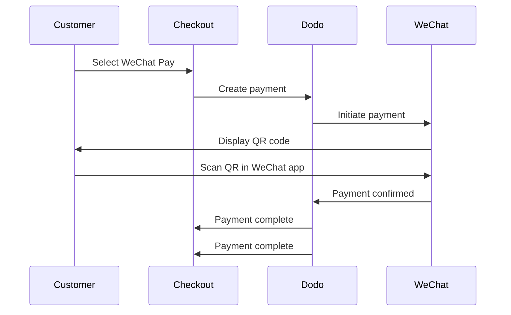

WeChat Pay là một trong hai nền tảng thanh toán di động phổ biến nhất Trung Quốc, được hơn một tỷ người sử dụng. Nền tảng này cho phép thanh toán bằng mã QR trong ứng dụng WeChat, trở thành phương thức thiết yếu đối với các doanh nghiệp hướng đến người tiêu dùng Trung Quốc.

## Tại sao nên cung cấp WeChat Pay?

<CardGroup cols={3}>
<Card title="1B+ Users" icon="users">
WeChat Pay được hơn một tỷ người sử dụng, trở thành một trong những nền tảng thanh toán lớn nhất thế giới.
</Card>

<Card title="Mobile-First" icon="mobile">
Thanh toán được hoàn tất hoàn toàn trong ứng dụng WeChat — nhanh chóng, quen thuộc và thuận tiện cho khách hàng Trung Quốc.
</Card>

<Card title="Dual Currency" icon="money-bill-transfer">
Chấp nhận thanh toán bằng cả USD và CNY, mang lại sự linh hoạt cho các giao dịch xuyên biên giới và giao dịch nội địa.
</Card>
</CardGroup>

## Tổng quan

| Chi tiết | Giá trị |
| :----- | :---- |
| **Đơn vị tiền tệ thanh toán** | USD, CNY |
| **Gói đăng ký** | Không |
| **Số tiền tối thiểu** | $0.50 / ¥1.00 |
| **Đối soát** | USD |

## Cách hoạt động



## Trải nghiệm khách hàng

1. Khách hàng chọn WeChat Pay tại bước thanh toán
2. Mã QR được hiển thị trên trang thanh toán
3. Khách hàng mở WeChat trên điện thoại và quét mã QR
4. Khách hàng xác nhận thanh toán trong ứng dụng WeChat
5. Thanh toán được xác nhận ngay lập tức và khách hàng được chuyển hướng đến trang thành công

<Info>
Khách hàng thanh toán bằng USD hoặc CNY, và bạn nhận tiền đối soát bằng USD.
</Info>

## Cấu hình

```javascript
const session = await client.checkoutSessions.create({
  product_cart: [{ product_id: 'pdt_123', quantity: 1 }],
  allowed_payment_method_types: ['we_chat_pay', 'credit', 'debit'],
  return_url: 'https://example.com/success'
});
```

## Loại phương thức API

| Loại | Phương thức | Đơn vị tiền tệ |
| :--- | :----- | :--------- |
| `we_chat_pay` | WeChat Pay | USD, CNY |

## Kiểm thử

<Steps>
<Step title="Enable test mode">
Sử dụng khóa API kiểm thử INLINE_CODE_PLACEHOLDER_9a4c11ee2d26cbea9f3abe1170224ee1 của bạn.
</Step>

<Step title="Create a test checkout">
Tạo một phiên thanh toán với `we_chat_pay` trong các phương thức thanh toán được phép.
</Step>

<Step title="Scan the QR code">
Mã QR kiểm thử sẽ được tạo — hãy quét mã bằng camera điện thoại thông thường của bạn (không cần ứng dụng WeChat). Bạn sẽ được chuyển hướng đến một trang kiểm thử, tại đó có thể mô phỏng giao dịch thành công hoặc thất bại.
</Step>
</Steps>

## Thực tiễn tốt nhất

<AccordionGroup>
<Accordion title="Target Chinese customers">
WeChat Pay chủ yếu được người tiêu dùng Trung Quốc sử dụng. Hãy cung cấp phương thức này khi cơ sở khách hàng của bạn bao gồm người mua Trung Quốc hoặc khi bạn hướng đến thị trường Trung Quốc.
</Accordion>

<Accordion title="Always include card fallbacks">
Không phải khách hàng nào cũng sử dụng WeChat. Luôn cung cấp `credit` và `debit` làm phương thức thanh toán dự phòng.
</Accordion>

<Accordion title="Optimize for mobile">
Nhiều người dùng WeChat Pay duyệt trên thiết bị di động. Đảm bảo trang thanh toán của bạn có thiết kế responsive — việc quét mã QR hoạt động tốt nhất khi trang thanh toán được hiển thị trên máy tính để bàn hoặc máy tính bảng trong khi khách hàng quét bằng điện thoại.
</Accordion>

<Accordion title="Consider both currencies">
WeChat Pay hỗ trợ cả USD và CNY. Chọn đơn vị tiền tệ thanh toán phù hợp nhất với thị trường mục tiêu — USD cho giao dịch xuyên biên giới, CNY cho giao dịch nội địa tại Trung Quốc.
</Accordion>
</AccordionGroup>

## Khắc phục sự cố

<AccordionGroup>
<Accordion title="WeChat Pay not appearing at checkout">
**Kiểm tra:**
1. `we_chat_pay` có được đưa vào `allowed_payment_method_types` không?
2. Đơn vị tiền tệ thanh toán có được đặt thành USD hoặc CNY không?
3. Số tiền giao dịch có đạt mức tối thiểu không?

**Giải pháp:** Xác minh loại phương thức thanh toán và đơn vị tiền tệ được truyền chính xác trong yêu cầu API.
</Accordion>

<Accordion title="QR code not scanning">
**Nguyên nhân:** Mã QR có thể đã hết hạn hoặc phiên bản WeChat của khách hàng đã lỗi thời.

**Giải pháp:** Làm mới trang thanh toán để tạo mã QR mới. Đảm bảo khách hàng đang sử dụng phiên bản WeChat hiện tại.
</Accordion>

<Accordion title="Payment not confirming">
**Nguyên nhân:** WeChat Pay thường được xác nhận ngay lập tức, nhưng vẫn có thể xảy ra chậm trễ do mạng.

**Giải pháp:** Theo dõi webhook để biết trạng thái xác nhận thanh toán. Nếu thanh toán không được xác nhận trong vài phút, khách hàng có thể cần thử lại.
</Accordion>
</AccordionGroup>

## Trang liên quan

<CardGroup cols={2}>
<Card title="Payment Methods Overview" icon="credit-card" href="/features/payment-methods">
Xem tất cả phương thức thanh toán được hỗ trợ.
</Card>

<Card title="Checkout Guide" icon="book" href="/developer-resources/checkout-session">
Hoàn tất hướng dẫn triển khai thanh toán.
</Card>

<Card title="Webhooks" icon="webhook" href="/developer-resources/webhooks">
Xử lý xác nhận thanh toán không đồng bộ.
</Card>

<Card title="Testing Process" icon="flask" href="/miscellaneous/testing-process">
Hướng dẫn kiểm thử đầy đủ cho tất cả phương thức thanh toán.
</Card>
</CardGroup>
