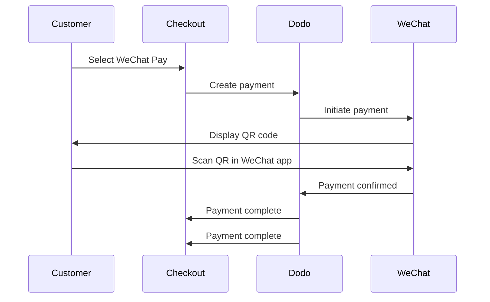

WeChat Pay là một trong hai nền tảng thanh toán di động thống trị của Trung Quốc, được sử dụng bởi hơn một tỷ người. Nó cho phép thanh toán qua mã QR trong ứng dụng WeChat, làm cho nó trở nên thiết yếu cho các doanh nghiệp nhắm đến người tiêu dùng Trung Quốc.

## Tại sao nên cung cấp WeChat Pay?

WeChat Pay được sử dụng bởi hơn một tỷ người, làm cho nó trở thành một trong những nền tảng thanh toán lớn nhất thế giới.

Các khoản thanh toán được hoàn thành hoàn toàn trong ứng dụng WeChat — nhanh chóng, quen thuộc và liền mạch cho khách hàng Trung Quốc.

Chấp nhận thanh toán bằng cả USD và CNY, mang lại sự linh hoạt cho các giao dịch xuyên biên giới và nội địa.

## Tổng quan

| Chi tiết | Giá trị |
| :----- | :---- |
| **Đơn vị tiền tệ** | USD, CNY |
| **Đăng ký** | Không |
| **Số tiền tối thiểu** | $0.50 / ¥1.00 |
| **Thanh toán** | USD |

## Cách thức hoạt động



## Trải nghiệm Khách hàng

1. Khách hàng chọn WeChat Pay tại checkout
2. Một mã QR được hiển thị trên trang thanh toán
3. Khách hàng mở WeChat trên điện thoại và quét mã QR
4. Khách hàng xác nhận thanh toán trong ứng dụng WeChat
5. Thanh toán được xác nhận ngay lập tức và khách hàng được chuyển đến trang thành công

Khách hàng thanh toán bằng USD hoặc CNY, và bạn nhận thanh toán bằng USD.

## Cấu hình

```javascript
const session = await client.checkoutSessions.create({
  product_cart: [{ product_id: 'prod_123', quantity: 1 }],
  allowed_payment_method_types: ['wechat_pay', 'credit', 'debit'],
  return_url: 'https://example.com/success'
});
```

## Kiểu Phương thức API

| Kiểu | Phương thức | Tiền tệ |
| :--- | :----- | :--------- |
| `wechat_pay` | WeChat Pay | USD, CNY |

## Kiểm thử

Sử dụng khóa API kiểm thử của Dodo Payments.

Tạo một phiên thanh toán với `wechat_pay` trong các phương thức thanh toán được phép.

Một mã QR kiểm thử sẽ được tạo — quét nó bằng camera điện thoại thông thường của bạn (không cần ứng dụng WeChat). Bạn sẽ được chuyển hướng đến trang kiểm thử nơi bạn có thể mô phỏng giao dịch là thành công hoặc thất bại.

## Thực hành Tốt nhất

WeChat Pay chủ yếu được sử dụng bởi người tiêu dùng Trung Quốc. Kết hợp nó khi cơ sở khách hàng của bạn bao gồm người mua Trung Quốc hoặc bạn đang nhắm đến thị trường Trung Quốc.

Không phải tất cả khách hàng đều có WeChat. Luôn bao gồm `credit` và `debit` như là phương thức thanh toán thay thế.

Nhiều người dùng WeChat Pay duyệt web trên di động. Đảm bảo trang thanh toán của bạn có khả năng đáp ứng — quét mã QR hoạt động tốt nhất khi thanh toán được hiển thị trên máy tính để bàn hoặc máy tính bảng trong khi khách hàng quét bằng điện thoại của họ.

WeChat Pay hỗ trợ cả USD và CNY. Chọn đơn vị tiền tệ thanh toán phù hợp nhất với thị trường mục tiêu của bạn — USD cho giao dịch xuyên biên giới, CNY cho giao dịch nội địa Trung Quốc.

## Xử lý sự cố

**Kiểm tra:**
1. `wechat_pay` có được thêm vào `allowed_payment_method_types` không?
2. Đơn vị tiền tệ có được đặt là USD hoặc CNY không?
3. Số tiền giao dịch có đáp ứng mức tối thiểu không?

**Giải pháp:** Xác minh loại phương thức thanh toán và đơn vị tiền tệ được truyền đúng trong yêu cầu API của bạn.

**Nguyên nhân:** Mã QR có thể đã hết hạn, hoặc phiên bản WeChat của khách hàng đã lỗi thời.

**Giải pháp:** Làm mới trang thanh toán để tạo mã QR mới. Đảm bảo rằng khách hàng đang sử dụng phiên bản WeChat hiện tại.

**Nguyên nhân:** Thông thường, WeChat Pay xác nhận ngay lập tức, nhưng có thể xảy ra chậm trễ mạng.

**Giải pháp:** Giám sát webhooks để xác nhận thanh toán. Nếu thanh toán không được xác nhận trong vài phút, khách hàng có thể cần thử lại.

## Trang liên quan

Xem tất cả các phương thức thanh toán được hỗ trợ.

Hướng dẫn triển khai thanh toán hoàn chỉnh.

Xử lý xác nhận thanh toán không đồng bộ.

Hướng dẫn kiểm thử đầy đủ cho tất cả các phương thức thanh toán.
