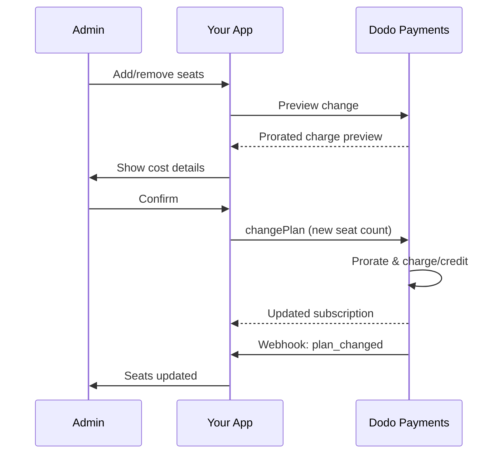

<Info>
Thanh toán theo số ghế cho phép bạn tính phí khách hàng dựa trên số lượng người dùng, thành viên nhóm hoặc giấy phép mà họ cần. Đây là mô hình định giá tiêu chuẩn cho các công cụ hợp tác nhóm, phần mềm doanh nghiệp và sản phẩm B2B SaaS.
</Info>

<CardGroup cols={2}>
<Card title="Hướng Dẫn Triển Khai" icon="code" href="/developer-resources/seat-based-pricing">
  Hướng dẫn từng bước với các ví dụ mã.
</Card>

<Card title="Tài Liệu Về Các Tiện Ích" icon="puzzle" href="/features/addons">
  Tìm hiểu về hệ thống tiện ích hỗ trợ thanh toán theo số ghế.
</Card>

<Card title="Quản Lý Đăng Ký" icon="repeat" href="/features/subscription">
  Quản lý các đăng ký theo số ghế và thay đổi kế hoạch.
</Card>

<Card title="Webhooks" icon="bell" href="/developer-resources/webhooks/intents/subscription">
  Theo dõi các thay đổi ghế với webhooks đăng ký.
</Card>
</CardGroup>

---

## Thanh Toán Theo Số Ghế Là Gì?

Thanh toán theo số ghế (còn gọi là định giá theo người dùng hoặc theo ghế) tính phí khách hàng dựa trên số lượng người dùng truy cập sản phẩm của bạn. Thay vì một khoản phí cố định, giá sẽ thay đổi theo kích thước nhóm.

### Các Trường Hợp Sử Dụng Thông Dụng

| Ngành | Ví dụ | Mô Hình Định Giá |
|----------|---------|---------------|
| Hợp Tác Nhóm | Slack, Notion, Asana | Theo người dùng hoạt động/tháng |
| Công Cụ Phát Triển | GitHub, GitLab, Jira | Theo ghế/tháng |
| Phần Mềm CRM | Salesforce, HubSpot | Theo giấy phép người dùng |
| Công Cụ Thiết Kế | Figma, Canva | Theo ghế biên tập viên |
| Phần Mềm Bảo Mật | 1Password, Okta | Theo người dùng/tháng |
| Hội Nghị Trực Tuyến | Zoom, Teams | Theo giấy phép chủ trì |

### Lợi Ích Của Định Giá Theo Số Ghế

**Đối Với Doanh Nghiệp Của Bạn:**
- Doanh thu tự nhiên tăng khi khách hàng phát triển
- Định giá có thể dự đoán mà khách hàng có thể lập ngân sách
- Lộ trình nâng cấp rõ ràng từ cá nhân đến nhóm đến doanh nghiệp
- Giá trị trọn đời cao hơn khi các nhóm mở rộng

**Đối Với Khách Hàng Của Bạn:**
- Chỉ trả tiền cho những gì họ sử dụng
- Dễ hiểu và dự đoán chi phí
- Linh hoạt thêm/bớt người dùng khi cần
- Định giá công bằng phù hợp với kích thước nhóm

---

## Cách Thanh Toán Theo Số Ghế Hoạt Động Trong Dodo Payments

Dodo Payments triển khai thanh toán theo số ghế bằng cách sử dụng hệ thống **Tiện Ích**. Đây là cách hoạt động:

### Tổng Quan Kiến Trúc

Một gói đăng ký Team Pro có giá $99/tháng và bao gồm 5 ghế. Nếu bạn có nhiều hơn 5 người dùng, bạn sẽ phải trả thêm $15/tháng cho mỗi ghế bổ sung.

Ví dụ, nếu nhóm của bạn cần 15 ghế:
- Gói cơ bản: $99/tháng (bao gồm 5 ghế)
- Phụ kiện: 10 ghế bổ sung × $15/tháng = $150/tháng
- Tổng chi phí hàng tháng: $99 + $150 = $249 cho 15 ghế

### Các Thành Phần Chính

| Thành Phần | Mục Đích | Ví Dụ |
|-----------|---------|---------|
| Sản Phẩm Cơ Bản | Đăng ký cốt lõi với các ghế đã bao gồm | "Kế Hoạch Nhóm - $99/tháng (bao gồm 5 ghế)" |
| Tiện Ích Ghế | Phí theo ghế cho người dùng bổ sung | "Ghế Bổ Sung - $15/tháng mỗi ghế" |
| Số Lượng | Số ghế bổ sung đã mua | 10 ghế bổ sung |

---

## Chiến Lược Định Giá

Chọn chiến lược định giá theo số ghế phù hợp với doanh nghiệp của bạn:

### Chiến Lược 1: Cơ Bản + Tiện Ích Theo Ghế

Bao gồm một số ghế nhất định trong kế hoạch cơ bản, tính phí cho các ghế bổ sung.

**Ví Dụ:**

```
Starter Plan: $49/month
├── Includes: 3 seats
├── Extra seats: $10/month each
└── 8 total seats = $49 + (5 × $10) = $99/month
```

**Tốt nhất cho:** Các sản phẩm mà các nhóm nhỏ có thể hoạt động với đề nghị cơ bản.

### Chiến Lược 2: Định Giá Hoàn Toàn Theo Ghế

Tính phí một mức cố định cho mỗi ghế mà không có phí cơ bản.

**Ví Dụ:**

```
Per User: $12/month
├── 5 users = $60/month
├── 20 users = $240/month
└── 100 users = $1,200/month
```

**Triển Khai:** Đặt giá kế hoạch cơ bản là $0, chỉ sử dụng tiện ích ghế.

**Tốt nhất cho:** Định giá đơn giản, minh bạch; mô hình dựa trên mức sử dụng.

### Chiến Lược 3: Định Giá Ghế Theo Bậc

Các kế hoạch cơ bản khác nhau với các mức giá theo ghế khác nhau.

**Ví Dụ:**

```
Starter: $0/month base + $15/seat
├── Lower features, higher per-seat cost

Professional: $99/month base + $10/seat
├── More features, lower per-seat cost

Enterprise: $499/month base + $7/seat
└── All features, volume discount on seats
```

**Triển Khai:** Tạo các sản phẩm riêng biệt cho mỗi bậc với các mức giá tiện ích khác nhau.

**Tốt nhất cho:** Khuyến khích nâng cấp lên các bậc cao hơn; bán hàng doanh nghiệp.

### Chiến Lược 4: Gói Ghế

Bán ghế theo gói thay vì từng cái một.

**Ví Dụ:**

```
5-Seat Pack: $50/month ($10/seat)
10-Seat Pack: $80/month ($8/seat)
25-Seat Pack: $175/month ($7/seat)
```

**Triển Khai:** Tạo nhiều tiện ích cho các kích thước gói khác nhau.

**Tốt nhất cho:** Đơn giản hóa quyết định mua hàng; khuyến khích cam kết lớn hơn.

---

## Thiết Lập Thanh Toán Theo Số Ghế

### Bước 1: Lập Kế Hoạch Định Giá Của Bạn

Trước khi triển khai, xác định cấu trúc định giá của bạn:

<Steps>
<Step title="Xác Định Kế Hoạch Cơ Bản">
Quyết định những gì được bao gồm trong đăng ký cơ bản:
- Giá cơ bản (có thể là $0 cho định giá hoàn toàn theo ghế)
- Số ghế đã bao gồm
- Các tính năng có sẵn ở cấp độ này
</Step>

<Step title="Đặt Giá Ghế">
Xác định chi phí tiện ích theo ghế:
- Giá cho mỗi ghế bổ sung
- Bất kỳ giảm giá theo khối lượng nào (thông qua nhiều tiện ích)
- Số ghế tối đa cho phép (nếu có)
</Step>

<Step title="Xem Xét Tần Suất Thanh Toán">
Căn chỉnh giá ghế với chu kỳ thanh toán của bạn:
- Đăng ký hàng tháng → phí ghế hàng tháng
- Đăng ký hàng năm → phí ghế hàng năm (thường được giảm giá)
</Step>
</Steps>

### Bước 2: Tạo Tiện Ích Ghế

Trong bảng điều khiển Dodo Payments của bạn:

1. Điều hướng đến **Sản Phẩm** → **Tiện Ích**
2. Nhấp vào **Tạo Tiện Ích**
3. Cấu hình tiện ích:

| Trường | Giá Trị | Ghi Chú |
|-------|-------|-------|
| Tên | "Ghế Bổ Sung" hoặc "Thành Viên Nhóm" | Tên rõ ràng, thân thiện với người dùng |
| Mô Tả | "Thêm một thành viên nhóm khác vào không gian làm việc của bạn" | Giải thích những gì khách hàng nhận được |
| Giá | Giá theo ghế của bạn | ví dụ: $10.00 |
| Tiền Tệ | Phù hợp với sản phẩm cơ bản của bạn | Phải là cùng một loại tiền tệ |
| Danh Mục Thuế | Giống như sản phẩm cơ bản | Đảm bảo xử lý thuế nhất quán |

<Tip>
Tạo tên tiện ích mô tả mà có ý nghĩa trên hóa đơn. "Ghế Nhóm Bổ Sung" rõ ràng hơn "Tiện Ích Ghế" cho khách hàng xem xét hóa đơn của họ.
</Tip>

### Bước 3: Tạo Sản Phẩm Đăng Ký Cơ Bản

Tạo sản phẩm đăng ký của bạn:

1. Điều hướng đến **Sản Phẩm** → **Tạo Sản Phẩm**
2. Chọn **Đăng Ký**
3. Cấu hình giá và chi tiết
4. Trong phần **Tiện Ích**, đính kèm tiện ích ghế của bạn

### Bước 4: Đính Kèm Tiện Ích Vào Sản Phẩm

Liên kết tiện ích ghế với đăng ký của bạn:

1. Chỉnh sửa sản phẩm đăng ký của bạn
2. Cuộn xuống phần **Tiện Ích**
3. Nhấp vào **Thêm Tiện Ích**
4. Chọn tiện ích ghế của bạn
5. Lưu thay đổi

<Check>
Sản phẩm đăng ký của bạn hiện hỗ trợ định giá theo số ghế. Khách hàng có thể mua bất kỳ số lượng ghế bổ sung nào trong quá trình thanh toán.
</Check>

---

## Quản Lý Ghế

### Thêm Ghế Vào Các Đăng Ký Mới

Khi tạo một phiên thanh toán, xác định số lượng ghế:

```typescript
const session = await client.checkoutSessions.create({
  product_cart: [{
    product_id: 'prod_team_plan',
    quantity: 1,
    addons: [{
      addon_id: 'addon_seat',
      quantity: 10  // 10 additional seats
    }]
  }],
  customer: { email: 'admin@company.com' },
  return_url: 'https://yourapp.com/success'
});
```

### Thay Đổi Số Ghế Trong Các Đăng Ký Hiện Tại

Sử dụng API Thay Đổi Kế Hoạch để điều chỉnh số ghế:

```typescript
// Add 5 more seats to existing subscription
await client.subscriptions.changePlan('sub_123', {
  product_id: 'prod_team_plan',
  quantity: 1,
  proration_billing_mode: 'prorated_immediately',
  addons: [{
    addon_id: 'addon_seat',
    quantity: 15  // New total: 15 additional seats
  }]
});
```

### Gỡ Bỏ Ghế

Để giảm số ghế, xác định số lượng thấp hơn:

```typescript
// Reduce from 15 to 8 additional seats
await client.subscriptions.changePlan('sub_123', {
  product_id: 'prod_team_plan',
  quantity: 1,
  proration_billing_mode: 'difference_immediately',
  addons: [{
    addon_id: 'addon_seat',
    quantity: 8  // Reduced to 8 additional seats
  }]
});
```

### Gỡ Bỏ Tất Cả Ghế Bổ Sung

Truyền một mảng tiện ích rỗng để gỡ bỏ tất cả tiện ích:

```typescript
// Remove all additional seats, keep only base plan seats
await client.subscriptions.changePlan('sub_123', {
  product_id: 'prod_team_plan',
  quantity: 1,
  proration_billing_mode: 'difference_immediately',
  addons: []  // Removes all add-ons
});
```

---

## Tính Toán Tỷ Lệ Cho Các Thay Đổi Ghế

Khi khách hàng thêm hoặc gỡ bỏ ghế giữa chu kỳ, tính toán tỷ lệ xác định cách họ được tính phí.



### Chế độ Proration

| Chế độ | Thêm ghế | Gỡ ghế |
|------|-------------|----------------|
| `prorated_immediately` | Tính phí cho những ngày còn lại trong chu kỳ | Tín dụng cho những ngày chưa sử dụng |
| `difference_immediately` | Tính phí giá ghế đầy đủ | Tín dụng áp dụng cho các gia hạn trong tương lai |
| `full_immediately` | Tính phí giá ghế đầy đủ, thiết lập lại chu kỳ thanh toán | Không có tín dụng |

### Ví dụ Proration

**Tình huống: 15 ngày chu kỳ thanh toán còn lại, thêm 5 ghế tại $10/ghế**

<Tabs>
<Tab title="prorated_immediately">

```
Prorated charge = ($10 × 5 seats) × (15 days / 30 days)
                = $50 × 0.5
                = $25 immediate charge
```

Khách hàng trả $25 ngay bây giờ, sau đó $50/tháng khi gia hạn.
</Tab>

<Tab title="difference_immediately">

```
Immediate charge = $10 × 5 seats = $50
```

Khách hàng trả toàn bộ $50 ngay bây giờ, bất kể vị trí trong chu kỳ.
</Tab>

<Tab title="full_immediately">

```
Immediate charge = Full subscription + add-ons
Billing cycle resets to today
```

Khách hàng trả toàn bộ số tiền, chu kỳ thanh toán mới bắt đầu.
</Tab>
</Tabs>

**Tình huống: Gỡ 3 ghế giữa chu kỳ với prorated_immediately**

```
Current: Team Plan ($99/month) + 10 extra seats × $10/seat = $199/month
Change: Remove 3 seats (10 → 7 extra seats) on day 20 of 30-day cycle
Remaining: 10 days

Credit for removed seats:
  = ($10 × 3 seats) × (10 days / 30 days)
  = $30 × 0.333
  = $10.00 credit

→ $10.00 credit added to subscription
→ Next renewal: $99 + (7 × $10) = $169.00/month
→ Credit auto-applies: $169.00 − $10.00 = $159.00 on next invoice
```

<Tip>
**Chọn chế độ proration cho các thay đổi ghế**: Sử dụng `prorated_immediately` cho việc thanh toán công bằng dựa trên ngày khi các nhóm thường xuyên điều chỉnh ghế. Sử dụng `difference_immediately` cho phép toán đơn giản hơn tính phí hoặc tín dụng theo giá ghế đầy đủ. Xem [Hướng dẫn Proration](/developer-resources/subscription-upgrade-downgrade#proration-modes) để so sánh chi tiết.
</Tip>

### Xem trước trước khi thay đổi

Luôn xem trước proration trước khi thực hiện thay đổi:

```typescript
const preview = await client.subscriptions.previewChangePlan('sub_123', {
  product_id: 'prod_team_plan',
  quantity: 1,
  proration_billing_mode: 'prorated_immediately',
  addons: [{ addon_id: 'addon_seat', quantity: 20 }]
});

console.log('Immediate charge:', preview.immediate_charge.summary);
// Show customer: "Adding 5 seats will cost $25 today"
```

---

## Theo dõi ghế với Webhooks

Giám sát các thay đổi ghế bằng cách lắng nghe các webhook đăng ký:

### Sự kiện liên quan

| Sự kiện | Khi nào kích hoạt | Trường hợp sử dụng |
|-------|----------------|----------|
| `subscription.active` | Đã kích hoạt đăng ký mới | Cung cấp ghế ban đầu |
| `subscription.plan_changed` | Ghế được thêm hoặc gỡ bỏ | Cập nhật số lượng ghế trong ứng dụng của bạn |
| `subscription.renewed` | Đăng ký được gia hạn | Xác nhận số lượng ghế không thay đổi |
| `subscription.cancelled` | Đăng ký bị hủy | Hủy cung cấp tất cả các ghế |

### Ví dụ về Trình xử lý Webhook

```typescript
app.post('/webhooks/dodo', async (req, res) => {
  const event = req.body;

  switch (event.type) {
    case 'subscription.active':
      // New subscription - provision seats
      const seats = calculateTotalSeats(event.data);
      await provisionSeats(event.data.customer_id, seats);
      break;

    case 'subscription.plan_changed':
      // Seats changed - update access
      const newSeats = calculateTotalSeats(event.data);
      await updateSeatCount(event.data.subscription_id, newSeats);
      break;

    case 'subscription.cancelled':
      // Subscription cancelled - deprovision
      await deprovisionAllSeats(event.data.subscription_id);
      break;
  }

  res.json({ received: true });
});

function calculateTotalSeats(subscriptionData) {
  const baseSeats = 5;  // Included in plan
  const addonSeats = subscriptionData.addons?.reduce(
    (total, addon) => total + addon.quantity, 0
  ) || 0;
  return baseSeats + addonSeats;
}
```

---

## Thiết lập giới hạn ghế

Ứng dụng của bạn phải đảm bảo các giới hạn ghế. Dodo Payments theo dõi thanh toán, nhưng bạn kiểm soát quyền truy cập.

### Chiến lược Thực thi

<Tabs>
<Tab title="Giới hạn cứng">
Ngăn chặn nghiêm ngặt việc thêm người dùng vượt qua số ghế.

```typescript
async function inviteUser(teamId: string, email: string) {
  const team = await getTeam(teamId);
  const subscription = await getSubscription(team.subscriptionId);
  const totalSeats = calculateTotalSeats(subscription);
  const usedSeats = await countTeamMembers(teamId);

  if (usedSeats >= totalSeats) {
    throw new Error('No seats available. Please upgrade your plan.');
  }

  await sendInvitation(teamId, email);
}
```

</Tab>

<Tab title="Giới hạn mềm với Cảnh báo">
Cho phép vượt quá với cảnh báo và thời gian ân hạn.

```typescript
async function inviteUser(teamId: string, email: string) {
  const team = await getTeam(teamId);
  const { totalSeats, usedSeats } = await getSeatInfo(team);

  if (usedSeats >= totalSeats) {
    // Allow but flag for billing
    await flagOverage(teamId, usedSeats - totalSeats + 1);
    await notifyAdmin(team.adminEmail, 'You have exceeded your seat limit');
  }

  await sendInvitation(teamId, email);
}
```

</Tab>

<Tab title="Tự động nâng cấp">
Tự động thêm ghế khi giới hạn được đạt.


```typescript
async function inviteUser(teamId: string, email: string) {
  const team = await getTeam(teamId);
  const { totalSeats, usedSeats, subscriptionId } = await getSeatInfo(team);

  if (usedSeats >= totalSeats) {
    // Automatically add a seat
    await client.subscriptions.changePlan(subscriptionId, {
      product_id: team.productId,
      quantity: 1,
      proration_billing_mode: 'prorated_immediately',
      addons: [{ addon_id: 'addon_seat', quantity: totalSeats - baseSeats + 1 }]
    });

    await notifyAdmin(team.adminEmail, 'A new seat was added to your plan');
  }

  await sendInvitation(teamId, email);
}
```

</Tab>
</Tabs>

---

## Mô hình Nâng cao

### Các Loại Ghế Khác Nhau

Cung cấp các loại ghế khác nhau với mức giá khác nhau:

```
Full Seats: $20/month - Full access to all features
View-Only Seats: $5/month - Read-only access
Guest Seats: $0/month - Limited external collaborator access
```

**Thực hiện:** Tạo các phụ kiện riêng biệt cho mỗi loại ghế.

```typescript
const session = await client.checkoutSessions.create({
  product_cart: [{
    product_id: 'prod_team_plan',
    quantity: 1,
    addons: [
      { addon_id: 'addon_full_seat', quantity: 10 },
      { addon_id: 'addon_viewer_seat', quantity: 25 },
      { addon_id: 'addon_guest_seat', quantity: 50 }
    ]
  }]
});
```

### Giảm giá Ghế Hàng Năm

Cung cấp giá ghế hàng năm với mức giảm giá:

```
Monthly: $15/seat/month
Annual: $12/seat/month (20% savings)
```

**Thực hiện:** Tạo các sản phẩm riêng biệt cho các gói hàng tháng và hàng năm với các mức giá phụ kiện khác nhau.

### Yêu cầu Số Ghế Tối Thiểu

Yêu cầu số ghế tối thiểu cho một số gói nhất định:

```typescript
async function validateSeatCount(planId: string, seatCount: number) {
  const minimums = {
    'prod_starter': 1,
    'prod_team': 5,
    'prod_enterprise': 25
  };

  if (seatCount < minimums[planId]) {
    throw new Error(`${planId} requires at least ${minimums[planId]} seats`);
  }
}
```

---

## Những Thực hành Tốt Nhất

### Những Thực hành Tốt Nhất về Giá cả

- **Giao tiếp rõ ràng**: Hiện giá theo ghế một cách nổi bật trên trang giá cả của bạn
- **Ghế đã bao gồm**: Cân nhắc bao gồm một vài ghế trong giá cơ bản để giảm bớt rào cản
- **Giảm giá theo số lượng**: Cung cấp mức giá thấp hơn theo ghế cho các nhóm lớn hơn để giành được các hợp đồng doanh nghiệp
- **Khuyến khích Hàng năm**: Giảm giá cho các gói hàng năm để cải thiện dòng tiền và sự giữ chân

### Những Thực hành Tốt Nhất về Kỹ thuật

- **Lưu trữ Số lượng Ghế**: Lưu trữ số lượng ghế đăng ký tại chỗ để tránh các cuộc gọi API trên mỗi yêu cầu
- **Đồng bộ thường xuyên**: Thỉnh thoảng đồng bộ số lượng ghế tại chỗ với Dodo Payments qua API
- **Xử lý lỗi**: Nếu thay đổi ghế không thành công, hiển thị thông điệp lỗi rõ ràng và tùy chọn thử lại
- **Thông tin Kiểm toán**: Ghi lại tất cả các thay đổi ghế để giải quyết tranh chấp thanh toán và tuân thủ

### Những Thực hành Tốt Nhất về Trải nghiệm Người Dùng

- **Phản hồi theo Thời gian Thực**: Hiển thị tác động chi phí ngay lập tức khi điều chỉnh ghế
- **Bước Xác nhận**: Yêu cầu xác nhận trước khi thay đổi thanh toán
- **Minh bạch Proration**: Giải thích rõ ràng các khoản phí prorated trước khi áp dụng
- **Dễ dàng Giảm cấp**: Đừng làm khó khăn việc giảm số ghế (điều này xây dựng lòng tin)

---

## Khắc phục Sự cố

<AccordionGroup>
<Accordion title="Số lượng ghế không khớp giữa ứng dụng và thanh toán">
**Triệu chứng**: Ứng dụng của bạn hiển thị số lượng ghế khác với đăng ký.

**Nguyên nhân**:
- Webhook không nhận được hoặc không được xử lý
- Điều kiện đua trong quá trình thay đổi ghế
- Dữ liệu lưu trữ không được cập nhật

**Giải pháp**:
1. Triển khai các trình xử lý webhook cho `subscription.plan_changed`
2. Thêm một nút "Đồng bộ với thanh toán" để lấy đăng ký hiện tại
3. Thiết lập TTL lưu trữ để đảm bảo làm mới thường xuyên
</Accordion>

<Accordion title="Các khoản phí proration không như mong đợi">
**Triệu chứng**: Khách hàng bối rối bởi số tiền tính phí giữa chu kỳ.

**Nguyên nhân**:
- Chế độ proration không được thông báo rõ ràng
- Khách hàng không thấy xem trước trước khi xác nhận

**Giải pháp**:
1. Luôn sử dụng `previewChangePlan` trước khi thực hiện thay đổi
2. Hiển thị phân tích rõ ràng: "Thêm X ghế = $Y hôm nay (prorated cho Z ngày)"
3. Tài liệu chính sách proration của bạn trong trung tâm trợ giúp
</Accordion>

<Accordion title="Phụ kiện không xuất hiện trong thanh toán">
**Triệu chứng**: Phụ kiện ghế không có sẵn trong quá trình thanh toán.

**Nguyên nhân**:
- Phụ kiện không được gán cho sản phẩm
- Phụ kiện đã bị lưu trữ hoặc xóa
- Sự không khớp về tiền tệ giữa sản phẩm và phụ kiện

**Giải pháp**:
1. Kiểm tra xem phụ kiện đã được gán trong cài đặt sản phẩm chưa
2. Kiểm tra trạng thái của phụ kiện trong bảng điều khiển Phụ kiện
3. Đảm bảo các loại tiền tệ khớp chính xác
</Accordion>

<Accordion title="Không thể giảm ghế dưới mức sử dụng hiện tại">
**Triệu chứng**: Khách hàng muốn giảm ghế nhưng đang có người dùng được phân công.

**Giải pháp**:
1. Hiển thị những người dùng nào phải được gỡ bỏ trước khi giảm ghế
2. Thực hiện một quy trình: Gỡ bỏ người dùng → Giảm ghế
3. Cân nhắc một thời gian ân hạn trước khi thực hiện việc giảm ghế
</Accordion>
</AccordionGroup>

---

## Tài liệu liên quan

<CardGroup cols={2}>
<Card title="Hướng dẫn Giá dựa trên Ghế" icon="code" href="/developer-resources/seat-based-pricing">
  Hướng dẫn triển khai đầy đủ cùng mã.
</Card>

<Card title="Phụ kiện" icon="puzzle" href="/features/addons">
  Hiểu sâu về hệ thống phụ kiện.
</Card>

<Card title="Thay đổi Gói & Proration" icon="arrows-rotate" href="/developer-resources/subscription-upgrade-downgrade">
  Xử lý các sửa đổi đăng ký.
</Card>

<Card title="Webhook Đăng ký" icon="bell" href="/developer-resources/webhooks/intents/subscription">
  Theo dõi các sự kiện đăng ký.
</Card>
</CardGroup>
