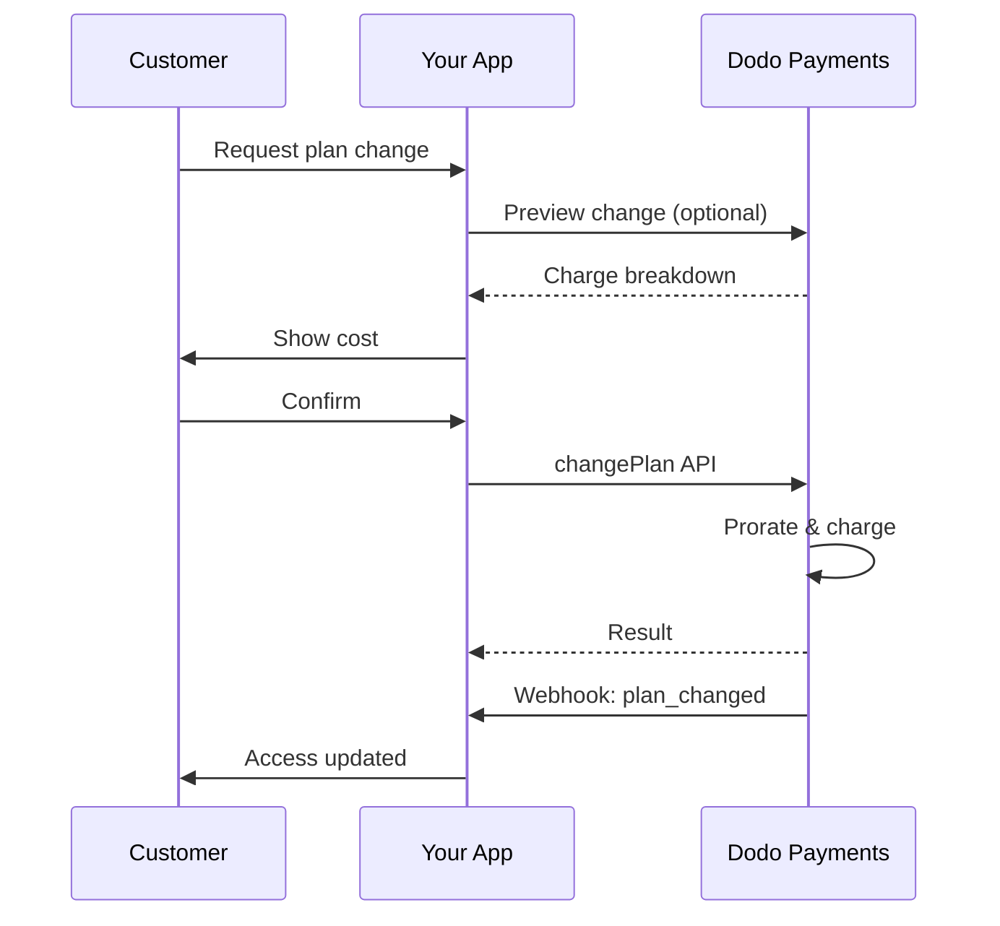
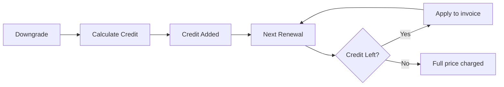

<Info>
Đăng ký cho phép bạn bán quyền truy cập liên tục với việc gia hạn tự động. Sử dụng các chu kỳ thanh toán linh hoạt, thử nghiệm miễn phí, thay đổi kế hoạch và bổ sung để điều chỉnh giá cho từng khách hàng.
</Info>

<CardGroup cols={2}>
<Card title="Nâng cấp & Hạ cấp" icon="repeat" href="/developer-resources/subscription-upgrade-downgrade">
Kiểm soát thay đổi kế hoạch với phân bổ và cập nhật số lượng.
</Card>

<Card title="Đăng ký theo yêu cầu" icon="bolt" href="/developer-resources/ondemand-subscriptions">
Ủy quyền một mệnh lệnh ngay bây giờ và tính phí sau với số tiền tùy chỉnh.
</Card>

<Card title="Cổng thông tin khách hàng" icon="id-card" href="/features/customer-portal">
Cho phép khách hàng quản lý kế hoạch, thanh toán và hủy bỏ.
</Card>

<Card title="Webhook Đăng ký" icon="code" href="/developer-resources/webhooks/intents/subscription">
Phản ứng với các sự kiện vòng đời như được tạo, gia hạn và hủy bỏ.
</Card>
</CardGroup>

## Đăng Ký Là Gì?

Đăng ký là các sản phẩm định kỳ mà khách hàng mua theo lịch trình. Chúng lý tưởng cho:

- **Giấy phép SaaS**: Ứng dụng, API hoặc quyền truy cập nền tảng
- **Thành viên**: Cộng đồng, chương trình hoặc câu lạc bộ
- **Nội dung kỹ thuật số**: Khóa học, phương tiện hoặc nội dung cao cấp
- **Kế hoạch hỗ trợ**: SLA, gói thành công hoặc bảo trì

## Lợi Ích Chính

- **Doanh thu dự đoán**: Thanh toán định kỳ với việc gia hạn tự động
- **Chu kỳ linh hoạt**: Hàng tháng, hàng năm, khoảng thời gian tùy chỉnh và thử nghiệm
- **Tính linh hoạt của kế hoạch**: Phân bổ cho nâng cấp và hạ cấp
- **Bổ sung và chỗ ngồi**: Gắn các nâng cấp tùy chọn, có thể định lượng
- **Thanh toán liền mạch**: Thanh toán được lưu trữ và cổng thông tin khách hàng
- **Ưu tiên cho nhà phát triển**: API rõ ràng cho việc tạo, thay đổi và theo dõi sử dụng

## Tạo Đăng Ký

Tạo các sản phẩm đăng ký trong bảng điều khiển Dodo Payments của bạn, sau đó bán chúng thông qua thanh toán hoặc API của bạn. Việc tách biệt các sản phẩm khỏi các đăng ký hoạt động cho phép bạn phiên bản giá, gắn bổ sung và theo dõi hiệu suất một cách độc lập.

### Tạo sản phẩm đăng ký

Cấu hình các trường trong bảng điều khiển để xác định cách sản phẩm đăng ký của bạn được bán, gia hạn và thanh toán. Các phần dưới đây tương ứng trực tiếp với những gì bạn thấy trong biểu mẫu tạo.

#### Chi tiết sản phẩm

- **Tên sản phẩm** (bắt buộc): Tên hiển thị được hiển thị trong thanh toán, cổng thông tin khách hàng và hóa đơn.
- **Mô tả sản phẩm** (bắt buộc): Một tuyên bố giá trị rõ ràng xuất hiện trong thanh toán và hóa đơn.
- **Hình ảnh sản phẩm** (bắt buộc): PNG/JPG/WebP tối đa 3 MB. Được sử dụng trên thanh toán và hóa đơn.
- **Thương hiệu**: Liên kết sản phẩm với một thương hiệu cụ thể để tạo chủ đề và email.
- **Danh mục thuế** (bắt buộc): Chọn danh mục (ví dụ: SaaS) để xác định quy tắc thuế.

<Tip>
Chọn danh mục thuế chính xác nhất để đảm bảo thu thuế đúng theo khu vực.
</Tip>

#### Giá cả

- **Loại giá**: Chọn <b>Đăng ký</b> (hướng dẫn này). Các lựa chọn thay thế là Thanh toán một lần và Thanh toán theo mức sử dụng.
- **Giá** (bắt buộc): Giá cơ bản định kỳ với đơn vị tiền tệ.
- **Giảm giá áp dụng (%)**: Phần trăm giảm giá tùy chọn áp dụng cho giá cơ bản; được phản ánh trong thanh toán và hóa đơn.
- **Lặp lại thanh toán mỗi** (bắt buộc): Khoảng thời gian cho việc gia hạn, ví dụ, mỗi 1 tháng. Chọn nhịp (tháng hoặc năm) và số lượng.
- **Thời gian đăng ký** (bắt buộc): Tổng thời gian mà đăng ký vẫn còn hiệu lực (ví dụ, 10 năm). Sau khi thời gian này kết thúc, việc gia hạn sẽ dừng lại trừ khi được gia hạn.
- **Số ngày thử nghiệm** (bắt buộc): Đặt độ dài thử nghiệm tính bằng ngày. Sử dụng 0 để vô hiệu hóa thử nghiệm. Khoản phí đầu tiên sẽ tự động xảy ra khi thử nghiệm kết thúc.
- **Chọn tiện ích bổ sung**: Gắn tối đa 10 tiện ích bổ sung mà khách hàng có thể mua cùng với gói cơ bản.

<Warning>
Thay đổi giá trên một sản phẩm đang hoạt động sẽ ảnh hưởng đến các giao dịch mua mới. Các đăng ký hiện có sẽ tuân theo cài đặt thay đổi kế hoạch và phân bổ của bạn.
</Warning>

<Info>
Bổ sung là lý tưởng cho các tiện ích có thể định lượng như chỗ ngồi hoặc lưu trữ. Bạn có thể kiểm soát số lượng cho phép và hành vi phân bổ khi khách hàng thay đổi chúng.
</Info>

#### Cài đặt nâng cao

- **Giá bao gồm thuế**: Hiển thị giá bao gồm thuế áp dụng. Tính toán thuế cuối cùng vẫn thay đổi theo vị trí của khách hàng.
- **Tạo khóa giấy phép**: Cấp một khóa duy nhất cho mỗi khách hàng sau khi mua. Xem hướng dẫn <a href="/features/license-keys">Khóa Giấy Phép</a>.
- **Giao hàng sản phẩm kỹ thuật số**: Giao tệp hoặc nội dung tự động sau khi mua. Tìm hiểu thêm trong <a href="/features/digital-product-delivery">Giao hàng sản phẩm kỹ thuật số</a>.
- **Siêu dữ liệu**: Gắn các cặp khóa–giá trị tùy chỉnh cho việc gán nhãn nội bộ hoặc tích hợp khách hàng. Xem <a href="/api-reference/metadata">Siêu dữ liệu</a>.

<Tip>
Sử dụng siêu dữ liệu để lưu trữ các định danh từ hệ thống của bạn (ví dụ: accountId) để bạn có thể đối chiếu các sự kiện và hóa đơn sau này.
</Tip>

## Thử Nghiệm Đăng Ký

Thử nghiệm cho phép khách hàng truy cập các đăng ký mà không cần thanh toán ngay lập tức. Khoản phí đầu tiên sẽ xảy ra tự động khi thử nghiệm kết thúc.

### Cấu Hình Thử Nghiệm

Đặt **Số Ngày Thử Nghiệm** trong phần giá sản phẩm (sử dụng `0` để vô hiệu hóa). Bạn có thể ghi đè điều này khi tạo đăng ký:

```typescript
// Via subscription creation
const subscription = await client.subscriptions.create({
  customer_id: 'cus_123',
  product_id: 'prod_monthly',
  trial_period_days: 14  // Overrides product's trial period
});

// Via checkout session
const session = await client.checkoutSessions.create({
  product_cart: [{ product_id: 'prod_monthly', quantity: 1 }],
  subscription_data: { trial_period_days: 14 }
});
```

<Warning>
Giá trị `trial_period_days` phải nằm trong khoảng từ 0 đến 10.000 ngày.
</Warning>

### Phát Hiện Trạng Thái Thử Nghiệm

<Warning>
Hiện tại, không có trường trực tiếp nào để phát hiện trạng thái thử nghiệm. Dưới đây là một giải pháp thay thế yêu cầu truy vấn thanh toán, điều này không hiệu quả. Chúng tôi đang làm việc trên một giải pháp hiệu quả hơn.
</Warning>

Để xác định xem một đăng ký có đang trong thời gian thử nghiệm hay không, hãy lấy danh sách các khoản thanh toán cho đăng ký đó. Nếu có chính xác một khoản thanh toán với số tiền 0, thì đăng ký đang trong thời gian thử nghiệm:

```typescript
const subscription = await client.subscriptions.retrieve('sub_123');
const payments = await client.payments.list({
  subscription_id: subscription.subscription_id
});

// Check if subscription is in trial
const isInTrial = payments.items.length === 1 && 
                  payments.items[0].total_amount === 0;
```

### Cập Nhật Thời Gian Thử Nghiệm

Mở rộng thời gian thử nghiệm bằng cách cập nhật `next_billing_date`:

```typescript
await client.subscriptions.update('sub_123', {
  next_billing_date: '2025-02-15T00:00:00Z'  // New trial end date
});
```

<Warning>
Bạn không thể đặt `next_billing_date` vào thời điểm trong quá khứ. Thời gian phải ở trong tương lai.
</Warning>

## Thay Đổi Kế Hoạch Đăng Ký

Thay đổi kế hoạch cho phép bạn nâng cấp hoặc hạ cấp các đăng ký, điều chỉnh số lượng hoặc chuyển sang các sản phẩm khác. Mỗi thay đổi sẽ kích hoạt một khoản phí ngay lập tức dựa trên chế độ phân bổ mà bạn chọn.

<Tip>
Bạn có thể thay đổi kế hoạch đăng ký và cập nhật ngày thanh toán tiếp theo trực tiếp từ bảng điều khiển Dodo Payments. Điều này cung cấp một cách nhanh chóng để điều chỉnh các đăng ký cho các yêu cầu hỗ trợ khách hàng, nâng cấp khuyến mãi hoặc di chuyển kế hoạch mà không cần thực hiện các cuộc gọi API.
</Tip>

<Tip>
**Bật thay đổi gói tự phục vụ:** Bạn có muốn khách hàng tự nâng cấp hoặc hạ cấp đăng ký của họ qua Cổng khách hàng không? Thêm các sản phẩm đăng ký của bạn vào Bộ sưu tập sản phẩm và bật "Cho phép Cập nhật Đăng ký" trong Cài đặt Đăng ký của bạn.
</Tip>



<Card title="Bộ sưu tập sản phẩm" icon="layer-group" href="/features/product-collections">
  Nhóm các sản phẩm liên quan vào các bộ sưu tập để cho phép các con đường nâng cấp/hạ cấp liền mạch trong Cổng khách hàng.
</Card>

### Chế độ phân bổ

Chọn cách khách hàng được lập hóa đơn khi thay đổi gói:

<Info>
**So sánh nhanh ba chế độ phân bổ:**

| | `prorated_immediately` | `difference_immediately` | `full_immediately` |
|---|---|---|---|
| **Nâng cấp** | Phí phân bổ cho các ngày còn lại | Phí đầy đủ được tính | Phí kế hoạch mới đầy đủ được tính |
| **Hạ cấp** | Tín dụng phân bổ cho các ngày còn lại | Phí chênh lệch đầy đủ như tín dụng | Không có tín dụng, thu đầy đủ |
| **Chu kỳ lập hóa đơn** | Giữ nguyên như cũ | Giữ nguyên như cũ | Đặt lại về ngày hôm nay |
| **Tốt nhất cho** | Lập hóa đơn công bằng theo thời gian | Thay đổi mức đơn giản | Chu kỳ lập hóa đơn được đặt lại |
</Info>

#### `prorated_immediately`
Tính phí theo tỷ lệ dựa trên thời gian còn lại trong chu kỳ lập hóa đơn hiện tại. Tốt nhất cho lập hóa đơn công bằng tính đến thời gian chưa sử dụng.

```typescript
await client.subscriptions.changePlan('sub_123', {
  product_id: 'prod_pro',
  quantity: 1,
  proration_billing_mode: 'prorated_immediately'
});
```

#### `difference_immediately`
Tính phí chênh lệch giá ngay lập tức (nâng cấp) hoặc thêm tín dụng cho các lần gia hạn sau (hạ cấp). Tốt nhất cho các tình huống nâng cấp/hạ cấp đơn giản.

```typescript
// Upgrade: charges $50 (difference between $30 and $80)
// Downgrade: credits remaining value, auto-applied to renewals
await client.subscriptions.changePlan('sub_123', {
  product_id: 'prod_pro',
  quantity: 1,
  proration_billing_mode: 'difference_immediately'
});
```

<Info>
Tín dụng từ việc hạ cấp sử dụng `difference_immediately` là đối tượng đăng ký và tự động áp dụng cho các lần gia hạn trong tương lai. Chúng khác với <a href="/features/customer-credit">Tín dụng Khách hàng</a>.
</Info>

Khi một khách hàng hạ cấp với `difference_immediately`, giá trị chưa sử dụng trở thành tín dụng đối tượng đăng ký tự động bù đắp cho các lần gia hạn trong tương lai:



#### `full_immediately`
Tính phí tổng số tiền kế hoạch mới ngay lập tức, không phụ thuộc vào thời gian còn lại. Tốt nhất cho việc đặt lại chu kỳ lập hóa đơn.

```typescript
await client.subscriptions.changePlan('sub_123', {
  product_id: 'prod_monthly',
  quantity: 1,
  proration_billing_mode: 'full_immediately'
});
```

<AccordionGroup>
<Accordion title="Ví dụ: Tính toán nâng cấp theo tỷ lệ">

**Kịch bản**: Khách hàng trên gói Cơ bản (30$/tháng) nâng cấp lên gói Pro (80$/tháng) vào ngày thứ 16 của chu kỳ 30 ngày sử dụng `prorated_immediately`.

```
Unused credit from Basic = $30 × (15 remaining / 30 total) = $15.00
Prorated cost of Pro     = $80 × (15 remaining / 30 total) = $40.00
────────────────────────────────────────────────────────────────────
Immediate charge         = $40.00 − $15.00 = $25.00
```

Lần gia hạn tiếp theo vào ngày lập hóa đơn ban đầu: **80,00$/tháng**.

<Tip>
Để có ví dụ tính toán chi tiết hơn và các trường hợp ngoại lệ, hãy xem hướng dẫn đầy đủ [Hướng dẫn Nâng cấp & Hạ cấp](/developer-resources/subscription-upgrade-downgrade).
</Tip>

</Accordion>
<Accordion title="Ví dụ: Tính toán tín dụng hạ cấp">

**Kịch bản**: Khách hàng trên gói Pro (80$/tháng) hạ cấp xuống gói Starter (20$/tháng) sử dụng `difference_immediately`.

```
Credit = Old plan − New plan = $80 − $20 = $60.00
```

Tín dụng 60$ tự động áp dụng cho các lần gia hạn trong tương lai:
- Gia hạn 1: 20$ − 20$ (tín dụng) = **0,00$** (tín dụng còn 40$)
- Gia hạn 2: 20$ − 20$ (tín dụng) = **0,00$** (tín dụng còn 20$)  
- Gia hạn 3: 20$ − 20$ (tín dụng) = **0,00$** (tín dụng đã hết)
- Gia hạn 4: **20,00$** (giá đầy đủ)

<Info>
Tìm hiểu thêm về cách quản lý tín dụng trong [Hướng dẫn Nâng cấp & Hạ cấp](/developer-resources/subscription-upgrade-downgrade).
</Info>

</Accordion>
</AccordionGroup>

### Thay đổi Gói với Các Phụ kiện

Chỉnh sửa các phụ kiện khi thay đổi gói. Các phụ kiện được bao gồm trong các phép tính phân bổ:

```typescript
await client.subscriptions.changePlan('sub_123', {
  product_id: 'prod_pro',
  quantity: 1,
  proration_billing_mode: 'difference_immediately',
  addons: [{ addon_id: 'addon_extra_seats', quantity: 2 }]  // Add add-ons
  // addons: []  // Empty array removes all existing add-ons
});
```

<Info>
Các thay đổi gói sẽ kích hoạt các khoản phí ngay lập tức. Các khoản phí không thành công có thể chuyển đăng ký sang trạng thái `on_hold`. Theo dõi các thay đổi qua các sự kiện webhook `subscription.plan_changed`.
</Info>

### Xem trước Thay đổi Gói

Trước khi cam kết thay đổi gói, xem trước khoản phí chính xác và đăng ký kết quả:

```typescript
const preview = await client.subscriptions.previewChangePlan('sub_123', {
  product_id: 'prod_pro',
  quantity: 1,
  proration_billing_mode: 'prorated_immediately'
});

// Show customer the charge before confirming
console.log('You will be charged:', preview.immediate_charge.summary);
```

<Card title="Xem trước API Thay đổi Gói" icon="eye" href="/api-reference/subscriptions/preview-change-plan">
  Xem trước các thay đổi gói trước khi cam kết với chúng.
</Card>

## Trạng Thái Đăng Ký

Các đăng ký có thể ở trong các trạng thái khác nhau trong suốt vòng đời của chúng:

- **`active`**: Đăng ký đang hoạt động và sẽ tự động gia hạn
- **`on_hold`**: Đăng ký bị tạm dừng do thanh toán không thành công. Cần cập nhật phương thức thanh toán để kích hoạt lại
- **`cancelled`**: Đăng ký đã bị hủy và sẽ không gia hạn
- **`expired`**: Đăng ký đã đến ngày hết hạn
- **`pending`**: Đăng ký đang được tạo hoặc xử lý

### Trạng Thái Tạm Dừng

Một đăng ký được đưa vào trạng thái `on_hold` khi:

- Một khoản thanh toán gia hạn không thành công (chưa đủ số dư, thẻ đã hết hạn, v.v.)
- Một khoản phí thay đổi gói không thành công
- Việc ủy quyền phương thức thanh toán không thành công

<Warning>
Khi một đăng ký ở trạng thái `on_hold`, nó sẽ không tự động gia hạn. Bạn phải cập nhật phương thức thanh toán để kích hoạt lại đăng ký.
</Warning>

### Kích Hoạt Lại Từ Trạng Thái Tạm Dừng

Để kích hoạt lại một đăng ký từ trạng thái `on_hold`, cập nhật phương thức thanh toán. Điều này tự động:

1. Tạo một khoản phí cho các khoản nợ còn lại
2. Tạo hóa đơn
3. Xử lý thanh toán bằng phương thức thanh toán mới
4. Kích hoạt lại đăng ký sang trạng thái `active` sau khi thanh toán thành công

```typescript
// Reactivate subscription from on_hold
const response = await client.subscriptions.updatePaymentMethod('sub_123', {
  type: 'new',
  return_url: 'https://example.com/return'
});

// For on_hold subscriptions, a charge is automatically created
if (response.payment_id) {
  console.log('Charge created:', response.payment_id);
  // Redirect customer to response.payment_link to complete payment
  // Monitor webhooks for payment.succeeded and subscription.active
}
```

<Info>
Sau khi cập nhật thành công phương thức thanh toán cho một đăng ký `on_hold`, bạn sẽ nhận được các sự kiện webhook `payment.succeeded` theo sau bởi các sự kiện `subscription.active`.
</Info>

## Quản Lý API

<AccordionGroup>
<Accordion title="Tạo đăng ký">
Sử dụng `POST /subscriptions` để tạo đăng ký một cách lập trình từ các sản phẩm, với các thử nghiệm và phụ kiện tùy chọn.

<Card title="Tài liệu API" icon="code" href="/api-reference/subscriptions/post-subscriptions">
Xem API tạo đăng ký.
</Card>
</Accordion>

<Accordion title="Cập nhật đăng ký">
Sử dụng `PATCH /subscriptions/{id}` để cập nhật số lượng, hủy vào ngày lập hóa đơn tiếp theo hoặc sửa đổi siêu dữ liệu.

<Card title="Tài liệu API" icon="code" href="/api-reference/subscriptions/patch-subscriptions">
Tìm hiểu cách cập nhật chi tiết đăng ký.
</Card>
</Accordion>

<Accordion title="Thay đổi gói (phân bổ)">
Thay đổi sản phẩm và số lượng hiện tại với các điều khiển phân bổ.

<Card title="Tài liệu API" icon="code" href="/api-reference/subscriptions/change-plan">
Xem xét các tùy chọn thay đổi gói.
</Card>
</Accordion>

<Accordion title="Phí theo yêu cầu">
Đối với các đăng ký theo yêu cầu, tính phí các khoản cụ thể khi cần thiết.

<Card title="Tài liệu API" icon="code" href="/api-reference/subscriptions/create-charge">
Tính phí cho một đăng ký theo yêu cầu.
</Card>
</Accordion>

<Accordion title="Danh sách và lấy thông tin">
Sử dụng `GET /subscriptions` để liệt kê tất cả các đăng ký và `GET /subscriptions/{id}` để lấy một.

<Card title="Tài liệu API" icon="code" href="/api-reference/subscriptions/get-subscriptions">
Duyệt các API liệt kê và lấy thông tin.
</Card>
</Accordion>

<Accordion title="Lịch sử sử dụng">
Lấy dữ liệu sử dụng được ghi lại cho các mô hình định giá theo mức hoặc hybrid.

<Card title="Tài liệu API" icon="code" href="/api-reference/subscriptions/get-usage-history">
Xem API lịch sử sử dụng.
</Card>
</Accordion>

<Accordion title="Cập nhật phương thức thanh toán">
Cập nhật phương thức thanh toán cho một đăng ký. Đối với các đăng ký đang hoạt động, điều này sẽ cập nhật phương thức thanh toán cho các lần gia hạn trong tương lai. Đối với các đăng ký đang ở trạng thái `on_hold`, điều này sẽ kích hoạt lại đăng ký bằng cách tạo một khoản phí cho các khoản nợ còn lại.

<Card title="Tài liệu API" icon="code" href="/api-reference/subscriptions/update-payment-method">
Tìm hiểu cách cập nhật phương thức thanh toán và kích hoạt lại các đăng ký.
</Card>
</Accordion>
</AccordionGroup>

## Các Tình Huống Sử Dụng Thông Thường

- **SaaS và API**: Truy cập theo cấp độ với các phụ kiện cho ghế ngồi hoặc sử dụng
- **Nội dung và truyền thông**: Truy cập hàng tháng với các thử nghiệm giới thiệu
- **Gói hỗ trợ B2B**: Hợp đồng hàng năm với các phụ kiện hỗ trợ cao cấp
- **Công cụ và plugin**: Khóa bản quyền và các phiên bản đã phát hành

## Ví dụ Tích Hợp

### Các Phiên Thanh Toán (đăng ký)
Khi tạo các phiên thanh toán, bao gồm sản phẩm đăng ký của bạn và các phụ kiện tùy chọn:

```typescript
const session = await client.checkoutSessions.create({
  product_cart: [
    {
      product_id: 'prod_subscription',
      quantity: 1
    }
  ]
});
```

### Thay đổi gói với phân bổ
Nâng cấp hoặc hạ cấp một đăng ký và kiểm soát hành vi phân bổ:

```typescript
await client.subscriptions.changePlan('sub_123', {
  product_id: 'prod_new',
  quantity: 1,
  proration_billing_mode: 'difference_immediately'
});
```

### Hủy vào ngày lập hóa đơn tiếp theo
Lên lịch hủy hiệu lực vào cuối kỳ lập hóa đơn hiện tại:

```typescript
await client.subscriptions.update('sub_123', {
  cancel_at_next_billing_date: true
});
```

### Các đăng ký theo yêu cầu
Tạo một đăng ký theo yêu cầu và tính phí sau khi cần:

```typescript
const onDemand = await client.subscriptions.create({
  customer_id: 'cus_123',
  product_id: 'prod_on_demand',
  on_demand: true
});

await client.subscriptions.createCharge(onDemand.id, {
  amount: 4900,
  currency: 'USD',
  description: 'Extra usage for September'
});
```

### Cập nhật phương thức thanh toán cho đăng ký đang hoạt động
Cập nhật phương thức thanh toán cho một đăng ký đang hoạt động:

```typescript
// Update with new payment method
const response = await client.subscriptions.updatePaymentMethod('sub_123', {
  type: 'new',
  return_url: 'https://example.com/return'
});

// Or use existing payment method
await client.subscriptions.updatePaymentMethod('sub_123', {
  type: 'existing',
  payment_method_id: 'pm_abc123'
});
```

### Kích hoạt lại đăng ký từ trạng thái tạm dừng
Kích hoạt lại một đăng ký đã bị tạm dừng do thanh toán không thành công:

```typescript
// Update payment method - automatically creates charge for remaining dues
const response = await client.subscriptions.updatePaymentMethod('sub_123', {
  type: 'new',
  return_url: 'https://example.com/return'
});

if (response.payment_id) {
  // Charge created for remaining dues
  // Redirect customer to response.payment_link
  // Monitor webhooks: payment.succeeded → subscription.active
}
```

## Các Đăng Ký với Mandates Tuân Thủ RBI

  Các đăng ký thẻ UPI và thẻ Ấn Độ hoạt động theo quy định của RBI (Ngân hàng Dự trữ Ấn Độ) với các yêu cầu về mệnh lệnh cụ thể:

  ### Giới Hạn Mandate

  Loại và số tiền mệnh lệnh phụ thuộc vào khoản phí định kỳ của đăng ký của bạn:

  - **Phí dưới 15.000 Rs:** Chúng tôi sẽ tạo một nhiệm vụ theo yêu cầu cho 15.000 INR. Số tiền đăng ký sẽ được tính theo định kỳ theo tần suất đăng ký của bạn, lên đến giới hạn mệnh lệnh.
  - **Phí 15.000 Rs hoặc cao hơn:** Chúng tôi tạo một mệnh lệnh đăng ký (hoặc mệnh lệnh theo yêu cầu) cho số tiền đăng ký chính xác.

Để biết thêm thông tin về các mệnh lệnh tuân thủ RBI cho các phương thức thanh toán Ấn Độ, xem trang <a href="/features/payment-methods/india">Các Phương Thức Thanh Toán Ấn Độ</a>.

  ### Cân nhắc về Nâng cấp và Hạ cấp

  **Quan trọng:** Khi nâng cấp hoặc hạ cấp các đăng ký, hãy xem xét cẩn thận các giới hạn mệnh lệnh:

  - Nếu việc nâng cấp/hạ cấp dẫn đến một số tiền phí vượt quá 15.000 Rs và vượt quá giới hạn thanh toán theo yêu cầu hiện tại, giao dịch phí có thể không thành công.
  - Trong các trường hợp như vậy, khách hàng có thể cần cập nhật phương thức thanh toán của họ hoặc thay đổi đăng ký để thiết lập một mệnh lệnh mới với giới hạn chính xác.

  ### Ủy quyền cho các Phí Giá Trị Cao

  Đối với các khoản phí đăng ký từ 15.000 Rs trở lên:

  - Khách hàng sẽ được ngân hàng của họ nhắc để ủy quyền giao dịch.
  - Nếu khách hàng không ủy quyền cho giao dịch, giao dịch sẽ không thành công và đăng ký sẽ bị tạm dừng.

  ### Độ Trễ Xử Lý 48 Giờ

  **Thời gian Xử Lý:** Các khoản phí lặp lại trên các thẻ Ấn Độ và các đăng ký UPI tuân theo một mô hình xử lý riêng biệt:

  - Các khoản phí được **khởi tạo** vào ngày đã lên lịch theo tần suất đăng ký của bạn.
  - Việc **trừ** thực tế từ tài khoản của khách hàng chỉ xảy ra sau **48 giờ** từ việc khởi tạo thanh toán.
  - Cửa sổ 48 giờ này có thể kéo dài thêm tới **2-3 giờ bổ sung** tùy thuộc vào phản hồi API của ngân hàng.

  ### Cửa Sổ Hủy Mệnh Lệnh

  Trong khoảng thời gian xử lý 48 giờ:

  - Khách hàng có thể hủy mệnh lệnh qua ứng dụng ngân hàng của họ.
  - Nếu một khách hàng hủy mệnh lệnh trong khoảng thời gian này, đăng ký sẽ vẫn **hoạt động** (đây là một trường hợp ngoại lệ cụ thể đối với các đăng ký thẻ Ấn Độ và thanh toán tự động UPI).
  - Tuy nhiên, việc trừ thực tế có thể không thành công, và trong trường hợp đó, chúng tôi sẽ đưa đăng ký vào trạng thái **tạm dừng**.

  **Xử lý Trường Hợp Ngoại Lệ:** Nếu bạn cung cấp lợi ích, tín dụng hoặc sử dụng đăng ký cho khách hàng ngay lập tức sau khi khởi tạo khoản phí, bạn cần xử lý cửa sổ 48 giờ này một cách thích hợp trong ứng dụng của mình. Cân nhắc:

  - Hoạt động lợi ích cho đến khi có xác nhận thanh toán
  - Thực hiện các khoảng thời gian ân hạn hoặc truy cập tạm thời
  - Theo dõi trạng thái đăng ký cho các trường hợp hủy mệnh lệnh
  - Xử lý các trạng thái tạm dừng của đăng ký trong logic ứng dụng của bạn

  <Tip>
  Theo dõi các webhook đăng ký để theo dõi các thay đổi trạng thái thanh toán và xử lý các trường hợp ngoại lệ nơi các lệnh bị hủy trong khoảng thời gian 48 giờ.
  </Tip>

## Thực Hành Tốt Nhất

- **Bắt đầu với các cấp độ rõ ràng**: 2–3 gói với sự khác biệt rõ rệt
- **Giao tiếp giá cả**: Hiển thị tổng số, phân bổ và lần gia hạn tiếp theo
- **Sử dụng các thử nghiệm một cách hợp lý**: Chuyển đổi bằng cách đào tạo, không chỉ bằng thời gian
- **Tận dụng các phụ kiện**: Giữ các gói cơ sở đơn giản và bán thêm các lựa chọn bổ sung
- **Kiểm tra thay đổi**: Xác thực các thay đổi gói và phân bổ trong chế độ thử nghiệm

<Info>
Các đăng ký là nền tảng linh hoạt cho doanh thu định kỳ. Bắt đầu bằng cách đơn giản, kiểm tra kỹ lưỡng và lặp lại dựa trên sự áp dụng, tỷ lệ rút lui và số liệu mở rộng.
</Info>