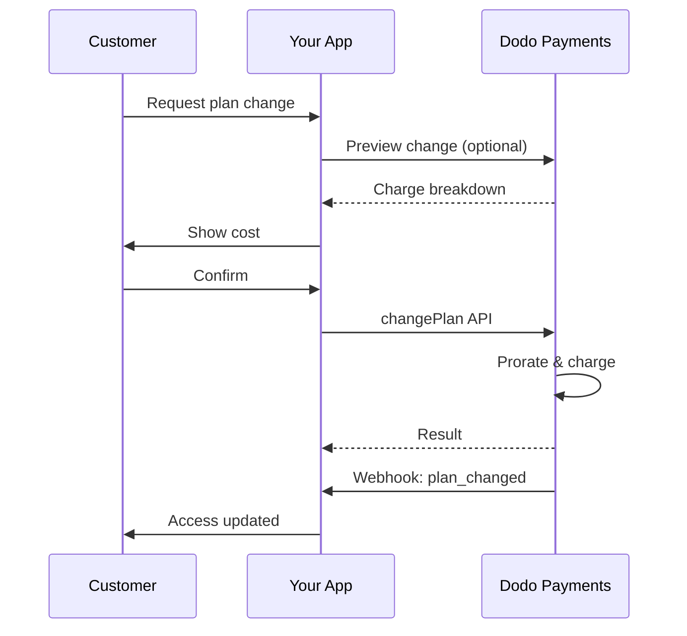
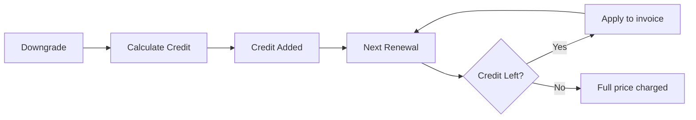
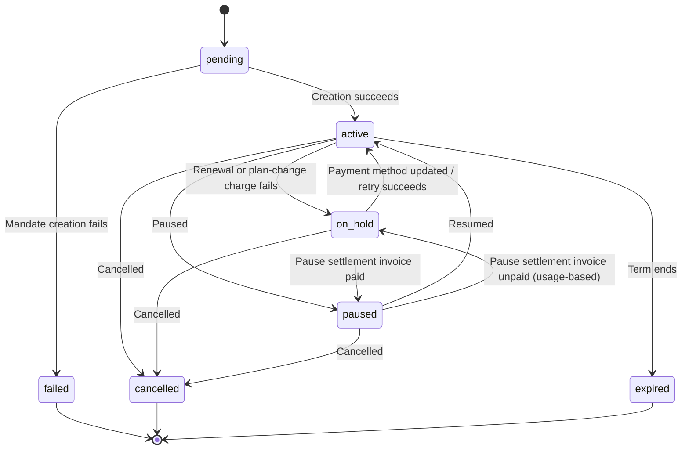

<Info>
Subscriptions let you sell ongoing access with automated renewals. Use flexible billing cycles, free trials, plan changes, and add‑ons to tailor pricing for each customer.
</Info>

<CardGroup cols={2}>
<Card title="Upgrade & Downgrade" icon="repeat" href="/developer-resources/subscription-upgrade-downgrade">
Control plan changes with proration and quantity updates.
</Card>

<Card title="On‑Demand Subscriptions" icon="bolt" href="/developer-resources/ondemand-subscriptions">
Authorize a mandate now and charge later with custom amounts.
</Card>

<Card title="Customer Portal" icon="id-card" href="/features/customer-portal">
Let customers manage plans, billing, and cancellations.
</Card>

<Card title="Subscription Webhooks" icon="code" href="/developer-resources/webhooks/intents/subscription">
React to lifecycle events like created, renewed, and canceled.
</Card>
</CardGroup>

## What Are Subscriptions?

Subscriptions are recurring products customers purchase on a schedule. They’re ideal for:

- **SaaS licenses**: Apps, APIs, or platform access
- **Memberships**: Communities, programs, or clubs
- **Digital content**: Courses, media, or premium content
- **Support plans**: SLAs, success packages, or maintenance

## Key Benefits

- **Predictable revenue**: Recurring billing with automated renewals
- **Flexible cycles**: Monthly, annual, custom intervals, and trials
- **Plan agility**: Proration for upgrades and downgrades
- **Add‑ons and seats**: Attach optional, quantifiable upgrades
- **Seamless checkout**: Hosted checkout and customer portal
- **Developer-first**: Clear APIs for creation, changes, and usage tracking

## Creating Subscriptions

Create subscription products in your Dodo Payments dashboard, then sell them through checkout or your API. Separating products from active subscriptions lets you version pricing, attach add‑ons, and track performance independently.

### Subscription product creation

Configure the fields in the dashboard to define how your subscription sells, renews, and bills. The sections below map directly to what you see in the creation form.

#### Product details

- **Product Name** (required): The display name shown in checkout, customer portal, and invoices.
- **Product Description** (required): A clear value statement that appears in checkout and invoices.
- **Product Image** (required): PNG/JPG/WebP up to 3 MB. Used on checkout and invoices.
- **Brand**: Associate the product with a specific brand for theming and emails.
- **Tax Category** (required): Choose the category (for example, SaaS) to determine tax rules.

<Tip>
Pick the most accurate tax category to ensure correct tax collection per region.
</Tip>

#### Pricing

- **Loại giá**: Chọn <b>Subscription</b> (hướng dẫn này). Các lựa chọn thay thế là Single Payment và Usage Based Billing.
- **Giá** (bắt buộc): Giá định kỳ cơ bản kèm đơn vị tiền tệ. Giá phải ít nhất là **$1** (hoặc giá trị tương đương theo đơn vị tiền tệ bạn chọn). Các khoản tiền dưới mức tối thiểu này không được hỗ trợ và subscription sẽ không hoạt động.
- **Discount Applicable (%)**: Tỷ lệ giảm giá tùy chọn áp dụng cho giá cơ bản; được phản ánh trong checkout và hóa đơn.
- **Lặp lại thanh toán mỗi** (bắt buộc): Khoảng thời gian gia hạn, ví dụ mỗi 1 Month. Chọn chu kỳ (tháng hoặc năm) và số lượng.
- **Thời hạn Subscription** (bắt buộc): Tổng thời hạn subscription duy trì trạng thái hoạt động (ví dụ 10 Years). Sau khi thời hạn này kết thúc, việc gia hạn sẽ dừng trừ khi được kéo dài.
- **Số ngày dùng thử** (bắt buộc): Đặt thời lượng dùng thử theo ngày. Sử dụng 0 để tắt dùng thử. Khoản phí đầu tiên sẽ tự động được thu khi thời gian dùng thử kết thúc.
- **Số tiền dùng thử**: Khoản phí trả trước tùy chọn cho paid trial. Để trống nếu muốn dùng thử miễn phí. Xem [Paid Trials](#paid-trials).
- **Chọn add-on**: Đính kèm tối đa 10 add-on mà khách hàng có thể mua cùng gói cơ bản.

<Warning>
Changing pricing on an active product affects new purchases. Existing subscriptions follow your plan‑change and proration settings.
</Warning>

<Info>
Add‑ons are ideal for quantifiable extras such as seats or storage. You can control allowed quantities and proration behavior when customers change them.
</Info>

#### Advanced settings

- **Tax Inclusive Pricing**: Display prices inclusive of applicable taxes. Final tax calculation still varies by customer location.
- **Generate license keys**: Issue a unique key to each customer after purchase. See the <a href="/features/license-keys">License Keys</a> guide.
- **Digital Product Delivery**: Deliver files or content automatically after purchase. Learn more in <a href="/features/digital-product-delivery">Digital Product Delivery</a>.
- **Metadata**: Attach custom key–value pairs for internal tagging or client integrations. See <a href="/api-reference/metadata">Metadata</a>.

<Tip>
Use metadata to store identifiers from your system (e.g., accountId) so you can reconcile events and invoices later.
</Tip>

## Subscription Trials

Trial cho phép khách hàng đánh giá subscription trước khi thanh toán đầy đủ mức giá định kỳ. Trial có thể là **free**, trong đó không khoản phí nào được thu cho đến khi trial kết thúc, hoặc **paid**, trong đó một khoản tiền giảm được thu trước. Trong cả hai trường hợp, giá đầy đủ sẽ bắt đầu từ lần gia hạn đầu tiên sau khi trial kết thúc.

### Configuring Trials

Set **Trial Period Days** in the product pricing section (use `0` to disable). You can override this when creating subscriptions:

```typescript
// Via subscription creation
const subscription = await client.subscriptions.create({
  customer: { customer_id: 'cus_123' },
  billing: { country: 'US' },
  product_id: 'pdt_monthly',
  quantity: 1,
  trial_period_days: 14  // Overrides product's trial period
});

// Via checkout session
const session = await client.checkoutSessions.create({
  product_cart: [{ product_id: 'pdt_monthly', quantity: 1 }],
  subscription_data: { trial_period_days: 14 }
});
```

<Warning>
The `trial_period_days` value must be between 0 and 10,000 days.
</Warning>

### Paid Trials

Trial không nhất thiết phải miễn phí. Đặt **Trial Amount** trên giá định kỳ của sản phẩm subscription để thu một khoản phí trả trước đã giảm trong thời gian trial. Sau đó, giá định kỳ đầy đủ sẽ được áp dụng từ lần gia hạn đầu tiên.

<Frame>

</Frame>

Paid trial được cấu hình trên giá của sản phẩm, không phải trên từng subscription hoặc checkout session:

| Trường | Kiểu | Mô tả |
|-------|------|-------------|
| `trial_amount` | integer | Số tiền được thu hôm nay cho trial, theo đơn vị nhỏ nhất của đơn vị tiền tệ trong giá (ví dụ `500` cho $5.00). Yêu cầu `trial_period_days > 0`. Bỏ qua hoặc đặt thành `null` để dùng free trial. |
| `trial_apply_discounts` | boolean | Cho biết mã giảm giá checkout có làm giảm khoản phí trial hay không. Mặc định là `false`, vì vậy toàn bộ Trial Amount vẫn được thu ngay cả khi giảm giá áp dụng cho giá định kỳ. |

```typescript
const product = await client.products.create({
  name: 'Pro Plan',
  tax_category: 'saas',
  price: {
    type: 'recurring_price',
    price: 2900,                      // $29.00 per month after the trial
    currency: 'USD',
    discount: 0,
    purchasing_power_parity: false,
    payment_frequency_count: 1,
    payment_frequency_interval: 'Month',
    subscription_period_count: 1,
    subscription_period_interval: 'Year',
    trial_period_days: 14,            // A paid trial requires a positive trial period
    trial_amount: 500,                // $5.00 charged today
    trial_apply_discounts: false      // Discounts apply to the recurring price only
  }
});
```

Paid trial cũng đi qua checkout. Trial amount chịu thuế, được hiển thị trong các phép tính của checkout session và giá của payment link, đồng thời markup Adaptive Currency được áp dụng theo từng đơn vị tiền tệ. [Preview endpoint](/developer-resources/checkout-session) trả về `trial_amount` và `trial_period_days` để bạn có thể hiển thị số tiền đến hạn hôm nay trước khi subscription được tạo.

<Info>
Free trial không thay đổi. Để trống **Trial Amount** sẽ giữ nguyên hành vi hiện tại, trong đó khoản phí đầu tiên là `0` và giá đầy đủ được thu khi trial kết thúc.
</Info>

### Ngăn lạm dụng Trial

**Prevent Trial Misuse** ngăn khách hàng liên tục yêu cầu trial cho cùng một doanh nghiệp. Khi được bật, khách hàng đã từng sử dụng trial sẽ tự động được chuyển thành **paid, no-trial purchase** thay vì nhận một trial mới.

<Frame>

</Frame>

Bật tùy chọn này từ tab **Subscriptions** trong **Settings**. Sau khi được bật:

- Khách hàng được đối chiếu theo **email đã chuẩn hóa**, trong đó các bí danh dấu cộng bị loại bỏ, vì vậy `user+trial@example.com` và `user@example.com` được tính là cùng một người.
- Lượt sử dụng được ghi nhận tại thời điểm **kích hoạt trial**, vì vậy khách hàng hủy ngay trong ngày vẫn đã sử dụng trial.
- Khách hàng hiện tại được bổ sung dữ liệu từ các trial trước đây của họ dựa trên email, nên người dùng trial trong quá khứ được nhận diện ngay lập tức.

<Info>
Tùy chọn này **tắt theo mặc định**. Xem [Subscription Settings](/features/product-collections#subscription-settings) để biết danh sách đầy đủ các tùy chọn kiểm soát subscription ở cấp doanh nghiệp.
</Info>

### Phát hiện trạng thái Trial

<Warning>
Hiện tại chưa có field trực tiếp để phát hiện trạng thái trial. Cách giải quyết tạm thời dưới đây yêu cầu truy vấn các payment, nên không hiệu quả. Chúng tôi đang phát triển một giải pháp hiệu quả hơn.
</Warning>

Để xác định một subscription **free trial** có đang trong thời gian trial hay không, hãy lấy danh sách payment của subscription. Nếu có chính xác một payment với amount bằng 0, subscription đang trong thời gian trial:

```typescript
const subscription = await client.subscriptions.retrieve('sub_123');
const payments = await client.payments.list({
  subscription_id: subscription.subscription_id
});

// Check if subscription is in trial
const isInTrial = payments.items.length === 1 && 
                  payments.items[0].total_amount === 0;
```

<Warning>
Kiểm tra amount bằng 0 này chỉ hoạt động với free trial. Với [paid trial](#paid-trials), payment đầu tiên bằng trial amount, không phải `0`. Thay vào đó, hãy so sánh payment đầu tiên với `trial_amount` của subscription hoặc kiểm tra xem `next_billing_date` còn nằm trong thời gian trial hay không.
</Warning>

### Cập nhật thời gian Trial

Kéo dài trial bằng cách cập nhật `next_billing_date`:

```typescript
await client.subscriptions.update('sub_123', {
  next_billing_date: '2025-02-15T00:00:00Z'  // New trial end date
});
```

<Warning>
Bạn không thể đặt `next_billing_date` thành thời điểm trong quá khứ. Ngày này phải nằm trong tương lai.
</Warning>

## Thay đổi Subscription Plan

Thay đổi plan cho phép bạn nâng cấp hoặc hạ cấp subscription, điều chỉnh số lượng hoặc chuyển sang sản phẩm khác. Tùy theo proration mode được chọn, thay đổi có thể tạo khoản phí ngay lập tức, tạo credit hoặc không điều chỉnh billing.

<Tip>
Bạn có thể thay đổi subscription plan và cập nhật ngày billing tiếp theo trực tiếp từ dashboard Dodo Payments. Đây là cách nhanh chóng để điều chỉnh subscription theo yêu cầu hỗ trợ khách hàng, nâng cấp khuyến mãi hoặc chuyển đổi plan mà không cần gọi API.
</Tip>

<Tip>
**Bật tính năng thay đổi plan tự phục vụ:** Bạn muốn khách hàng tự nâng cấp hoặc hạ cấp subscription thông qua Customer Portal? Thêm các sản phẩm subscription vào Product Collection và bật "Allow Subscription Updates" trong Subscription Settings.
</Tip>



<Card title="Product Collections" icon="layer-group" href="/features/product-collections">
  Nhóm các sản phẩm liên quan vào collections để bật quy trình nâng cấp/hạ cấp liền mạch trong Customer Portal.
</Card>

### Proration Modes

Chọn cách tính phí cho khách hàng khi thay đổi plan:

<Info>
**So sánh nhanh bốn proration mode:**

| | `prorated_immediately` | `difference_immediately` | `full_immediately` | `do_not_bill` |
|---|---|---|---|---|
| **Nâng cấp** | Tính phí theo tỷ lệ cho số ngày còn lại | Thu toàn bộ phần chênh lệch giá | Thu toàn bộ giá của plan mới | Không tính phí — chuyển ngay lập tức |
| **Hạ cấp** | Tạo credit theo tỷ lệ cho số ngày còn lại | Toàn bộ phần chênh lệch giá được chuyển thành credit | Không có credit, thu đầy đủ | Không có credit — chuyển ngay lập tức |
| **Chu kỳ billing** | Đặt lại về hôm nay | Đặt lại về hôm nay | Đặt lại về hôm nay | Giữ nguyên |
| **Phù hợp nhất cho** | Billing công bằng theo thời gian | Thay đổi tier đơn giản | Đặt lại chu kỳ billing | Chuyển đổi miễn phí hoặc hỗ trợ đặc biệt |
</Info>

#### `prorated_immediately`
Tính phí theo tỷ lệ dựa trên thời gian còn lại trong chu kỳ billing hiện tại. Phù hợp nhất cho cách tính phí công bằng, có tính đến thời gian chưa sử dụng.

```typescript
await client.subscriptions.changePlan('sub_123', {
  product_id: 'pdt_pro',
  quantity: 1,
  proration_billing_mode: 'prorated_immediately'
});
```

#### `difference_immediately`
Thu phần chênh lệch giá ngay lập tức (khi nâng cấp) hoặc cộng credit cho các lần gia hạn trong tương lai (khi hạ cấp). Phù hợp nhất cho các trường hợp nâng cấp/hạ cấp đơn giản.

```typescript
// Upgrade: charges $50 (difference between $30 and $80)
// Downgrade: credits remaining value, auto-applied to renewals
await client.subscriptions.changePlan('sub_123', {
  product_id: 'pdt_pro',
  quantity: 1,
  proration_billing_mode: 'difference_immediately'
});
```

<Info>
Credit từ việc hạ cấp bằng `difference_immediately` được giới hạn trong subscription và tự động áp dụng cho các lần gia hạn trong tương lai. Chúng khác với các quyền lợi của <a href="/features/credit-based-billing">Credit-Based Billing</a>.
</Info>

Khi khách hàng hạ cấp bằng `difference_immediately`, giá trị chưa sử dụng trở thành credit giới hạn trong subscription và tự động bù trừ cho các lần gia hạn trong tương lai:



#### `full_immediately`
Thu toàn bộ số tiền của plan mới ngay lập tức, bỏ qua thời gian còn lại. Phù hợp nhất để đặt lại chu kỳ billing.

```typescript
await client.subscriptions.changePlan('sub_123', {
  product_id: 'pdt_monthly',
  quantity: 1,
  proration_billing_mode: 'full_immediately'
});
```

#### `do_not_bill`
Chuyển sang plan mới mà không điều chỉnh billing. Không có phí proration và không có credit — khách hàng chỉ cần chuyển sang plan mới. Phù hợp nhất cho việc chuyển đổi hỗ trợ đặc biệt, chuyển đổi plan miễn phí hoặc các trường hợp bạn muốn tự chịu phần chênh lệch chi phí.

```typescript
await client.subscriptions.changePlan('sub_123', {
  product_id: 'pdt_new_plan',
  quantity: 1,
  proration_billing_mode: 'do_not_bill'
});
```

<AccordionGroup>
<Accordion title="Example: Prorated upgrade calculation">

**Tình huống**: Khách hàng đang dùng Basic ($30/tháng) nâng cấp lên Pro ($80/tháng) vào ngày thứ 16 của chu kỳ 30 ngày bằng `prorated_immediately`.

```
Unused credit from Basic = $30 × (15 remaining / 30 total) = $15.00
Prorated cost of Pro     = $80 × (15 remaining / 30 total) = $40.00
────────────────────────────────────────────────────────────────────
Immediate charge         = $40.00 − $15.00 = $25.00
```

Lần gia hạn tiếp theo vào **15 tháng 2** (16 tháng 1 + 30 ngày): **$80.00/tháng**.

<Tip>
Để xem thêm các ví dụ tính toán chi tiết và trường hợp đặc biệt, hãy xem [Upgrade & Downgrade Guide](/developer-resources/subscription-upgrade-downgrade) đầy đủ của chúng tôi.
</Tip>

</Accordion>
<Accordion title="Example: Downgrade credit calculation">

**Tình huống**: Khách hàng đang dùng Pro ($80/tháng) hạ cấp xuống Starter ($20/tháng) bằng `difference_immediately`.

```
Credit = Old plan − New plan = $80 − $20 = $60.00
```

Credit $60 tự động được áp dụng cho các lần gia hạn trong tương lai:
- Lần gia hạn 1: $20 − $20 (credit) = **$0.00** (còn lại $40 credit)
- Lần gia hạn 2: $20 − $20 (credit) = **$0.00** (còn lại $20 credit)  
- Lần gia hạn 3: $20 − $20 (credit) = **$0.00** (credit đã hết)
- Lần gia hạn 4: **$20.00** (giá đầy đủ)

<Info>
Tìm hiểu thêm về cách quản lý credit trong [Upgrade & Downgrade Guide](/developer-resources/subscription-upgrade-downgrade).
</Info>

</Accordion>
</AccordionGroup>

### Thay đổi Plan với Add-on

Điều chỉnh add-on khi thay đổi plan. Add-on được đưa vào các phép tính proration:

```typescript
await client.subscriptions.changePlan('sub_123', {
  product_id: 'pdt_pro',
  quantity: 1,
  proration_billing_mode: 'difference_immediately',
  addons: [{ addon_id: 'addon_extra_seats', quantity: 2 }]  // Add add-ons
  // addons: []  // Empty array removes all existing add-ons
});
```

<Info>
Theo mặc định (`effective_at: 'immediately'`), các thay đổi gói sẽ kích hoạt khoản phí ngay lập tức. Truyền `effective_at: 'next_billing_date'` để lên lịch thay đổi vào ngày thanh toán tiếp theo — thay đổi đang chờ sẽ được trả về trên subscription dưới dạng `scheduled_change`, và bạn có thể hủy thay đổi đó bằng [Hủy thay đổi gói đã lên lịch](/api-reference/subscriptions/cancel-change-plan). Các khoản phí thất bại có thể chuyển subscription sang trạng thái `on_hold`, trừ khi bạn truyền `on_payment_failure: 'prevent_change'`, tùy chọn này giữ subscription ở gói hiện tại cho đến khi thanh toán thành công. Theo dõi các thay đổi thông qua các webhook event `subscription.plan_changed`.
</Info>

### Xem trước thay đổi Plan

Trước khi xác nhận thay đổi plan, hãy xem trước khoản phí chính xác và subscription sau thay đổi:

```typescript
const preview = await client.subscriptions.previewChangePlan('sub_123', {
  product_id: 'pdt_pro',
  quantity: 1,
  proration_billing_mode: 'prorated_immediately'
});

// Show customer the charge before confirming
console.log('You will be charged:', preview.immediate_charge.summary);
```

<Card title="Preview Change Plan API" icon="eye" href="/api-reference/subscriptions/preview-change-plan">
  Xem trước các thay đổi plan trước khi xác nhận.
</Card>

## Tạm dừng và tiếp tục Subscription

Tạm dừng sẽ đóng băng subscription thay vì kết thúc subscription. Việc lập hóa đơn dừng lại, quyền truy cập bị thu hồi, còn subscription vẫn giữ nguyên plan và lịch sử để customer có thể tiếp tục chính xác từ nơi họ đã dừng. Hãy sử dụng tính năng này như một lựa chọn giữ chân customer thay cho việc hủy.

Mở bất kỳ subscription đang active nào trong **Sales → Subscriptions** rồi nhấp **Pause subscription**. Trạng thái sẽ chuyển thành `paused` và các lần gia hạn sẽ dừng cho đến khi subscription được tiếp tục.

<Frame>
    
</Frame>

### Điều gì xảy ra khi bạn tạm dừng

- **Các lần gia hạn dừng lại.** Không có invoice nào được tạo và không có khoản phí gia hạn nào được thực hiện trong khi subscription bị tạm dừng.
- **Quyền truy cập bị thu hồi ngay lập tức.** Việc tạm dừng sẽ thu hồi mọi [entitlement grant](/features/entitlements/introduction) đã cấp và đang chờ cấp trên subscription, vô hiệu hóa [license keys](/features/license-keys) và ngừng cấp URL tải xuống [digital product](/features/digital-product-delivery) mới. Khi tiếp tục, các quyền này sẽ được cấp lại, giống như khi khôi phục từ `on_hold`.
- **Đồng hồ billing đóng băng.** `next_billing_date` và `expires_at` đều tiến về sau chính xác bằng thời lượng tạm dừng, để customer giữ được khoảng thời gian họ đã thanh toán.
- **Không có giới hạn về thời lượng tạm dừng.** Subscription bị tạm dừng sẽ tiếp tục ở trạng thái đó cho đến khi có người tiếp tục. Bạn không cần đặt trước thời lượng tạm dừng.

<Warning>
Tạm dừng sẽ thu hồi quyền truy cập ngay lập tức, không phải khi kết thúc billing period. Nếu subscription kiểm soát quyền truy cập vào product của bạn, hãy thông báo rõ điều này cho customer trước khi họ xác nhận.
</Warning>

Việc tiếp tục sẽ đưa subscription về `active` và khôi phục các entitlement. Vì đồng hồ đã bị đóng băng, lần gia hạn tiếp theo sẽ diễn ra muộn hơn lịch ban đầu một khoảng bằng thời lượng tạm dừng — subscription bị tạm dừng 12 ngày sẽ gia hạn muộn 12 ngày.

### Tạm dừng Subscription tính phí theo usage

Một subscription [tính phí theo usage](/features/usage-based-billing/introduction) có thể có usage đã được ghi nhận nhưng chưa được lập hóa đơn tại thời điểm bị tạm dừng. Tùy chọn **Bill Usage at Pause** trong **Settings → Subscriptions** quyết định cách xử lý usage đó:

| Setting | Behavior |
|---------|----------|
| **On** (mặc định) | Dodo Payments tạo invoice cho usage phát sinh kể từ ngày billing gần nhất và thu tiền ngay lập tức. |
| **Off** | Usage chưa thanh toán được chuyển tiếp và lập hóa đơn trong invoice định kỳ tiếp theo của subscription. |

Chỉ usage được đo lường mới được quyết toán theo cách này — recurring base fee không bao giờ bị tính tại thời điểm tạm dừng. Subscription Standard và on-demand không có khoản nào cần quyết toán, nên setting này không ảnh hưởng đến chúng.

<Info>
**Bill Usage at Pause** được ghi nhận theo từng billing cycle. Việc thay đổi tùy chọn giữa cycle không thay đổi cách cycle đang diễn ra được quyết toán; giá trị mới sẽ áp dụng từ cycle tiếp theo.
</Info>

<Warning>
Settlement invoice được thu như mọi invoice khác, vì vậy việc thu tiền có thể thất bại. Nếu invoice vẫn chưa được thanh toán sau grace period của [dunning](/features/recovery/subscription-dunning), subscription sẽ chuyển sang `on_hold` nhưng vẫn được đánh dấu là đã tạm dừng.
</Warning>

Subscription ở trạng thái này có hai cách thoát và chúng khác nhau ở bên chịu khoản usage chưa thanh toán:

| Exit | Result |
|------|--------|
| Settlement invoice được thanh toán | Subscription trở về `paused`, không phải `active`. Hãy tiếp tục subscription một cách rõ ràng khi customer sẵn sàng. |
| Bạn tiếp tục subscription trực tiếp | Subscription chuyển thẳng sang `active` và settlement invoice chưa thanh toán sẽ được **void**, cùng với các lần retry đang chờ. Usage còn nợ được ghi giảm. |

<Info>
Tiếp tục subscription là một cách hợp lệ để thoát khỏi trạng thái hold này — bạn không cần thu settlement invoice trước. Tuy nhiên, cần lưu ý rằng việc tiếp tục sẽ miễn khoản usage còn nợ thay vì chuyển khoản đó sang kỳ sau.
</Info>

### Cho phép Customer tự tạm dừng Subscription

**Allow Subscription Pause** trong **Settings → Subscriptions** kiểm soát việc customer có thể tạm dừng và tiếp tục từ Customer Portal hay không. Tùy chọn này **tắt theo mặc định**, vì vậy tính năng tự tạm dừng cần được chủ động bật.

<Frame>
    
</Frame>

Setting này chỉ áp dụng cho Customer Portal. Bạn luôn có thể tạm dừng và tiếp tục từ dashboard hoặc API, bất kể trạng thái của toggle.

Việc tắt tùy chọn này sẽ ngăn các yêu cầu tạm dừng mới từ customer, nhưng không giữ customer hiện đang tạm dừng ở trạng thái đó — họ vẫn có thể tiếp tục subscription mà họ đã tự tạm dừng. Các lần tạm dừng do bạn thực hiện vẫn thuộc quyền kiểm soát của bạn.

<Card title="Pausing from the Customer Portal" icon="id-card" href="/features/customer-portal#pausing-a-subscription">
Xem những gì customer nhìn thấy, bao gồm cả hộp thoại xác nhận.
</Card>

### Tạm dừng qua API

Tạm dừng và tiếp tục là một field `pause` duy nhất trên endpoint update subscription. Không có endpoint tạm dừng riêng.

```typescript
// Pause
await client.subscriptions.update('sub_123', { pause: true });

// Resume
await client.subscriptions.update('sub_123', { pause: false });
```

<Warning>
`pause` không thể được gửi cùng bất kỳ field nào khác — gửi field này cùng với bất kỳ field nào khác sẽ bị từ chối với `422`. Đặt `status` thành `paused` **không** làm subscription tạm dừng; thay vào đó, hãy sử dụng field `pause`.
</Warning>

Tạm dừng phát ra `subscription.paused` và tiếp tục phát ra `subscription.unpaused`. Cả hai đều chứa subscription object đầy đủ, với `paused_at` được đặt trong thời gian tạm dừng và `null` sau khi tiếp tục.

### Tạm dừng và các thao tác Subscription khác

- **Việc hủy vẫn hoạt động.** Bạn có thể hủy subscription bị tạm dừng giống hệt subscription đang active. Mọi settlement invoice đang mở từ lần tạm dừng sẽ bị void khi bạn thực hiện việc này.
- **Các thay đổi plan đã lên lịch bị trì hoãn, không bị loại bỏ.** [Plan change](#subscription-plan-changes) được lên lịch vào ngày billing tiếp theo sẽ giữ nguyên trong khi subscription bị tạm dừng, sau đó được áp dụng vào ngày billing đã dịch chuyển khi subscription tiếp tục. `scheduled_change.effective_at` của thay đổi là snapshot tại thời điểm lên lịch và không được điều chỉnh theo thời gian tạm dừng, nên có thể hiển thị một ngày trong quá khứ — hãy hiểu đó là “đã được lên lịch vào”, không phải ngày được đảm bảo. Để loại bỏ thay đổi thay vì tiếp tục áp dụng, hãy sử dụng [Cancel Scheduled Plan Change](/api-reference/subscriptions/cancel-change-plan).

## Các trạng thái Subscription

Một subscription sẽ đi qua một tập hợp status được xác định trong suốt vòng đời. Bảng này là tài liệu tham chiếu cho mọi status, nguyên nhân tạo ra status đó và cách (hoặc liệu có thể) khôi phục hay không.

| Status | Ý nghĩa | Có thể khôi phục? | Cách khôi phục / bước tiếp theo |
|--------|---------|------------------|-------------------------------|
| `pending` | Subscription đang được tạo hoặc xử lý | — | Chờ `subscription.active` (hoặc `subscription.failed`) |
| `active` | Subscription đang active và sẽ tự động gia hạn | — | Không cần thao tác |
| `on_hold` | Khoản thanh toán gia hạn (hoặc phí thay đổi plan) thất bại; các lần gia hạn đã dừng | **Có** | Cập nhật payment method để kích hoạt lại — tự động qua [Payment Retries](/features/recovery/payment-retries) và [Dunning](/features/recovery/subscription-dunning), hoặc thủ công qua [Update Payment Method API](/api-reference/subscriptions/update-payment-method) |
| `paused` | Subscription được bạn hoặc customer chủ động tạm dừng; billing bị đóng băng và quyền truy cập bị thu hồi | **Có** | Tiếp tục bằng `pause: false` hoặc từ Customer Portal khi tính năng tự tạm dừng được bật — xem [Tạm dừng và tiếp tục Subscription](#pausing-and-resuming-subscriptions) |
| `cancelled` | Subscription đã bị hủy và sẽ không gia hạn | Chỉ mua lại | Customer phải bắt đầu subscription mới; [Dunning](/features/recovery/subscription-dunning) có thể nhắc customer mua lại |
| `failed` | **Việc tạo** subscription thất bại (mandate ban đầu hoặc payment không thành công) | **Không — trạng thái kết thúc** | Customer phải tạo subscription mới với payment method hoạt động |
| `expired` | Subscription đã đến cuối term | — | Customer phải bắt đầu subscription mới nếu có nhu cầu |

<Warning>
`on_hold` và `failed` thường bị nhầm lẫn. `on_hold` là trạng thái **có thể khôi phục** của một subscription đã active nhưng gia hạn thất bại. `failed` là trạng thái **kết thúc** chỉ xảy ra khi **việc tạo subscription ban đầu** thất bại — không thể kích hoạt lại trạng thái này.
</Warning>

<Info>
`on_hold` và `paused` cũng khác nhau. `on_hold` là trạng thái ngoài ý muốn — một payment đã thất bại. `paused` là trạng thái chủ động — bạn hoặc customer đã chọn đóng băng subscription và không có lần gia hạn nào được thực hiện trong thời gian subscription bị tạm dừng. Subscription tính phí theo usage vẫn có thể còn một settlement invoice cần thanh toán tại thời điểm bị tạm dừng; xem [Tạm dừng Subscription tính phí theo usage](#pausing-usage-based-subscriptions).
</Info>

### State Machine



### Trạng thái On Hold

Subscription chuyển sang trạng thái `on_hold` khi:

- Payment gia hạn thất bại (không đủ tiền, thẻ hết hạn, v.v.)
- Phí thay đổi plan thất bại
- Việc ủy quyền payment method thất bại
- [Pause settlement invoice](#pausing-usage-based-subscriptions) của subscription tính phí theo usage không được thanh toán

<Warning>
Khi subscription ở trạng thái `on_hold`, subscription sẽ không tự động gia hạn. Bạn phải cập nhật payment method để kích hoạt lại subscription.
</Warning>

### Kích hoạt lại từ trạng thái On Hold

Để kích hoạt lại subscription từ trạng thái `on_hold`, hãy cập nhật payment method. Thao tác này sẽ tự động:

1. Tạo khoản charge cho các khoản còn nợ
2. Tạo invoice
3. Xử lý payment bằng payment method mới
4. Đưa subscription về trạng thái `active` sau khi payment thành công

<Note>
Ngoại lệ duy nhất là trạng thái hold do pause settlement invoice chưa thanh toán. Việc thanh toán invoice đó sẽ đưa subscription về `paused`, không phải `active`, vì subscription đang ở trạng thái tạm dừng trước khi payment thất bại. Hãy tiếp tục subscription một cách rõ ràng sau khi invoice được quyết toán.
</Note>

```typescript
// Reactivate subscription from on_hold
const response = await client.subscriptions.updatePaymentMethod('sub_123', {
  payment_method: {
    type: 'new',
    return_url: 'https://example.com/return'
  }
});

// For on_hold subscriptions, a charge is automatically created
if (response.payment_id) {
  console.log('Charge created:', response.payment_id);
  // Redirect customer to response.payment_link to complete payment
  // Monitor webhooks for payment.succeeded and subscription.active
}
```

<Info>
Sau khi cập nhật payment method thành công cho subscription `on_hold`, bạn sẽ nhận được các webhook event `payment.succeeded` rồi đến `subscription.active`.
</Info>

### Webhook Event theo Transition

Mỗi transition sẽ phát ra một webhook để bạn có thể triển khai logic entitlement mà không cần polling:

| Transition | Event |
|------------|-------|
| Subscription được kích hoạt | `subscription.active` |
| Gia hạn thành công | `subscription.renewed` |
| Gia hạn thất bại → on hold | `subscription.on_hold` |
| Subscription bị tạm dừng | `subscription.paused` |
| Subscription bị tạm dừng được tiếp tục | `subscription.unpaused` |
| Tạo subscription thất bại | `subscription.failed` |
| Plan được nâng cấp/hạ cấp | `subscription.plan_changed` |
| Đã hủy | `subscription.cancelled` |
| Term kết thúc | `subscription.expired` |
| Bất kỳ field nào thay đổi | `subscription.updated` |

<Card title="Subscription Webhook Payloads" icon="webhook" href="/developer-resources/webhooks/intents/subscription">
Xem schema payload đầy đủ cho các event trong vòng đời subscription.
</Card>

## Quản lý API

<AccordionGroup>
<Accordion title="Create subscriptions">
Sử dụng `POST /checkouts` để tạo subscription theo cách lập trình từ các product, cùng với trial tùy chọn (`subscription_data.trial_period_days`) và add-on (`product_cart[].addons`).

<Warning>
`POST /subscriptions` đã deprecated. Các integration hiện có vẫn tiếp tục hoạt động, nhưng integration mới nên sử dụng [Checkout Sessions](/api-reference/checkout-sessions/create).
</Warning>

<Card title="API Reference" icon="code" href="/api-reference/checkout-sessions/create">
Xem API tạo checkout session.
</Card>
</Accordion>

<Accordion title="Update subscriptions">
Sử dụng `PATCH /subscriptions/{subscription_id}` để hủy vào ngày billing tiếp theo, gia hạn subscription, cập nhật thông tin billing hoặc chỉnh sửa metadata. Để thay đổi quantity, hãy sử dụng [Change Plan API](/api-reference/subscriptions/change-plan) — `PATCH` không chấp nhận `quantity`.

<Card title="API Reference" icon="code" href="/api-reference/subscriptions/patch-subscriptions">
Tìm hiểu cách cập nhật thông tin subscription.
</Card>
</Accordion>

<Accordion title="Pause and resume subscriptions">
Tạm dừng và tiếp tục sử dụng cùng endpoint `PATCH /subscriptions/{subscription_id}` thông qua field `pause`: `pause: true` tạm dừng subscription đang active và `pause: false` tiếp tục subscription. Không thể kết hợp field này với bất kỳ field nào khác trong cùng request. Để xem đầy đủ behavior, ảnh hưởng đến billing và các setting business liên quan, hãy xem [Tạm dừng và tiếp tục Subscription](#pausing-and-resuming-subscriptions).

<Card title="API Reference" icon="code" href="/api-reference/subscriptions/patch-subscriptions">
Xem API update subscription, bao gồm field `pause`.
</Card>
</Accordion>

<Accordion title="Change plans (proration)">
Thay đổi product đang active và quantity với các tùy chọn proration.

<Card title="API Reference" icon="code" href="/api-reference/subscriptions/change-plan">
Xem lại các tùy chọn thay đổi plan.
</Card>
</Accordion>

<Accordion title="On‑demand charges">
Đối với subscription on-demand, hãy tính các amount cụ thể theo nhu cầu.

<Card title="API Reference" icon="code" href="/api-reference/subscriptions/create-charge">
Tính phí subscription on-demand.
</Card>
</Accordion>

<Accordion title="List and retrieve">
Sử dụng `GET /subscriptions` để liệt kê tất cả subscription và `GET /subscriptions/{id}` để truy xuất một subscription.

<Card title="API Reference" icon="code" href="/api-reference/subscriptions/get-subscriptions">
Xem các API listing và retrieval.
</Card>
</Accordion>

<Accordion title="Usage history">
Lấy usage đã ghi nhận cho các mô hình pricing metered hoặc hybrid.

<Card title="API Reference" icon="code" href="/api-reference/subscriptions/get-usage-history">
Xem usage history API.
</Card>
</Accordion>

<Accordion title="Update payment method">
Cập nhật payment method cho subscription. Đối với subscription đang active, thao tác này cập nhật payment method cho các lần gia hạn trong tương lai. Đối với subscription ở trạng thái `on_hold`, thao tác này kích hoạt lại subscription bằng cách tạo charge cho các khoản còn nợ.

Khi tạo payment-method link mới (request type `New`), bạn có thể truyền `allowed_payment_method_types` để giới hạn các payment method mà customer nhìn thấy trên trang đó. Customer sẽ không bao giờ thấy method không có trong danh sách, dù việc đưa một method vào danh sách không đảm bảo method đó sẽ xuất hiện (khả dụng vẫn phụ thuộc vào các yếu tố như vị trí của customer và business settings của bạn).

<Card title="API Reference" icon="code" href="/api-reference/subscriptions/update-payment-method">
Tìm hiểu cách cập nhật payment method và kích hoạt lại subscription.
</Card>
</Accordion>
</AccordionGroup>

## Các trường hợp sử dụng phổ biến

- **SaaS và API**: Quyền truy cập theo tier với add-on cho seat hoặc usage
- **Content và media**: Quyền truy cập hàng tháng với trial giới thiệu
- **Plan hỗ trợ B2B**: Hợp đồng hàng năm với add-on hỗ trợ cao cấp
- **Tools và plugin**: License key và các bản phát hành theo version

## Ví dụ Integration

### Checkout Sessions (subscription)
Khi tạo checkout session, hãy thêm subscription product và các add-on tùy chọn:

```typescript
const session = await client.checkoutSessions.create({
  product_cart: [
    {
      product_id: 'pdt_subscription',
      quantity: 1
    }
  ]
});
```

### Thay đổi plan với proration
Nâng cấp hoặc hạ cấp subscription và kiểm soát behavior của proration:

```typescript
await client.subscriptions.changePlan('sub_123', {
  product_id: 'pdt_new',
  quantity: 1,
  proration_billing_mode: 'difference_immediately'
});
```

### Hủy vào ngày billing tiếp theo
Lên lịch hủy có hiệu lực vào cuối billing period hiện tại:

```typescript
await client.subscriptions.update('sub_123', {
  cancel_at_next_billing_date: true
});
```

### Gia hạn thời hạn Subscription
Kéo dài thời gian subscription hoạt động bằng cách truyền `subscription_period_count` và `subscription_period_interval` mới vào `PATCH /subscriptions/{subscription_id}`. Thời điểm hết hạn của subscription được tính lại từ count và interval mới — ví dụ, để cấp thêm thời gian cho customer trong plan hiện tại:

```typescript
await client.subscriptions.update('sub_123', {
  subscription_period_count: 5,
  subscription_period_interval: 'Month'
});
```

<Note>
Thời hạn của subscription chỉ có thể được **tăng**, không thể rút ngắn.
</Note>

### Subscription on-demand
Tạo subscription on-demand và tính phí sau khi cần:

```typescript
const onDemand = await client.subscriptions.create({
  customer: { customer_id: 'cus_123' },
  billing: { country: 'US' },
  product_id: 'pdt_on_demand',
  quantity: 1,
  on_demand: { mandate_only: true }
});

await client.subscriptions.charge(onDemand.subscription_id, {
  product_price: 4900,
  product_currency: 'USD',
  product_description: 'Extra usage for September'
});
```

### Cập nhật payment method cho Subscription đang active
Cập nhật payment method cho subscription đang active:

```typescript
// Update with new payment method
const response = await client.subscriptions.updatePaymentMethod('sub_123', {
  payment_method: {
    type: 'new',
    return_url: 'https://example.com/return'
  }
});

// Or use existing payment method
await client.subscriptions.updatePaymentMethod('sub_123', {
  payment_method: {
    type: 'existing',
    payment_method_id: 'pm_abc123'
  }
});
```

### Kích hoạt lại Subscription từ on_hold
Kích hoạt lại subscription bị chuyển sang on hold do payment thất bại:

```typescript
// Update payment method - automatically creates charge for remaining dues
const response = await client.subscriptions.updatePaymentMethod('sub_123', {
  payment_method: {
    type: 'new',
    return_url: 'https://example.com/return'
  }
});

if (response.payment_id) {
  // Charge created for remaining dues
  // Redirect customer to response.payment_link
  // Monitor webhooks: payment.succeeded → subscription.active
}
```

## Subscription với Mandate tuân thủ RBI

  Subscription UPI và Indian card hoạt động theo quy định RBI (Reserve Bank of India), với các yêu cầu mandate cụ thể:

  ### Giới hạn Mandate

  Loại và amount của mandate phụ thuộc vào recurring charge của subscription:

  - **Charge thấp hơn mandate floor (mặc định ₹15,000):** Chúng tôi tạo on-demand mandate với amount bằng floor. Amount subscription được tính định kỳ theo tần suất subscription, tối đa bằng mandate limit.
  - **Charge bằng hoặc cao hơn mandate floor:** Chúng tôi tạo subscription mandate (hoặc on-demand mandate) với amount subscription chính xác.

  Mandate floor có thể được cấu hình theo merchant hoặc theo request thông qua `mandate_min_amount_inr_paise` (INR paise). Amount được đăng ký với ngân hàng là `max(mandate_floor, billing_amount)` — vì vậy floor trở thành authorization ceiling mà customer nhìn thấy mỗi khi billing thấp hơn.

Để biết thông tin chi tiết về mandate tuân thủ RBI và mandate floor có thể cấu hình cho các payment method của Ấn Độ, hãy xem trang <a href="/features/payment-methods/india#configurable-mandate-floor">India Payment Methods</a>.

  ### Lưu ý khi Nâng cấp và Hạ cấp

  **Quan trọng:** Khi nâng cấp hoặc hạ cấp subscription, hãy cân nhắc cẩn thận các mandate limit:

  - Nếu việc nâng cấp/hạ cấp tạo ra amount charge vượt quá Rs 15,000 và vượt existing on-demand payment limit, transaction charge có thể thất bại.
  - Trong trường hợp này, customer có thể cần cập nhật payment method hoặc thay đổi subscription lần nữa để thiết lập mandate mới với limit phù hợp.

  ### Authorization cho Charge có Giá trị Cao

  Với charge subscription từ Rs 15,000 trở lên:

  - Ngân hàng sẽ yêu cầu customer authorize transaction.
  - Nếu customer không authorize transaction, transaction sẽ thất bại và subscription sẽ được chuyển sang on hold.

  ### Độ trễ Xử lý 48 giờ

  **Processing Timeline:** Recurring charge trên Indian card và subscription UPI tuân theo quy trình xử lý đặc biệt:

  - Charge được **initiated** vào ngày đã lên lịch theo tần suất subscription.
  - Khoản **deduction** thực tế từ tài khoản của customer chỉ diễn ra sau **48 giờ** kể từ khi payment được initiated.
  - Khoảng thời gian 48 giờ này có thể kéo dài thêm **2-3 giờ** tùy thuộc vào phản hồi từ bank API.

  ### Khoảng thời gian Hủy Mandate

  Trong processing window 48 giờ:

  - Customer có thể hủy mandate qua banking app của họ.
  - Nếu customer hủy mandate trong khoảng thời gian này, subscription vẫn **active** (đây là edge case chỉ áp dụng cho Indian card và subscription UPI AutoPay).
  - Tuy nhiên, deduction thực tế có thể thất bại và trong trường hợp đó, chúng tôi sẽ chuyển subscription sang **on hold**.

  **Edge Case Handling:** Nếu bạn cung cấp benefits, credits hoặc subscription usage cho customer ngay khi charge được initiated, bạn cần xử lý phù hợp processing window 48 giờ này trong application. Hãy cân nhắc:


  - Trì hoãn việc kích hoạt benefit cho đến khi payment được xác nhận
  - Triển khai grace period hoặc quyền truy cập tạm thời
  - Theo dõi subscription status để phát hiện việc hủy mandate
  - Xử lý trạng thái subscription hold trong application logic

  <Tip>
  Theo dõi subscription webhook để nắm bắt các thay đổi về payment status và xử lý các edge case khi mandate bị hủy trong processing window 48 giờ.
  </Tip>

## Best Practices

- **Bắt đầu với các tier rõ ràng**: 2–3 plan có khác biệt dễ nhận biết
- **Truyền đạt pricing rõ ràng**: Hiển thị tổng tiền, proration và lần gia hạn tiếp theo
- **Sử dụng trial có cân nhắc**: Chuyển đổi bằng onboarding, không chỉ bằng thời gian
- **Tận dụng add-on**: Giữ base plan đơn giản và upsell các tiện ích bổ sung
- **Kiểm thử các thay đổi**: Xác thực plan change và proration trong test mode

<Info>
Subscription là nền tảng linh hoạt cho doanh thu định kỳ. Hãy bắt đầu đơn giản, kiểm thử kỹ lưỡng và cải tiến dựa trên các chỉ số adoption, churn và expansion.
</Info>