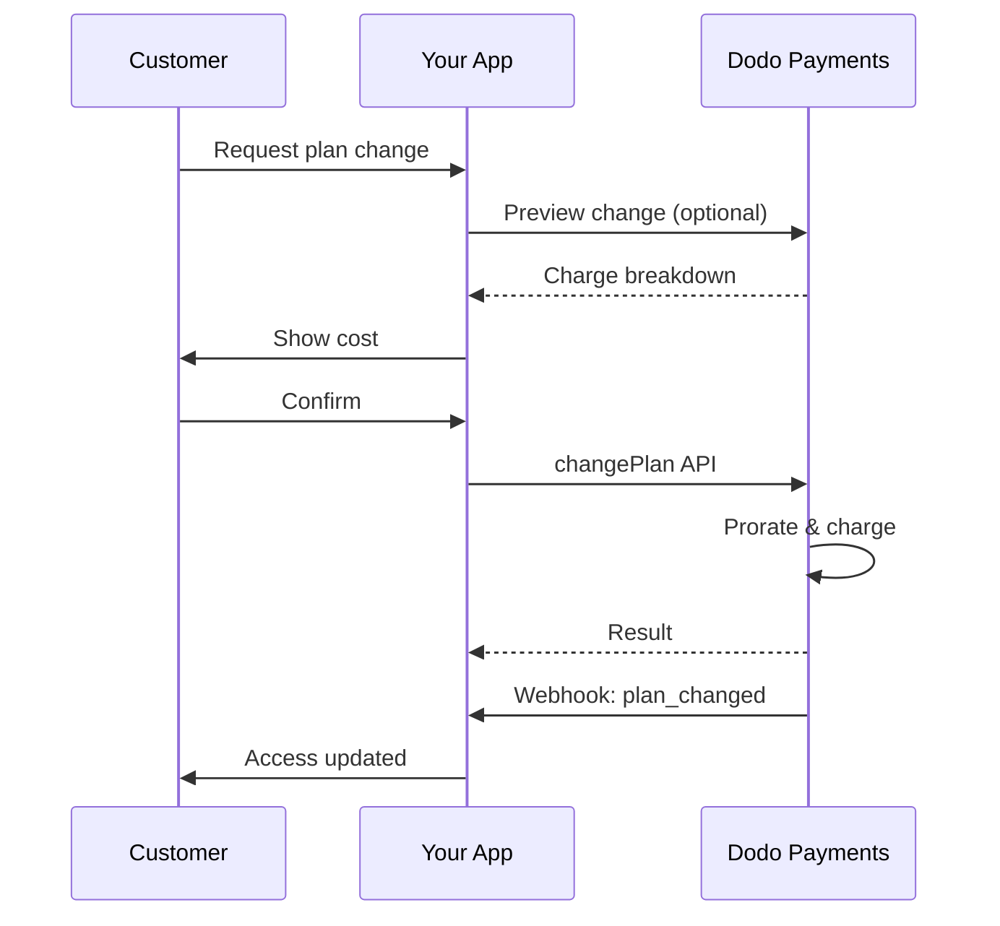
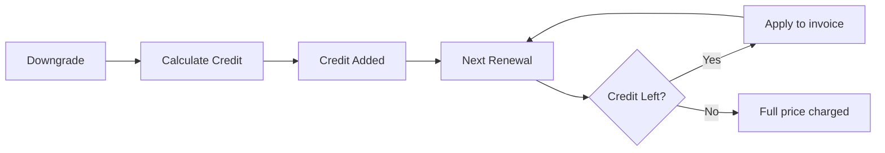
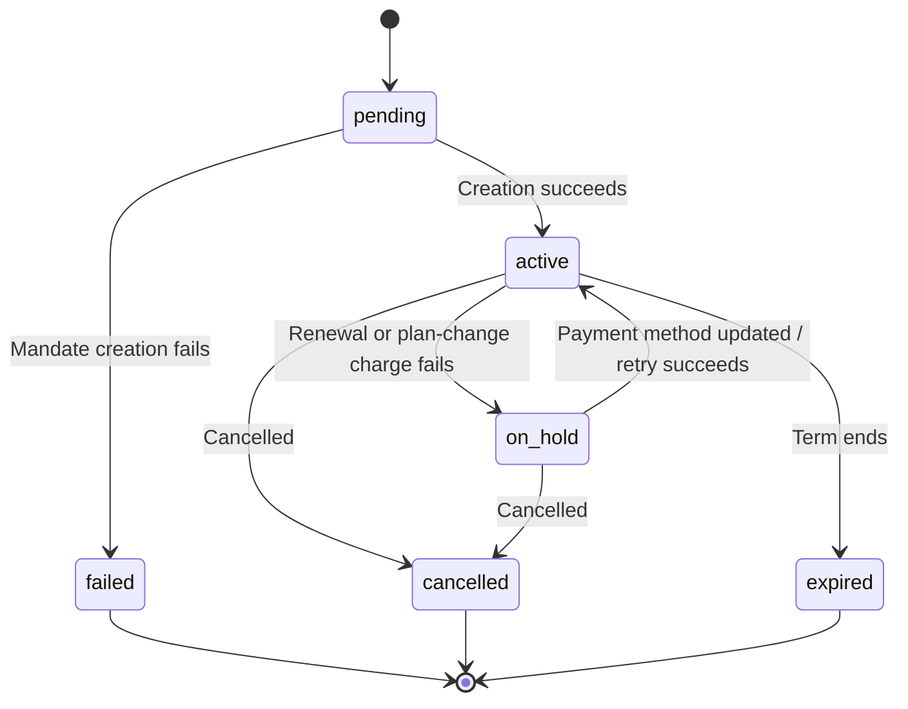

<Info>
Subscriptions let you sell ongoing access with automated renewals. Use flexible billing cycles, free trials, plan changes, and add‑ons to tailor pricing for each customer.
</Info>

<CardGroup cols={2}>
<Card title="Upgrade & Downgrade" icon="repeat" href="/developer-resources/subscription-upgrade-downgrade">
Control plan changes with proration and quantity updates.
</Card>

<Card title="On‑Demand Subscriptions" icon="bolt" href="/developer-resources/ondemand-subscriptions">
Authorize a mandate now and charge later with custom amounts.
</Card>

<Card title="Customer Portal" icon="id-card" href="/features/customer-portal">
Let customers manage plans, billing, and cancellations.
</Card>

<Card title="Subscription Webhooks" icon="code" href="/developer-resources/webhooks/intents/subscription">
React to lifecycle events like created, renewed, and canceled.
</Card>
</CardGroup>

## What Are Subscriptions?

Subscriptions are recurring products customers purchase on a schedule. They’re ideal for:

- **SaaS licenses**: Apps, APIs, or platform access
- **Memberships**: Communities, programs, or clubs
- **Digital content**: Courses, media, or premium content
- **Support plans**: SLAs, success packages, or maintenance

## Key Benefits

- **Predictable revenue**: Recurring billing with automated renewals
- **Flexible cycles**: Monthly, annual, custom intervals, and trials
- **Plan agility**: Proration for upgrades and downgrades
- **Add‑ons and seats**: Attach optional, quantifiable upgrades
- **Seamless checkout**: Hosted checkout and customer portal
- **Developer-first**: Clear APIs for creation, changes, and usage tracking

## Creating Subscriptions

Create subscription products in your Dodo Payments dashboard, then sell them through checkout or your API. Separating products from active subscriptions lets you version pricing, attach add‑ons, and track performance independently.

### Subscription product creation

Configure the fields in the dashboard to define how your subscription sells, renews, and bills. The sections below map directly to what you see in the creation form.

#### Product details

- **Product Name** (required): The display name shown in checkout, customer portal, and invoices.
- **Product Description** (required): A clear value statement that appears in checkout and invoices.
- **Product Image** (required): PNG/JPG/WebP up to 3 MB. Used on checkout and invoices.
- **Brand**: Associate the product with a specific brand for theming and emails.
- **Tax Category** (required): Choose the category (for example, SaaS) to determine tax rules.

<Tip>
Pick the most accurate tax category to ensure correct tax collection per region.
</Tip>

#### Pricing

- **Loại giá**: Chọn <b>Subscription</b> (hướng dẫn này). Các lựa chọn thay thế là Thanh toán một lần và Thanh toán dựa trên sử dụng.
- **Giá** (bắt buộc): Giá cơ bản định kỳ với tiền tệ. Giá phải tối thiểu là **$1** (hoặc tương đương trong tiền tệ bạn chọn). Các khoản dưới mức tối thiểu này không được hỗ trợ và gói đăng ký sẽ không hoạt động.
- **Giảm giá áp dụng (%)**: Mức giảm giá phần trăm tùy chọn áp dụng vào giá cơ bản; sẽ được phản ánh trong thanh toán và hóa đơn.
- **Lặp lại thanh toán mỗi** (bắt buộc): Khoảng thời gian gia hạn, ví dụ: mỗi 1 tháng. Chọn tần suất (tháng hoặc năm) và số lượng.
- **Thời gian Đăng ký** (bắt buộc): Tổng thời hạn mà gói đăng ký vẫn còn hiệu lực (ví dụ: 10 năm). Sau khi kết thúc thời gian này, việc gia hạn sẽ dừng trừ khi được gia hạn thêm.
- **Số ngày dùng thử** (bắt buộc): Đặt độ dài thời gian dùng thử bằng ngày. Dùng 0 để tắt chế độ dùng thử. Lần tính phí đầu tiên sẽ tự động diễn ra khi kết thúc thời gian dùng thử.
- **Chọn tiện ích mở rộng**: Đính kèm tối đa 10 tiện ích mở rộng mà khách hàng có thể mua cùng với gói chính.

<Warning>
Changing pricing on an active product affects new purchases. Existing subscriptions follow your plan‑change and proration settings.
</Warning>

<Info>
Add‑ons are ideal for quantifiable extras such as seats or storage. You can control allowed quantities and proration behavior when customers change them.
</Info>

#### Advanced settings

- **Tax Inclusive Pricing**: Display prices inclusive of applicable taxes. Final tax calculation still varies by customer location.
- **Generate license keys**: Issue a unique key to each customer after purchase. See the <a href="/features/license-keys">License Keys</a> guide.
- **Digital Product Delivery**: Deliver files or content automatically after purchase. Learn more in <a href="/features/digital-product-delivery">Digital Product Delivery</a>.
- **Metadata**: Attach custom key–value pairs for internal tagging or client integrations. See <a href="/api-reference/metadata">Metadata</a>.

<Tip>
Use metadata to store identifiers from your system (e.g., accountId) so you can reconcile events and invoices later.
</Tip>

## Subscription Trials

Trials let customers access subscriptions without immediate payment. The first charge occurs automatically when the trial ends.

### Configuring Trials

Set **Trial Period Days** in the product pricing section (use `0` to disable). You can override this when creating subscriptions:

```typescript
// Via subscription creation
const subscription = await client.subscriptions.create({
  customer_id: 'cus_123',
  product_id: 'prod_monthly',
  trial_period_days: 14  // Overrides product's trial period
});

// Via checkout session
const session = await client.checkoutSessions.create({
  product_cart: [{ product_id: 'prod_monthly', quantity: 1 }],
  subscription_data: { trial_period_days: 14 }
});
```

<Warning>
The `trial_period_days` value must be between 0 and 10,000 days.
</Warning>

### Detecting Trial Status

<Warning>
Currently, there is no direct field to detect trial status. The following is a workaround that requires querying payments, which is inefficient. We are working on a more efficient solution.
</Warning>

To determine if a subscription is in trial, retrieve the list of payments for the subscription. If there is exactly one payment with amount 0, the subscription is in trial period:

```typescript
const subscription = await client.subscriptions.retrieve('sub_123');
const payments = await client.payments.list({
  subscription_id: subscription.subscription_id
});

// Check if subscription is in trial
const isInTrial = payments.items.length === 1 && 
                  payments.items[0].total_amount === 0;
```

### Updating Trial Period

Extend the trial by updating `next_billing_date`:

```typescript
await client.subscriptions.update('sub_123', {
  next_billing_date: '2025-02-15T00:00:00Z'  // New trial end date
});
```

<Warning>
You cannot set `next_billing_date` to a past time. The date must be in the future.
</Warning>

## Subscription Plan Changes

Plan changes let you upgrade or downgrade subscriptions, adjust quantities, or migrate to different products. Depending on the proration mode you select, a change may trigger an immediate charge, create credit, or apply no billing adjustment.

<Tip>
You can change subscription plans and update the next billing date directly from the Dodo Payments dashboard. This provides a quick way to adjust subscriptions for customer support requests, promotional upgrades, or plan migrations without making API calls.
</Tip>

<Tip>
**Enable self-service plan changes:** Want customers to upgrade or downgrade their own subscriptions via the Customer Portal? Add your subscription products to a Product Collection and enable "Allow Subscription Updates" in your Subscription Settings.
</Tip>



<Card title="Product Collections" icon="layer-group" href="/features/product-collections">
  Group related products into collections to enable seamless upgrade/downgrade paths in the Customer Portal.
</Card>

### Proration Modes

Choose how customers are billed when changing plans:

<Info>
**Quick comparison of the four proration modes:**

| | `prorated_immediately` | `difference_immediately` | `full_immediately` | `do_not_bill` |
|---|---|---|---|---|
| **Nâng cấp** | Phí theo tỷ lệ cho các ngày còn lại | Tính toàn bộ sự chênh lệch giá | Tính toàn bộ giá gói mới | Không tính phí — chuyển ngay lập tức |
| **Giảm cấp** | Tín dụng theo tỷ lệ cho các ngày còn lại | Toàn bộ số chênh lệch giá thành tín dụng | Không tín dụng, tính toàn bộ phí | Không tín dụng — chuyển ngay lập tức |
| **Chu kỳ thanh toán** | Đặt lại về hôm nay | Đặt lại về hôm nay | Đặt lại về hôm nay | Giữ nguyên |
| **Tốt nhất cho** | Thanh toán theo thời gian hợp lý | Thay đổi cấp độ đơn giản | Đặt lại chu kỳ thanh toán | Di chuyển miễn phí hoặc chuyển đổi danh nghĩa |
</Info>

#### `prorated_immediately`
Charges prorated amount based on remaining time in the current billing cycle. Best for fair billing that accounts for unused time.

```typescript
await client.subscriptions.changePlan('sub_123', {
  product_id: 'prod_pro',
  quantity: 1,
  proration_billing_mode: 'prorated_immediately'
});
```

#### `difference_immediately`
Charges the price difference immediately (upgrade) or adds credit for future renewals (downgrade). Best for simple upgrade/downgrade scenarios.

```typescript
// Upgrade: charges $50 (difference between $30 and $80)
// Downgrade: credits remaining value, auto-applied to renewals
await client.subscriptions.changePlan('sub_123', {
  product_id: 'prod_pro',
  quantity: 1,
  proration_billing_mode: 'difference_immediately'
});
```

<Info>
Credits from downgrades using `difference_immediately` are subscription-scoped and auto-applied to future renewals. They're distinct from <a href="/features/credit-based-billing">Credit-Based Billing</a> entitlements.
</Info>

When a customer downgrades with `difference_immediately`, the unused value becomes a subscription-scoped credit that automatically offsets future renewals:



#### `full_immediately`
Charges full new plan amount immediately, ignoring remaining time. Best for resetting billing cycles.

```typescript
await client.subscriptions.changePlan('sub_123', {
  product_id: 'prod_monthly',
  quantity: 1,
  proration_billing_mode: 'full_immediately'
});
```

#### `do_not_bill`
Switches to the new plan without any billing adjustment. No proration charges, no credits — the customer simply moves to the new plan. Best for courtesy migrations, free plan switches, or scenarios where you want to absorb the cost difference.

```typescript
await client.subscriptions.changePlan('sub_123', {
  product_id: 'prod_new_plan',
  quantity: 1,
  proration_billing_mode: 'do_not_bill'
});
```

<AccordionGroup>
<Accordion title="Example: Prorated upgrade calculation">

**Scenario**: Customer on Basic ($30/month) upgrades to Pro ($80/month) on day 16 of a 30-day cycle using `prorated_immediately`.

```
Unused credit from Basic = $30 × (15 remaining / 30 total) = $15.00
Prorated cost of Pro     = $80 × (15 remaining / 30 total) = $40.00
────────────────────────────────────────────────────────────────────
Immediate charge         = $40.00 − $15.00 = $25.00
```

Gia hạn tiếp theo vào **ngày 15 tháng 2** (16 tháng 1 + 30 ngày): **80,00 USD/tháng**.

<Tip>
For more detailed calculation examples and edge cases, see our full [Upgrade & Downgrade Guide](/developer-resources/subscription-upgrade-downgrade).
</Tip>

</Accordion>
<Accordion title="Example: Downgrade credit calculation">

**Scenario**: Customer on Pro ($80/month) downgrades to Starter ($20/month) using `difference_immediately`.

```
Credit = Old plan − New plan = $80 − $20 = $60.00
```

The $60 credit auto-applies to future renewals:
- Renewal 1: $20 − $20 (credit) = **$0.00** ($40 credit remaining)
- Renewal 2: $20 − $20 (credit) = **$0.00** ($20 credit remaining)  
- Renewal 3: $20 − $20 (credit) = **$0.00** (credit exhausted)
- Renewal 4: **$20.00** (full price)

<Info>
Learn more about how credits are managed in the [Upgrade & Downgrade Guide](/developer-resources/subscription-upgrade-downgrade).
</Info>

</Accordion>
</AccordionGroup>

### Changing Plans with Add-ons

Modify add-ons when changing plans. Add-ons are included in proration calculations:

```typescript
await client.subscriptions.changePlan('sub_123', {
  product_id: 'prod_pro',
  quantity: 1,
  proration_billing_mode: 'difference_immediately',
  addons: [{ addon_id: 'addon_extra_seats', quantity: 2 }]  // Add add-ons
  // addons: []  // Empty array removes all existing add-ons
});
```

<Info>
Plan changes trigger immediate charges. Failed charges may move the subscription to `on_hold` status. Track changes via `subscription.plan_changed` webhook events.
</Info>

### Previewing Plan Changes

Before committing to a plan change, preview the exact charge and resulting subscription:

```typescript
const preview = await client.subscriptions.previewChangePlan('sub_123', {
  product_id: 'prod_pro',
  quantity: 1,
  proration_billing_mode: 'prorated_immediately'
});

// Show customer the charge before confirming
console.log('You will be charged:', preview.immediate_charge.summary);
```

<Card title="Preview Change Plan API" icon="eye" href="/api-reference/subscriptions/preview-change-plan">
  Preview plan changes before committing to them.
</Card>

## Subscription States

Một đăng ký sẽ trải qua một tập hợp trạng thái xác định trong suốt vòng đời của nó. Bảng này là tài liệu tham khảo cho mọi trạng thái, nguyên nhân xảy ra và cách (hoặc nếu có thể) bạn có thể khôi phục nó.

| Trạng thái | Ý nghĩa | Có thể khôi phục? | Đường dẫn khôi phục / bước tiếp theo |
|--------|---------------|--------------|---------------------------|
| `pending` | Đăng ký đang được tạo hoặc xử lý | — | Chờ `subscription.active` (hoặc `subscription.failed`) |
| `active` | Đăng ký đang hoạt động và sẽ tự động gia hạn | — | Không cần hành động nào |
| `on_hold` | Thanh toán gia hạn (hoặc phí thay đổi gói) đã thất bại; đăng ký bị tạm dừng | **Có** | Cập nhật phương thức thanh toán để kích hoạt lại — tự động qua [Thử Lại Thanh Toán](/features/recovery/payment-retries) và [Dunning](/features/recovery/subscription-dunning), hoặc thủ công qua [API Cập nhật Phương thức Thanh toán](/api-reference/subscriptions/update-payment-method) |
| `cancelled` | Đăng ký đã bị hủy và sẽ không được gia hạn | Chỉ có thể mua lại | Khách hàng phải bắt đầu đăng ký mới; [Dunning](/features/recovery/subscription-dunning) có thể nhắc nhở mua lại |
| `failed` | Tạo **đăng ký** không thành công (ủy nhiệm ban đầu hoặc thanh toán không thành công) | **Không — cuối cùng** | Khách hàng phải tạo đăng ký mới với phương thức thanh toán hoạt động |
| `expired` | Đăng ký đã hết hạn | — | Khách hàng phải bắt đầu đăng ký mới nếu muốn |

<Warning>
`on_hold` và `failed` thường bị nhầm lẫn. `on_hold` là trạng thái **có thể khôi phục** cho một đăng ký đã hoạt động nhưng gia hạn thất bại. `failed` là trạng thái **cuối cùng** chỉ xảy ra khi tạo **đăng ký ban đầu** thất bại — không thể kích hoạt lại.
</Warning>

### Máy Trạng Thái



### Trạng Thái Tạm Dừng

Một đăng ký sẽ vào trạng thái `on_hold` khi:

- Thanh toán gia hạn thất bại (không đủ tiền, thẻ hết hạn, v.v.)
- Phí thay đổi gói thất bại
- Ủy quyền phương thức thanh toán thất bại

<Warning>
Khi một đăng ký ở trạng thái `on_hold`, nó sẽ không tự động gia hạn. Bạn phải cập nhật phương thức thanh toán để kích hoạt lại đăng ký.
</Warning>

### Kích Hoạt Lại từ Trạng Thái Tạm Dừng

Để kích hoạt lại một đăng ký từ trạng thái `on_hold`, cập nhật phương thức thanh toán. Điều này tự động:

1. Tạo một khoản phí cho các khoản nợ còn lại
2. Tạo hóa đơn
3. Xử lý thanh toán bằng phương thức thanh toán mới
4. Kích hoạt lại đăng ký về trạng thái `active` khi thanh toán thành công

```typescript
// Reactivate subscription from on_hold
const response = await client.subscriptions.updatePaymentMethod('sub_123', {
  payment_method: {
    type: 'new',
    return_url: 'https://example.com/return'
  }
});

// For on_hold subscriptions, a charge is automatically created
if (response.payment_id) {
  console.log('Charge created:', response.payment_id);
  // Redirect customer to response.payment_link to complete payment
  // Monitor webhooks for payment.succeeded and subscription.active
}
```

<Info>
Sau khi cập nhật thành công phương thức thanh toán cho một đăng ký `on_hold`, bạn sẽ nhận được các sự kiện webhook `payment.succeeded` tiếp theo là `subscription.active`.
</Info>

### Sự Kiện Webhook theo Chuyển Đổi

Mỗi chuyển đổi phát ra một webhook để bạn có thể thực hiện logic quyền mà không cần khảo sát liên tục:

| Chuyển đổi | Sự kiện |
|------------|-------|
| Đăng ký được kích hoạt | `subscription.active` |
| Gia hạn thành công | `subscription.renewed` |
| Gia hạn thất bại → tạm dừng | `subscription.on_hold` |
| Tạo thất bại | `subscription.failed` |
| Nâng cấp/giảm cấp gói | `subscription.plan_changed` |
| Bị hủy | `subscription.cancelled` |
| Kết thúc thời hạn | `subscription.expired` |
| Bất kỳ thay đổi trường nào | `subscription.updated` |

<Card title="Subscription Webhook Payloads" icon="webhook" href="/developer-resources/webhooks/intents/subscription">
Xem toàn bộ lược đồ payload cho các sự kiện vòng đời đăng ký.
</Card>

## Quản Lý API

<AccordionGroup>
<Accordion title="Create subscriptions">
Sử dụng `POST /subscriptions` để tạo đăng ký theo cách lập trình từ các sản phẩm, với các giai đoạn thử nghiệm và bổ sung tùy chọn.

<Card title="API Reference" icon="code" href="/api-reference/subscriptions/post-subscriptions">
Xem API tạo đăng ký.
</Card>
</Accordion>

<Accordion title="Update subscriptions">
Sử dụng `PATCH /subscriptions/{id}` để cập nhật số lượng, hủy vào ngày lập hóa đơn tiếp theo hoặc sửa đổi metadata.

<Card title="API Reference" icon="code" href="/api-reference/subscriptions/patch-subscriptions">
Tìm hiểu cách cập nhật chi tiết đăng ký.
</Card>
</Accordion>

<Accordion title="Change plans (proration)">
Thay đổi sản phẩm và số lượng đang hoạt động với kiểm soát tỷ lệ.

<Card title="API Reference" icon="code" href="/api-reference/subscriptions/change-plan">
Xem xét tùy chọn thay đổi kế hoạch.
</Card>
</Accordion>

<Accordion title="On‑demand charges">
Đối với đăng ký theo yêu cầu, tính phí các khoản cụ thể theo yêu cầu.

<Card title="API Reference" icon="code" href="/api-reference/subscriptions/create-charge">
Tính phí một đăng ký theo yêu cầu.
</Card>
</Accordion>

<Accordion title="List and retrieve">
Sử dụng `GET /subscriptions` để liệt kê tất cả các đăng ký và `GET /subscriptions/{id}` để lấy thông tin một đăng ký.

<Card title="API Reference" icon="code" href="/api-reference/subscriptions/get-subscriptions">
Duyệt API danh sách và truy xuất.
</Card>
</Accordion>

<Accordion title="Usage history">
Lấy lịch sử sử dụng đã ghi nhận cho các mô hình định giá đo lường hoặc hỗn hợp.

<Card title="API Reference" icon="code" href="/api-reference/subscriptions/get-usage-history">
Xem API lịch sử sử dụng.
</Card>
</Accordion>

<Accordion title="Update payment method">
Cập nhật phương thức thanh toán cho một đăng ký. Đối với các đăng ký đang hoạt động, điều này cập nhật phương thức thanh toán cho các lần gia hạn tiếp theo. Đối với các đăng ký trong trạng thái `on_hold`, điều này kích hoạt lại đăng ký bằng cách tạo một khoản phí cho các khoản nợ còn lại.

Khi tạo một liên kết phương thức thanh toán mới (loại yêu cầu `New`), bạn có thể truyền `allowed_payment_method_types` để giới hạn các phương thức thanh toán mà khách hàng nhìn thấy trên trang đó. Khách hàng sẽ không bao giờ thấy một phương pháp không nằm trong danh sách, mặc dù bao gồm một phương pháp không đảm bảo nó xuất hiện (sự sẵn có vẫn phụ thuộc vào các yếu tố như vị trí của khách hàng và cài đặt doanh nghiệp của bạn).

<Card title="API Reference" icon="code" href="/api-reference/subscriptions/update-payment-method">
Tìm hiểu cách cập nhật phương thức thanh toán và kích hoạt lại đăng ký.
</Card>
</Accordion>
</AccordionGroup>

## Trường Hợp Sử Dụng Phổ Biến

- **SaaS và API**: Truy cập phân cấp với bổ sung cho chỗ ngồi hoặc sử dụng
- **Nội dung và truyền thông**: Truy cập hàng tháng với các giai đoạn thử nghiệm giới thiệu
- **Kế hoạch hỗ trợ B2B**: Hợp đồng hàng năm với bổ sung hỗ trợ cao cấp
- **Công cụ và plugin**: Khóa giấy phép và phát hành theo phiên bản

## Ví Dụ Tích Hợp

### Phiên Thanh Toán (đăng ký)
Khi tạo phiên thanh toán, bao gồm sản phẩm đăng ký và bổ sung tùy chọn của bạn:

```typescript
const session = await client.checkoutSessions.create({
  product_cart: [
    {
      product_id: 'prod_subscription',
      quantity: 1
    }
  ]
});
```

### Thay đổi gói với tỷ lệ
Nâng cấp hoặc giảm cấp một đăng ký và kiểm soát hành vi tỷ lệ:

```typescript
await client.subscriptions.changePlan('sub_123', {
  product_id: 'prod_new',
  quantity: 1,
  proration_billing_mode: 'difference_immediately'
});
```

### Hủy vào ngày lập hóa đơn tiếp theo
Lên lịch hủy bỏ có hiệu lực vào cuối kỳ lập hóa đơn hiện tại:

```typescript
await client.subscriptions.update('sub_123', {
  cancel_at_next_billing_date: true
});
```

### Mở rộng thời gian đăng ký
Mở rộng thời gian một đăng ký chạy bằng cách truyền một `subscription_period_count` và `subscription_period_interval` mới cho `PATCH /subscriptions/{id}`. Thời hạn hết hạn của đăng ký được tính toán lại từ số lượng và khoảng thời gian mới — ví dụ, để cấp cho khách hàng thời gian thêm trên gói hiện tại của họ:

```typescript
await client.subscriptions.update('sub_123', {
  subscription_period_count: 5,
  subscription_period_interval: 'Month'
});
```

<Note>
Thời gian của một đăng ký chỉ có thể được **tăng**, không bao giờ rút ngắn.
</Note>

### Đăng ký theo yêu cầu
Tạo một đăng ký theo yêu cầu và tính phí sau khi cần thiết:

```typescript
const onDemand = await client.subscriptions.create({
  customer_id: 'cus_123',
  product_id: 'prod_on_demand',
  on_demand: { mandate_only: true }
});

await client.subscriptions.charge(onDemand.id, {
  product_price: 4900,
  product_currency: 'USD',
  product_description: 'Extra usage for September'
});
```

### Cập nhật phương thức thanh toán cho đăng ký đang hoạt động
Cập nhật phương thức thanh toán cho một đăng ký đang hoạt động:

```typescript
// Update with new payment method
const response = await client.subscriptions.updatePaymentMethod('sub_123', {
  payment_method: {
    type: 'new',
    return_url: 'https://example.com/return'
  }
});

// Or use existing payment method
await client.subscriptions.updatePaymentMethod('sub_123', {
  payment_method: {
    type: 'existing',
    payment_method_id: 'pm_abc123'
  }
});
```

### Kích hoạt lại đăng ký từ trạng thái on_hold
Kích hoạt lại một đăng ký đã bị giữ lại do thanh toán thất bại:

```typescript
// Update payment method - automatically creates charge for remaining dues
const response = await client.subscriptions.updatePaymentMethod('sub_123', {
  payment_method: {
    type: 'new',
    return_url: 'https://example.com/return'
  }
});

if (response.payment_id) {
  // Charge created for remaining dues
  // Redirect customer to response.payment_link
  // Monitor webhooks: payment.succeeded → subscription.active
}
```

## Đăng ký với các Yêu cầu tuân thủ RBI

  Các đăng ký UPI và thẻ Ấn Độ hoạt động theo các quy định của RBI (Ngân hàng Dự trữ Ấn Độ) với các yêu cầu nhất định:

  ### Giới hạn Ủy nhiệm

  Loại và số lượng ủy nhiệm phụ thuộc vào khoản phí định kỳ của đăng ký của bạn:

  - **Các khoản phí dưới mức sàn ủy nhiệm (mặc định ₹15,000):** Chúng tôi tạo một ủy nhiệm theo yêu cầu cho số tiền sàn. Số tiền của đăng ký được trừ định kỳ theo tần suất của đăng ký, cho tới mức giới hạn của ủy nhiệm.
  - **Các khoản phí tại hoặc trên mức sàn ủy nhiệm:** Chúng tôi tạo một ủy nhiệm đăng ký (hoặc ủy nhiệm theo yêu cầu) cho số tiền đăng ký chính xác.

  Mức sàn của ủy nhiệm có thể được cấu hình theo từng thương nhân hoặc yêu cầu qua `mandate_min_amount_inr_paise` (INR paise). Số tiền được đăng ký với ngân hàng là `max(mandate_floor, billing_amount)` — do đó mức sàn thực tế trở thành giới hạn ủy quyền hiển thị cho khách hàng khi thanh toán thấp hơn.

Để biết thông tin chi tiết về các ủy nhiệm tuân thủ RBI và mức sàn có thể cấu hình cho các phương thức thanh toán ở Ấn Độ, xem trang <a href="/features/payment-methods/india#configurable-mandate-floor">Phương thức thanh toán Ấn Độ</a>.

  ### Cân nhắc nâng cấp và hạ cấp

  **Quan trọng:** Khi nâng cấp hoặc hạ cấp đăng ký, cần thận trọng xem xét giới hạn của ủy nhiệm:

  - Nếu việc nâng cấp/hạ cấp dẫn đến số tiền vượt quá Rs 15,000 và vượt qua giới hạn thanh toán theo yêu cầu hiện tại, phí giao dịch có thể thất bại.
  - Trong trường hợp đó, khách hàng có thể cần cập nhật phương thức thanh toán của họ hoặc thay đổi đăng ký một lần nữa để thiết lập một ủy nhiệm mới với giới hạn đúng.

  ### Ủy quyền cho các khoản phí cao

  Đối với các khoản phí đăng ký từ Rs 15,000 trở lên:

  - Khách hàng sẽ được ngân hàng của họ yêu cầu ủy quyền giao dịch.
  - Nếu khách hàng không thực hiện ủy quyền, giao dịch sẽ thất bại và đăng ký sẽ bị giữ lại.

  ### Trễ xử lý 48 giờ

  **Thời gian xử lý:** Các khoản phí định kỳ trên thẻ Ấn Độ và đăng ký UPI tuân theo một mẫu xử lý riêng biệt:

  - Các khoản phí được **khởi đầu** vào ngày đã lên lịch theo tần suất đăng ký của bạn.
  - Việc thực sự **khấu trừ** từ tài khoản của khách hàng chỉ xảy ra sau **48 giờ** kể từ khi bắt đầu thanh toán.
  - Khoảng thời gian 48 giờ này có thể kéo dài tối đa **2-3 giờ bổ sung** tùy thuộc vào phản hồi API của ngân hàng.

  ### Cửa sổ hủy ủy nhiệm

  Trong khoảng thời gian xử lý 48 giờ:

  - Khách hàng có thể hủy ủy nhiệm thông qua ứng dụng ngân hàng của họ.
  - Nếu khách hàng hủy ủy nhiệm trong thời gian này, đăng ký sẽ vẫn **hoạt động** (đây là trường hợp cụ thể đối với thẻ Ấn Độ và đăng ký AutoPay UPI).
  - Tuy nhiên, việc khấu trừ thực tế có thể thất bại và trong trường hợp đó, chúng tôi sẽ giữ trạng thái đăng ký **on hold**.

  **Xử lý trường hợp đặc biệt:** Nếu bạn cung cấp lợi ích, tín dụng, hoặc sử dụng đăng ký cho khách hàng ngay khi bắt đầu tính phí, bạn cần xử lý khoảng thời gian 48 giờ này một cách thích hợp trong ứng dụng của bạn. Xem xét:

  - Trì hoãn kích hoạt lợi ích cho đến khi xác nhận thanh toán
  - Thực hiện các khoảng thời gian ân hạn hoặc truy cập tạm thời
  - Giám sát trạng thái đăng ký để hủy ủy nhiệm
  - Xử lý các trạng thái giữ của đăng ký trong logic ứng dụng của bạn

  <Tip>
  Giám sát các webhook đăng ký để theo dõi các thay đổi trạng thái thanh toán và xử lý các trường hợp đặc biệt khi ủy nhiệm bị hủy trong thời gian 48 giờ.
  </Tip>

## Thực tiễn tốt nhất

- **Bắt đầu với các tầng rõ ràng**: 2–3 gói với sự khác biệt rõ ràng
- **Truyền đạt giá cả**: Hiển thị tổng, tỷ lệ và lần gia hạn tiếp theo
- **Sử dụng thí điểm một cách khôn ngoan**: Chuyển đổi với hướng dẫn tham gia, không chỉ là thời gian
- **Tận dụng tiện ích bổ sung**: Giữ các gói cơ bản đơn giản và bán thêm các phần bổ sung
- **Thử nghiệm thay đổi**: Kiểm tra các thay đổi của gói và tỷ lệ trong chế độ thử nghiệm

<Info>
Các đăng ký là nền tảng linh hoạt cho doanh thu định kỳ. Bắt đầu đơn giản, thử nghiệm kỹ lưỡng và lặp lại dựa trên sự chấp nhận, mức độ rời bỏ và mở rộng.
</Info>